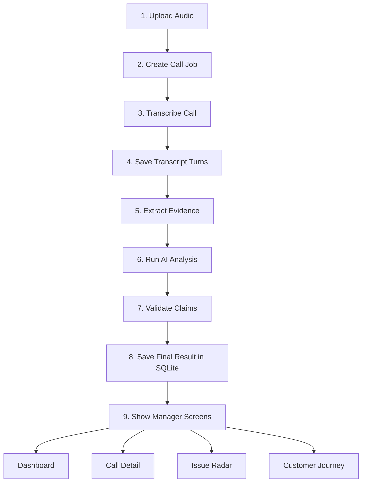

# Call Center Radar

Call Center Radar is an evidence-first call intelligence POC for support and operations teams. It turns call recordings into manager-ready insights with traceable evidence, synchronized audio and transcript playback, and clear recommended actions.

## POC Goal

Build a fast, defensible demo that answers:

- Which calls need manager attention right now
- Why the system flagged that call
- What exact transcript and audio evidence supports the decision
- What recurring issues are appearing across calls

## Project Objective

The project objective is to build a proof-of-concept call intelligence system that can process support-call recordings, identify the calls that need manager attention, explain every important AI judgment with transcript and audio evidence, and present the result in a simple operations dashboard.

For this POC, success means:

- a new call can be uploaded and processed
- the manager can open one call and understand what happened quickly
- every major conclusion can be traced back to real call evidence
- the team can demonstrate both business value and technical defensibility

## Sample Data

The current sample dataset lives in `callradar-data` and contains:

- `1441` audio files in `audio/`
- `1441` metadata JSON files in `metadata/`
- one metadata record per call, matched by call ID

Sample metadata includes:

- agent name
- caller name
- call start and end timestamps
- agent and caller speaker IDs
- survey response timing
- quality labels such as `caller_mos`, `agent_mos`, and `lhvb_script`

This sample set is used for:

- initial pipeline development
- transcript and evidence testing
- dashboard demonstrations
- evaluation and regression checks before the live demo

## Core POC Principles

- Trust: every important AI judgment must link back to transcript turns and audio evidence
- Speed: a new audio file can be uploaded and processed during the demo
- Action: managers see a brief, a score, a reason, and the next likely action
- Simplicity: SQLite for the POC, local-first workflow, and modular services

## Main POC Features

- Audio upload and processing job tracking
- Transcript persistence with immutable `transcript_turn_id`
- Call Detail screen with synced audio and transcript
- Evidence-backed intent, mood, resolution, and summary
- Manager brief and recommended action
- Radar Priority score with visible score breakdown
- Show Me Why evidence flow with jump-to-audio
- Issue Radar for repeated operational issues
- Customer Journey for repeat callers
- Agent treatment and satisfaction support signals

## POC Architecture

Architecture reading guide:

- Steps 1 to 8 are the processing pipeline
- Step 9 is where the manager sees the result
- Dashboard, Call Detail, Issue Radar, and Customer Journey all read from the same validated stored result

## POC Abstract Flow

1. A user uploads a call recording.
2. The system creates a processing job and validates the audio.
3. The call is transcribed into speaker turns with timestamps.
4. A deterministic evidence layer finds candidate signals.
5. An LLM produces structured call analysis.
6. A validator rejects unsupported claims.
7. The final result is stored and shown in the manager dashboard and Call Detail view.

## Build Strategy

This POC is designed for two contributors working on vertical feature slices.

- One contributor starts with setup and base workflow
- After setup, both contributors work on full-stack feature units
- Stories are prioritized by demo value and testability, not by frontend/backend ownership

Detailed planning lives in:

- `docs/Implementation_Backlog_Plan.md`
- `docs/wiki/Home.md`
- `docs/wiki/Architecture-and-Delivery-Plan.md`

## Suggested Initial Scope

Must-have POC scope:

1. Upload and job pipeline
2. Call Detail with audio and transcript sync
3. Evidence-backed AI analysis for a single call
4. Radar Priority and Show Me Why
5. Manager dashboard ranked queue
6. Logging, tests, and demo fallback path

Stretch scope:

- Issue Radar
- Customer Journey
- Agent treatment and satisfaction views

## Tech Direction

- Database: SQLite for the POC
- Transcription: local-first transcription pipeline
- Analysis: hybrid deterministic evidence plus LLM reasoning
- Validation: every displayed claim must resolve to real transcript evidence
- Deployment: local demo first, lightweight hosting only where useful

## Repository Notes

This repo is for the office POC effort. The current delivery focus is speed, explainability, and demo reliability rather than production scale.
