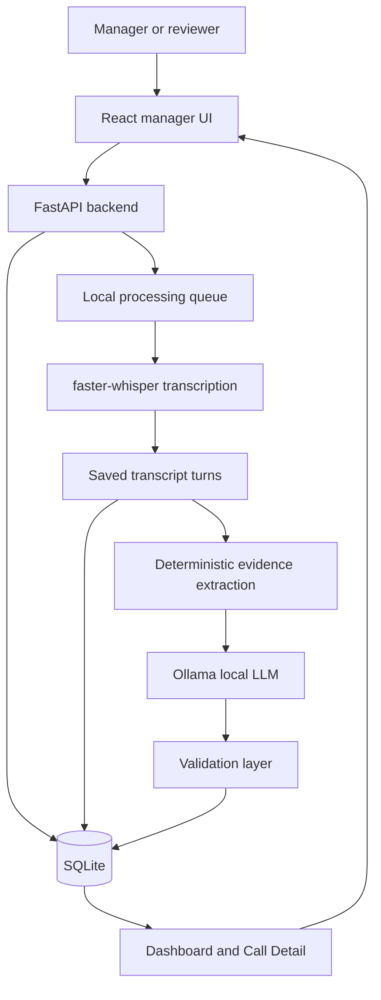

# Call Center Radar

Call Center Radar is an evidence-first call intelligence POC for support and
operations teams. It processes call recordings, creates transcripts, runs local
AI analysis, validates every important AI claim against saved evidence, and shows
managers which calls need attention.

This README starts with the easiest Docker setup so a reviewer can run the POC
without installing Python, Node, FFmpeg, or AI model tooling directly on their
machine.

## Quick Start With Docker

Use this path if you only want to run and review the app.


### Step 1: Open A Terminal

Open Terminal on macOS or Linux. On Windows, open PowerShell.

Go to the project folder:

```bash
cd "Call-Centre Radar"
```

If your folder is inside Documents on macOS, the command may look like this:

```bash
cd "$HOME/Documents/Call-Centre Radar"
```

### Step 2: Start The App

Run:

```bash
docker compose up --build
```

Keep this terminal open. It is running the app.

The first run can take several minutes because Docker builds the app and
downloads the required base images.

### Step 3: Install The Local AI Model

Open a second terminal in the same project folder and run:

```bash
docker compose run --rm ollama-model
```

This downloads the free local model used for call analysis:

```text
qwen2.5:7b
```

This can take time on the first run. After it finishes once, Docker keeps the
model in a local volume.

### Step 4: Open The App

Open this URL in your browser:

```text
http://localhost:8080
```

You should see the Call Center Radar dashboard.

At the bottom of the app, the service health bar shows whether the database,
processing worker, transcription runtime, Ollama server, and LLM model are
ready. Click the bar to see details.

### Step 5: Try A Call

1. Open the **Single call upload** tab.
2. Upload one audio file and its matching metadata file.
3. Submit the call.
4. Watch the global processing queue.
5. When processing is complete, open the call detail page.
6. Review the transcript, call analysis, score, and manager summary.

For batch testing:

1. Open the **Batch upload** tab.
2. Select multiple audio files.
3. Select multiple metadata files.
4. Submit the batch.
5. The app skips unmatched files and shows the skipped items.

### Stop The App

Press `Ctrl+C` in the terminal running Docker Compose.

### Start Again Later

Run:

```bash
docker compose up
```

### Clear All Local Demo Data

This removes uploaded calls, SQLite data, cached Whisper models, and the Ollama
model volume:

```bash
docker compose down -v
```

Run the quick start again after this if you want a fresh demo.

### Common Docker Problems

If the app does not open:

```bash
docker compose ps
```

Check that the `app` service is running.

If the health bar says the model is missing:

```bash
docker compose run --rm ollama-model
```

If port `8080` is already used by another app:

```bash
CALL_RADAR_HOST_PORT=8090 docker compose up --build
```

Then open:

```text
http://localhost:8090
```

If you want to see the API health response directly:

```bash
curl http://localhost:8080/api/health
```

## What This Project Does

The POC answers these questions:

- Which calls need manager attention today?
- What did the customer want?
- What was the customer mood, and where did it shift?
- Was the issue resolved?
- What exact transcript evidence supports the AI decision?
- Which issues are repeating across calls?
- How are agents performing by call volume, handle time, and outcome?

## Main Features

### Call Upload

- Single call upload for one audio file and one metadata file.
- Batch upload for many audio files and metadata files.
- Validation that audio and metadata are matched.
- Clear skipped-file messages when a matching pair is missing.

### Processing Queue

- Non-blocking global processing queue.
- Multiple calls can be queued while another call is processing.
- Failed or completed queue items can be cleared from the UI.
- Finished calls can be opened directly from the queue or recent calls list.

### Transcription

- Local speech-to-text using `faster-whisper`.
- Stereo-aware speaker handling for agent and customer channels.
- Saved transcript turns with timestamps and immutable `transcript_turn_id`
  values.

### Call Detail

- Audio playback.
- Transcript conversation view for agent and customer communication.
- Search and speaker filtering.
- Call analysis summary, intent, mood, resolution, and manager brief.
- Radar Priority score with score breakdown.

### AI Analysis

- Local LLM-backed structured analysis through Ollama.
- No paid AI API is required for the default POC flow.
- Deterministic validation rejects unsupported AI claims.
- Evidence must come from saved transcript turns, not invented model text.

### Manager Dashboard

- Today view of processed calls.
- Ranked call list for manager attention.
- Issue Radar for recurring issues.
- Agent summary with call volume, handle time, outcomes, and satisfaction
  signals.

### Service Health

- Bottom health status bar across the app.
- Clickable details for each local service.
- Setup guidance when the database, worker, transcription runtime, Ollama, or
  model is not ready.

## Model Used In This Project

### Speech-To-Text Model

- Library: `faster-whisper`
- Default model: `base.en`
- Purpose: converts audio recordings into timestamped transcript turns
- Cost: free local model

Why this is used:

- It runs locally.
- It avoids paid transcription APIs for the POC.
- It gives timestamps needed for audio and transcript sync.
- It is fast enough for a hackathon demo.

Upgrade options:

- `small.en` or `medium.en` for better accuracy.
- `large-v3` or `distil-large-v3` for stronger transcription if hardware allows.
- Paid managed STT later if production accuracy is more important than zero
  cost.

### LLM Analysis Model

- Runtime: Ollama
- Default model: `qwen2.5:7b`
- Purpose: intent, mood, resolution, summary, manager brief, and recommended
  action
- Cost: free local model

Why this is used:

- It runs locally.
- It keeps transcripts on the reviewer's machine.
- It avoids paid model usage during the demo.
- It can be replaced behind the analysis provider interface later.

Upgrade options:

- Try stronger local models such as `qwen2.5:14b` or a Llama-family model.
- Compare against paid models offline for accuracy evaluation if allowed.
- Keep deterministic evidence validation even when using stronger models.

More detail is in
[Technology Decisions](docs/Technology_Decisions.md).

## Tech Stack

| Layer | Technology | Purpose |
| --- | --- | --- |
| Frontend | React, TypeScript, Vite | Manager UI, call detail, dashboards |
| API | FastAPI, Python 3.12 | Upload, processing, analysis, dashboard APIs |
| Database | SQLite | POC persistence for calls, transcripts, analysis, and queue state |
| Speech-to-text | FFmpeg, FFprobe, `faster-whisper` | Audio conversion, duration probing, transcription |
| LLM runtime | Ollama, `qwen2.5:7b` | Free local structured call analysis |
| Validation | Pydantic models, deterministic evidence checks | Reject unsupported model output |
| Tests | Vitest, React Testing Library, Pytest, Ruff, ESLint, Prettier | Quality gate and regression coverage |
| Packaging | Docker, Docker Compose | Reviewer-friendly local release |

## Architecture



### Architecture In Plain English

1. The user uploads audio and metadata from the browser.
2. FastAPI stores the upload and creates a processing job.
3. The local queue processes jobs one at a time.
4. FFmpeg prepares audio for transcription.
5. `faster-whisper` creates timestamped transcript turns.
6. The transcript is saved in SQLite.
7. Deterministic rules extract evidence candidates.
8. Ollama runs local LLM analysis.
9. The validation layer rejects unsupported claims.
10. The dashboard and call detail pages show only saved, validated results.

This design is intentionally stronger than a simple
`audio -> transcription -> LLM -> dashboard` flow because every manager-facing AI
judgment must connect back to saved transcript evidence.

## Local Developer Setup Without Docker

Use this path only if you want to develop the code directly.

### Requirements

- Node.js 20.15 or later
- npm 10.7 or later
- Python 3.12 or later
- FFmpeg and FFprobe on `PATH`
- Ollama on `PATH`

### Install Dependencies

```bash
npm install
python3 -m venv .venv
./.venv/bin/pip install -e 'apps/api[dev]'
cp .env.example .env
```

### Run Everything

```bash
npm run dev
```

The single runner starts:

- Ollama, if it is installed and not already running
- the API at `http://127.0.0.1:8000`
- the web app at the Vite URL shown in the terminal

The runner also checks the configured Ollama model and pulls it once when
allowed.

Useful model settings:

- `CALL_RADAR_OLLAMA_MODEL=<model>` changes the local analysis model.
- `CALL_RADAR_START_OLLAMA=false` prevents the runner from starting Ollama.
- `CALL_RADAR_PULL_OLLAMA_MODEL=false` prevents automatic model download.

### Run Services Separately

```bash
npm run dev:api
```

```bash
npm run dev:web
```

## Build And Test

Run the production web build:

```bash
npm run build
```

Run all tests:

```bash
npm run test
```

Run lint:

```bash
npm run lint
```

Run format check:

```bash
npm run format:check
```

Run coverage:

```bash
npm run test:coverage
```

## Database

The POC uses SQLite.

For local development, migrations run through:

```bash
npm run db:migrate
```

Seed a small local dataset:

```bash
npm run db:seed
```

Docker stores SQLite data in the `call-radar-data` Docker volume.

## Sample Data

Tracked sample data lives here:

- `sample-data/callradar-data/audio/`
- `sample-data/callradar-data/metadata/`

Each valid demo call should have:

- one audio file
- one metadata JSON file
- the same call ID in both filenames

The app skips unmatched audio or metadata during batch upload and shows the
skipped items.

## Demo Flow

1. Start the app with Docker.
2. Confirm the bottom health bar is healthy.
3. Upload one call.
4. Watch the processing queue.
5. Open the completed call.
6. Review the transcript and audio playback.
7. Review AI analysis, manager brief, and Radar Priority.
8. Open the dashboard to see ranked manager attention.
9. Show Issue Radar and agent summaries if the demo needs broader views.

## Internal Documentation

- [Technology Decisions](docs/Technology_Decisions.md): model and library pros,
  cons, choices, and upgrade paths.
- [Engineering Governance](docs/Engineering_Governance.md): branch, PR, review,
  and delivery rules.
- [Git Flow](docs/Git_Flow.md): required branch and pull-request flow.
- [Developer Notes](docs/Developer_Notes.md): setup and engineering standards.
- [Implementation Backlog Plan](docs/Implementation_Backlog_Plan.md): epics,
  stories, phases, and delivery order.
- [Wiki Home](docs/wiki/Home.md): project wiki entry point.
- [Architecture and Delivery Plan](docs/wiki/Architecture-and-Delivery-Plan.md):
  deeper project architecture and demo planning.
- [Story Documentation](docs/stories/README.md): implementation notes for
  completed and in-progress stories.

## Repository Note

This repository is for the office POC effort. The current delivery focus is demo
clarity, explainability, local/free execution, and reviewer confidence. It is not
yet hardened for production scale, authentication, regulated retention, or
multi-tenant hosting.
