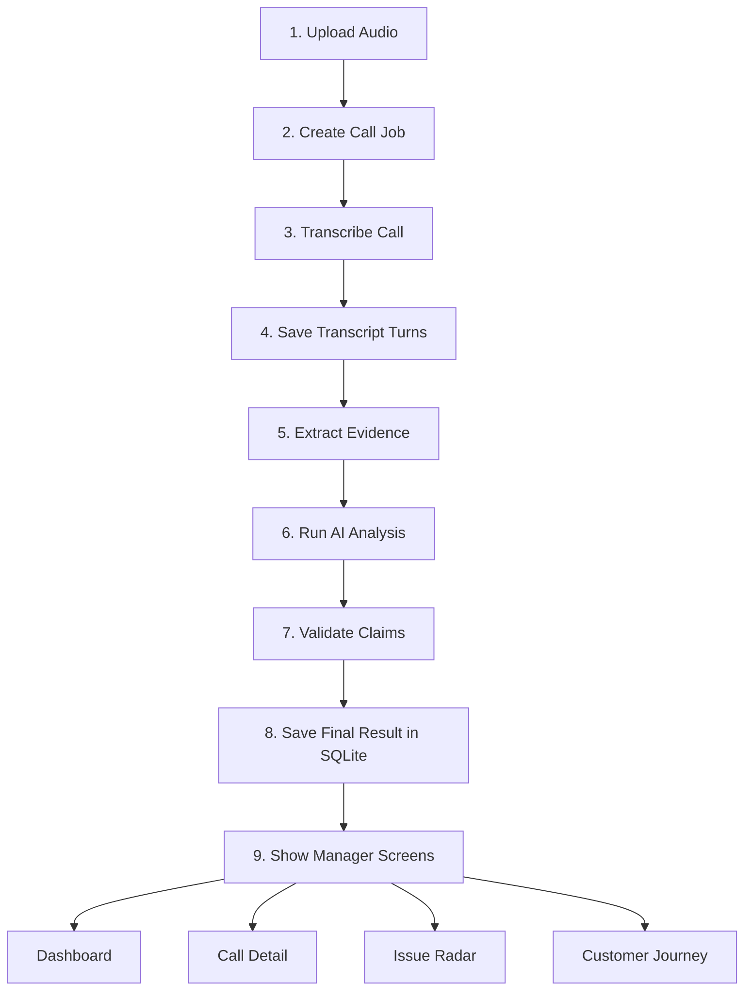

# Call Center Radar

Call Center Radar is an evidence-first call intelligence POC for support and operations teams. It turns call recordings into manager-ready insights with traceable evidence, synchronized audio and transcript playback, and clear recommended actions.

## POC Goal

Build a fast, defensible demo that answers:

- Which calls need manager attention right now
- Why the system flagged that call
- What exact transcript and audio evidence supports the decision
- What recurring issues are appearing across calls

## Project Objective

The project objective is to build a proof-of-concept call intelligence system that can process support-call recordings, identify the calls that need manager attention, explain every important AI judgment with transcript and audio evidence, and present the result in a simple operations dashboard.

For this POC, success means:

- a new call can be uploaded and processed
- the manager can open one call and understand what happened quickly
- every major conclusion can be traced back to real call evidence
- the team can demonstrate both business value and technical defensibility

## Sample Data

The current sample dataset lives in `callradar-data` and contains:

- `1441` audio files in `audio/`
- `1441` metadata JSON files in `metadata/`
- one metadata record per call, matched by call ID

Sample metadata includes:

- agent name
- caller name
- call start and end timestamps
- agent and caller speaker IDs
- survey response timing
- quality labels such as `caller_mos`, `agent_mos`, and `lhvb_script`

This sample set is used for:

- initial pipeline development
- transcript and evidence testing
- dashboard demonstrations
- evaluation and regression checks before the live demo

Tracked repo asset locations:

- sample dataset: `sample-data/callradar-data/`
- project objective PDF: `reference/Call_Centre_Radar_1.pdf`

## Core POC Principles

- Trust: every important AI judgment must link back to transcript turns and audio evidence
- Speed: a new audio file can be uploaded and processed during the demo
- Action: managers see a brief, a score, a reason, and the next likely action
- Simplicity: SQLite for the POC, local-first workflow, and modular services

## Main POC Features

- Audio upload and processing job tracking
- Transcript persistence with immutable `transcript_turn_id`
- Call Detail screen with synced audio and transcript
- Evidence-backed intent, mood, resolution, and summary
- Manager brief and recommended action
- Radar Priority score with visible score breakdown
- Show Me Why evidence flow with jump-to-audio
- Issue Radar for repeated operational issues
- Customer Journey for repeat callers
- Agent treatment and satisfaction support signals

## POC Architecture



Architecture reading guide:

- Steps 1 to 8 are the processing pipeline
- Step 9 is where the manager sees the result
- Dashboard, Call Detail, Issue Radar, and Customer Journey all read from the same validated stored result

## POC Abstract Flow

1. A user uploads a call recording.
2. The system creates a processing job and validates the audio.
3. The call is transcribed into speaker turns with timestamps.
4. A deterministic evidence layer finds candidate signals.
5. An LLM produces structured call analysis.
6. A validator rejects unsupported claims.
7. The final result is stored and shown in the manager dashboard and Call Detail view.

## Build Strategy

This POC is designed for two contributors working on vertical feature slices.

- One contributor starts with setup and base workflow
- After setup, both contributors work on full-stack feature units
- Stories are prioritized by demo value and testability, not by frontend/backend ownership

Detailed planning lives in:

- `docs/Implementation_Backlog_Plan.md`
- `docs/wiki/Home.md`
- `docs/wiki/Architecture-and-Delivery-Plan.md`
- `docs/Git_Flow.md`

## Suggested Initial Scope

Must-have POC scope:

1. Upload and job pipeline
2. Call Detail with audio and transcript sync
3. Evidence-backed AI analysis for a single call
4. Radar Priority and Show Me Why
5. Manager dashboard ranked queue
6. Logging, tests, and demo fallback path

Stretch scope:

- Issue Radar
- Customer Journey
- Agent treatment and satisfaction views

## Tech Direction

- Database: SQLite for the POC
- Transcription: free local `faster-whisper` `base.en` model, with stereo channel attribution
- Analysis: free local Ollama LLM reasoning plus deterministic evidence validation
- Validation: every displayed claim must resolve to real transcript evidence
- Deployment: local demo first, lightweight hosting only where useful

## Local Transcription Setup

The POC transcribes MP3 and WAV recordings locally. No paid transcription API or external LLM is used in this step.

Prerequisites:

- Python 3.12
- Node 20+
- FFmpeg and FFprobe available on `PATH`

From the repository root:

```bash
python3 -m venv .venv
./.venv/bin/pip install -e 'apps/api[dev]'
npm ci
npm run dev
```

The first call processed downloads the free `base.en` model once. Processing a stereo recording uses the left channel as `agent` and right channel as `customer` by default; set `CALL_RADAR_STEREO_LEFT_SPEAKER` and `CALL_RADAR_STEREO_RIGHT_SPEAKER` to change that mapping. Mono recordings are intentionally stored as `unknown` speaker until diarization is implemented.

For a live check, upload an MP3 or WAV recording, select **Transcribe call**, then open Call Detail. The persisted timestamped transcript can be searched, filtered, and played from any turn.

## Local AI Analysis Setup

Call analysis runs on this Mac through Ollama. It is free for the POC and does not send transcript text to a paid cloud provider. Install Ollama once, then download the default analysis model:

```bash
brew install ollama
ollama serve
ollama pull qwen2.5:7b
```

Keep `ollama serve` running before starting the API. The API sends structured, timestamped transcript turns to `http://127.0.0.1:11434`, asks the local model for strict JSON, then rejects any claim or mood shift whose turn ID, quote, or timestamps do not exactly match saved SQLite transcript data. It never falls back to keyword heuristics. If Ollama is unavailable, analysis returns a retriable `503` and existing saved analysis remains unchanged.

Optional settings: `CALL_RADAR_OLLAMA_BASE_URL`, `CALL_RADAR_OLLAMA_MODEL`, and `CALL_RADAR_ANALYSIS_TIMEOUT_SECONDS`. The default model is `qwen2.5:7b`.

## Run Locally

Start both the web app and the API together with the single runner:

```bash
npm run dev
```

That starts:

- the web app on Vite
- the API server on `http://127.0.0.1:8000`

The runner is cross-platform and works on macOS, Linux, and Windows as long as the
project virtual environment exists at `./.venv`.

If you want to run them separately:

```bash
npm run dev:web
```

```bash
npm run dev:api
```

## Build

To build the web app:

```bash
npm run build
```

## Test

Run the full test suite:

```bash
npm run test
```

Run lint checks:

```bash
npm run lint
```

Run formatting checks:

```bash
npm run format:check
```

## Database Setup

The POC uses SQLite.

If you need to prepare or seed the local database, use:

```bash
npm run db:migrate
```

```bash
npm run db:seed
```

## Demo Flow

The intended demo flow is:

1. Open the app in the browser
2. Upload a call recording
3. Watch the processing job complete
4. Open the Call Detail page
5. Review the transcript, evidence, and manager recommendations
6. Jump between evidence and audio timestamps

## Project Focus

This repo is built around three POC goals:

- Trust: every important AI judgment must point back to saved transcript evidence
- Speed: new recordings can be processed during the demo
- Action: managers get a clear brief, a score, and a recommended next step

## Helpful Docs

- [Engineering Governance](docs/Engineering_Governance.md)
- [Git Flow](docs/Git_Flow.md)
- [Implementation Backlog Plan](docs/Implementation_Backlog_Plan.md)
- [Wiki Home](docs/wiki/Home.md)

## Repository Notes

This repo is for the office POC effort. The current delivery focus is speed, explainability, and demo reliability rather than production scale.
