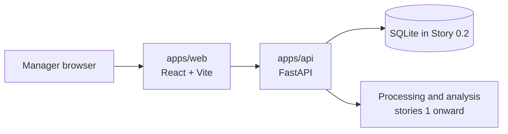

# Developer Notes

## Story 0.1 Bootstrap

This repository is a small monorepo for a fast, evidence-first POC. It keeps the web application and API separate while allowing each story to deliver a complete vertical slice.



### Repository layout

```text
apps/
  web/                 React manager UI
  api/                 FastAPI application
    src/app/           API modules by feature
docs/                  architecture, delivery, and developer guidance
sample-data/           demo assets; never mutate original samples
reference/             requirement and objective PDFs
```

### Local setup

Prerequisites: Node 20.15+ with npm 10.7+, and Python 3.12+.

```bash
npm install
python3 -m venv .venv
./.venv/bin/pip install -e 'apps/api[dev]'
cp .env.example .env
npm run dev
```

The manager UI runs at `http://localhost:5173`. The API runs at `http://localhost:8000/api`.

Use the full quality gate before opening a PR:

```bash
npm run lint
npm run format:check
npm run test
npm run build
```

### Architectural rules

- Keep stories vertical: UI, API, persistence, logs, and tests belong together when they are needed for a user-visible outcome.
- Keep product logic in feature modules, not in route handlers or React page components.
- Treat saved transcript turns as immutable evidence. AI output may reference a `transcript_turn_id`; it may not invent a timestamp or quote.
- SQLite is the only POC database. Add migrations and database bootstrap in Story 0.2.
- Do not call paid AI services from default development or demo flows. Model providers must stay behind an interface so local and paid options can be compared later.
- Do not log raw audio, customer PII, access tokens, or full transcripts unless an explicit later story defines a redaction policy.

### Story ownership and handoff

Start every story from updated `development` using a focused `feature/story-x.y-description` branch. Keep commits scoped to the issue and open a PR into `development`.

When implementing a story, add a short developer note to its PR containing:

- what user-visible behavior changed
- API contract and stored data changes
- logs introduced and redaction considerations
- tests run and gaps
- how to demonstrate it with a sample or a newly uploaded audio file

## Story 0.2: Core developer workflow

Story 0.2 makes the local POC state repeatable. It adds a SQLite database, versioned migrations, a metadata-only seed path, JSON-safe lifecycle logs, and a health endpoint.

```bash
# Create or upgrade the local database.
npm run db:migrate

# Seed five bundled sample metadata records. Audio is never copied or read.
npm run db:seed

# Verify the live API after npm run dev.
curl http://127.0.0.1:8000/api/health
```

Configuration is local and optional. Copy `.env.example` to `.env`, then set `CALL_RADAR_DATABASE_PATH` only when you need a different SQLite file. Do not commit `.env` or generated files under `data/`.

Operational logs are JSON lines written to standard output. They report lifecycle, migration, and seed events only; raw audio, full transcripts, customer names, and tokens must not be logged.

### Next boundaries

- Story 0.3 owns coverage thresholds, CI workflow, and pre-commit automation.
- Story 1.1 owns the first manager upload workflow and may extend `apps/web/src` and `apps/api/src/app` together.
