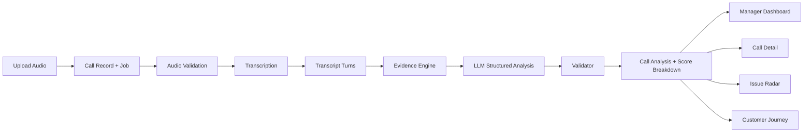
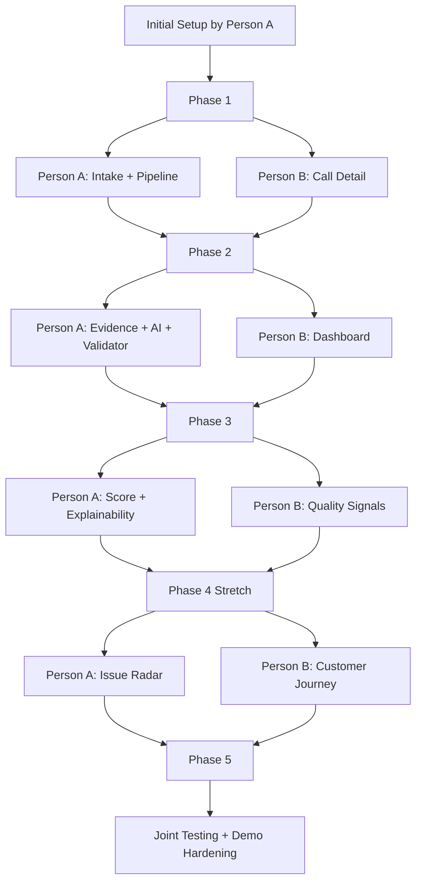
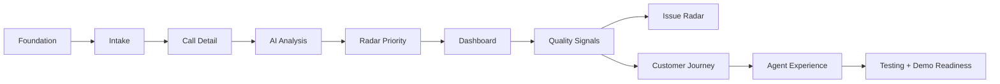

# Call Center Radar POC Implementation Backlog

## Working Model

This POC should be built through vertical, testable feature slices rather than splitting people into frontend-only and backend-only roles.

Principles:

- One story owns UI, API, persistence, and tests for a user-visible feature.
- Both contributors should be able to work across the stack after the initial setup is complete.
- Features should end in a demoable result, not a partial technical layer.
- We optimize for fast integration, daily progress, and low merge conflict risk.

## Delivery Model for Two People

One person starts with the initial project setup. After that, both contributors work on independent feature slices that are small enough to build, test, and verify end to end.

Recommended rule:

- One story = one testable feature unit
- No long-lived UI-only or backend-only ownership
- Each feature should include acceptance checks and logs

## Priority Order

1. Foundation and repo setup
2. Call ingestion and processing pipeline skeleton
3. Call Detail screen with transcript and audio sync
4. Evidence-backed AI analysis for one call
5. Manager dashboard with ranked queue
6. Score breakdown and Show Me Why
7. Logging, tests, and accuracy checks
8. Issue Radar
9. Customer Journey
10. Agent treatment and satisfaction view
11. Demo hardening and fallback flows

## Epic Breakdown

### Epic 0: Project Foundation

Goal: get both contributors unblocked quickly.

#### Story 0.1: Monorepo and app bootstrap

Tasks:

- Initialize project structure
- Set up frontend app
- Set up backend app
- Set up shared environment and config
- Set up lint, format, and test scripts
- Set up branch strategy and PR flow

#### Story 0.2: Core developer workflow

Tasks:

- SQLite bootstrap
- Migration setup
- Seed and sample data structure
- Logging baseline
- Health endpoint
- README with run steps

#### Story 0.3: CI baseline

Tasks:

- Unit test runner
- Coverage reporting
- Basic build checks
- Pre-commit or equivalent checks

Done when:

- both contributors can pull, run, test, and ship one feature independently

### Epic 1: Call Intake and Job Pipeline

Goal: accept audio and track processing.

#### Story 1.1: Upload and register call

Tasks:

- Upload UI
- Metadata form
- Save file reference
- Create call record
- Create processing job record
- Show job status

#### Story 1.2: Processing pipeline skeleton

Tasks:

- Job queue flow
- Audio validation
- Stereo and mono detection
- Processing states: queued, transcribing, analyzing, completed, failed
- Persist job events

#### Story 1.3: Transcript persistence

Tasks:

- Transcript turn schema
- Save speaker turns with timestamps
- Store immutable `transcript_turn_id`
- Load transcript by call

Done when:

- a new call can be uploaded and the system shows a persisted processing result skeleton

### Epic 2: Call Detail Core Experience

Goal: build the main proof screen first.

#### Story 2.1: Call Detail page shell

Tasks:

- Call header
- Audio player
- Transcript pane
- Evidence pane placeholder
- Processing state UI

#### Story 2.2: Audio and transcript sync

Tasks:

- Play and pause
- Current timestamp
- Jump to transcript turn
- Jump from transcript and evidence to audio time
- Highlight active turn while playing

#### Story 2.3: Transcript usability

Tasks:

- Speaker labels
- Timestamps
- Search and filter in transcript
- Scroll to active turn

Done when:

- we can open a call and clearly inspect the recording with synced transcript

### Epic 3: Evidence Engine and Single Call AI Analysis

Goal: produce trusted analysis for one call.

#### Story 3.1: Deterministic evidence extraction

Tasks:

- Detect candidate evidence turns
- Extract timestamps and quotes
- Rule hooks for unresolved and problem phrases
- Evidence link model

#### Story 3.2: Structured LLM analysis

Tasks:

- Prompt contract
- JSON schema
- Intent
- Mood
- Resolution
- Summary
- Manager brief
- Recommended action

#### Story 3.3: Validation layer

Tasks:

- JSON validation
- Quote must exist
- Turn ID must exist
- Timestamp derived from transcript turn
- Reject unsupported claims

Done when:

- one call returns explainable, evidence-backed analysis

### Epic 4: Radar Priority and Explainability

Goal: rank calls and justify the ranking.

#### Story 4.1: Attention score engine

Tasks:

- Score factors
- Weights
- Score calculation
- Breakdown persistence

#### Story 4.2: Show Me Why

Tasks:

- Link each factor to transcript turn
- Evidence drawer
- Audio jump
- Claim-to-evidence traceability

Done when:

- a reviewer can ask why a score is high and we can show the exact evidence

### Epic 5: Manager Dashboard

Goal: give managers a simple first screen.

#### Story 5.1: Today view

Tasks:

- Top KPIs
- Needs attention queue
- Simple labels
- Risk states

#### Story 5.2: Ranked call list

Tasks:

- Sort by Radar Priority
- Resolution status
- Mood and risk badges
- Open call detail

Done when:

- a manager can land on the dashboard and know what needs attention in under 10 seconds

### Epic 6: Quality Signals

Goal: add a few high-value POC differentiators.

#### Story 6.1: False resolution

Tasks:

- Detect resolved language that is contradicted later
- Evidence-backed rule
- Show only if validated

#### Story 6.2: Repeated questions

Tasks:

- Repeated info request detection
- Evidence events

#### Story 6.3: Silence and balance

Tasks:

- Silence windows
- Agent and customer talk ratio
- Display with evidence and timing

Done when:

- we have 2 to 3 quality signals that feel useful and defensible

### Epic 7: Issue Radar

Goal: move from single-call insight to operational trend insight.

#### Story 7.1: Issue grouping

Tasks:

- Issue categories
- Group calls by category
- Trend direction logic

#### Story 7.2: Issue Radar UI

Tasks:

- Critical, emerging, and stable groups
- Representative evidence
- Open related calls

Done when:

- we can show recurring business issues, not just call summaries

### Epic 8: Customer Journey

Goal: show repeat-caller history.

#### Story 8.1: Customer history model

Tasks:

- Link calls to customer
- Sequence prior calls
- Summarize repeated issue trail

#### Story 8.2: Customer Journey UI

Tasks:

- Timeline
- Mood and outcome progression
- Repeat issue marker
- Open prior call

Done when:

- we can demonstrate repeat contact and worsening experience

### Epic 9: Agent Experience

Goal: show staff treatment and satisfaction view.

#### Story 9.1: Agent treatment signals

Tasks:

- Abusive or rude language flags
- Escalation and stress indicators
- Evidence links

#### Story 9.2: Agent summary page

Tasks:

- Calls handled
- Difficult calls
- Estimated satisfaction
- Support and coaching framing

Done when:

- we can show service-person treatment as a differentiator

### Epic 10: Observability, Testing, and Accuracy

Goal: make the POC stable and defensible.

#### Story 10.1: Logs and traceability

Tasks:

- Request and job IDs
- Model version
- Rule version
- Validation result
- Failure reasons

#### Story 10.2: Unit tests

Tasks:

- Score engine
- Validator
- Evidence matching
- API schema
- Job status transitions

#### Story 10.3: Accuracy evaluation

Tasks:

- Gold call sample
- Manual labels
- Intent, resolution, and evidence evaluation
- Demo scorecard

Done when:

- we can answer how we know it works with something concrete

### Epic 11: Demo Readiness

Goal: polish what judges will actually see.

#### Story 11.1: Demo flow

Tasks:

- Upload new audio
- Show processing timeline
- Open result
- Click evidence
- Jump audio

#### Story 11.2: Fallback plan

Tasks:

- Preprocessed backup calls
- Health check page
- Error states
- Demo-safe sample set

Done when:

- the demo can survive slow inference or a bad upload

## Two-Person Execution Plan

### Phase 0: Initial setup

Owner:

- Person A only

Scope:

- Epic 0
- Repo, app bootstrap, DB, test scaffolding, CI, env, health check

### Phase 1: First parallel split

Person A:

- Epic 1
- Upload, job pipeline, transcript persistence

Person B:

- Epic 2
- Call Detail UI and audio/transcript sync with mock data first

### Phase 2: Second parallel split

Person A:

- Epic 3
- Evidence engine, LLM analysis, validator

Person B:

- Epic 5
- Manager dashboard and ranked queue using seeded or mock analysis

### Phase 3: Third parallel split

Person A:

- Epic 4 and Story 10.1
- Score engine, breakdown, show-me-why data model, logs

Person B:

- Epic 6
- False resolution, repeated questions, silence and balance UI and API

### Phase 4: Stretch features

Person A:

- Epic 7
- Issue Radar

Person B:

- Epic 8
- Customer Journey

### Phase 5: Final polish

Both:

- Epic 10.2
- Epic 10.3
- Epic 11

## Must-Have POC Scope

If time is very tight, the must-have slice is:

1. Setup
2. Upload and job pipeline
3. Call Detail with audio/transcript sync
4. Evidence-backed intent, mood, resolution, and summary
5. Manager brief and recommended action
6. Radar Priority and score breakdown
7. Dashboard ranked queue
8. Logs, basic tests, and demo fallback

Everything after that is stretch scope.

## Definition of Done for Each Story

Each story should include:

- UI
- Backend or API
- Persistence if needed
- Tests
- Logging
- Acceptance scenario
- Demo-ready state

## Recommended Initial GitHub Epic Breakdown

1. `Epic: Foundation and developer workflow`
2. `Epic: Call intake and processing pipeline`
3. `Epic: Call Detail core experience`
4. `Epic: Evidence-backed AI analysis`
5. `Epic: Radar Priority and Show Me Why`
6. `Epic: Manager dashboard`
7. `Epic: Quality signals`
8. `Epic: Issue Radar`
9. `Epic: Customer Journey`
10. `Epic: Agent experience`
11. `Epic: Observability, testing, and accuracy`
12. `Epic: Demo readiness`

## Delivery Diagrams

### Architecture

### Two-Person Delivery

### Delivery Priority

