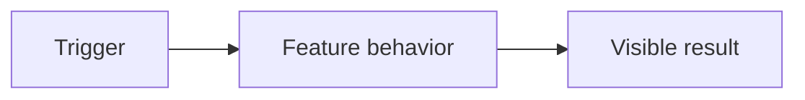

# Story X.Y: Title

**GitHub issue:** #TBD

**Status:** Backlog | In Progress | In Review | Done

**Owner:** TBD

**Epic:** TBD
**Last updated:** YYYY-MM-DD

## 1. Outcome

### User-Visible Goal

Describe the manager, agent, or developer outcome in one short paragraph.

### Scope

- Included:
- Excluded:

### Acceptance Criteria

- [ ] Criterion copied from the GitHub story.

## 2. Design

### Flow

### Components and Ownership

| Area | Files or module | Responsibility |
| --- | --- | --- |
| UI | `TBD` | TBD |
| API | `TBD` | TBD |
| Persistence | `TBD` | TBD |
| Tests | `TBD` | TBD |

### Contracts and Data

Record API request and response changes, database migration or schema changes, immutable evidence references, and configuration values. Write `Not applicable` where none exist.

## 3. Operational Behavior

### Logging and Privacy

State event names, useful diagnostic fields, and excluded sensitive data. Raw audio, full transcripts, customer PII, and secrets must never be logged unless an approved redaction policy is linked here.

### Failure and Recovery

Describe expected error states, user feedback, retry or fallback behavior, and how a developer can diagnose or recover.

## 4. Verification

### Automated Tests

| Check | Result | Notes |
| --- | --- | --- |
| Unit tests | TBD | TBD |
| Integration tests | TBD | TBD |
| Lint and format | TBD | TBD |
| Build | TBD | TBD |
| Accuracy evaluation | TBD | Not applicable until analysis stories |

### Manual Verification and Demo Path

1. TBD

### Known Gaps and Follow-Up Boundaries

- TBD

## 5. Delivery Record

- Branch: `feature/story-x.y-short-name`
- Pull request: TBD
- Commit(s): TBD
- Review result: TBD
