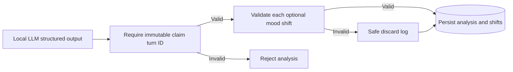

# Bug 85: Canonical Evidence Derivation Recovery

**GitHub issue:** [#85](https://github.com/vrize-poc-demo/call-center-radar/issues/85)

**Status:** In Review

**Owner:** Vipin

**Epic:** Evidence-backed AI analysis
**Last updated:** 2026-08-23

## 1. Outcome

### User-Visible Goal

A manager can open Call Detail after a successful transcription when the local
LLM returns a real transcript ID with a shortened duplicate quote or timestamp.
The API derives evidence from the immutable turn; unsupported optional shifts
remain hidden instead of blocking the valid core analysis.

### Scope

- Included: canonical evidence derivation for known IDs, selective recovery for
  invalid optional mood shifts, safe logs, API regression tests, and developer
  documentation.
- Excluded: accepting unknown required IDs, inventing replacement evidence,
  retrying the model, or changing mood-label semantics.

### Acceptance Criteria

- [x] Required unknown claim IDs remain strictly rejected.
- [x] Known claim IDs derive canonical quote and timing from immutable turns.
- [x] Invalid optional mood shifts are discarded rather than persisted.
- [x] The valid analysis returns HTTP 200 with the normal no-shift state.
- [x] Logs include count and stable reasons but no transcript content.
- [x] Unit and integration tests cover the recovered path.

## 2. Design

`derive_claim_evidence` requires each claim's immutable turn ID and replaces
model-provided quote/timing copies with saved values. `filter_valid_mood_shifts`
applies the same derivation to optional events, then discards unsupported
shifts. No transcript text is added to logs.

## 3. Verification

| Check | Result | Notes |
| --- | --- | --- |
| Regression tests | Passed | Known-ID quote/timing derivation, unknown-ID rejection, and optional-shift recovery. |
| Full quality gate | Passed | 68 API tests, 29 web tests, lint, format, and production build passed. |
| Manual reproduction | Passed | Call `206b7a74c8274a3597ce44ffd3839c34` now returns HTTP 200 with canonical evidence. |

## 4. Delivery Record

- Branch: `fix/bug-85-canonical-evidence`
- Pull request: [#86](https://github.com/vrize-poc-demo/call-center-radar/pull/86)
  (targets `development`; human merge only)
- Commit(s): `ec68528` - canonical evidence derivation and regression coverage;
  `f148624` - branch and delivery record.

### Change Log

| Commit | What changed | Why |
| --- | --- | --- |
| `ec68528` | Derived evidence from immutable IDs, recovered optional shifts, and added regressions. | Keep unknown IDs fail-closed while preventing model-owned duplicate fields from blocking manager analysis. |
| `ec68528` | Re-ran the complete quality gate and the exact manual local-model call. | Confirm the recovered API path is not only unit-tested but usable in Call Detail. |
| `f148624` | Rebased the bug fix onto merged `development` after PR #84 landed. | Keep the bug fix independent, reviewable, and compliant with the repository Git flow. |
| Pending | Opened PR #86 and confirmed its GitHub Quality Gates passed. | Hand Bug #85 to human review only after independent repository checks complete. |
