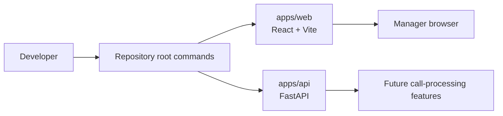

# Story 0.1: Monorepo and App Bootstrap

**GitHub issue:** [#13](https://github.com/vrize-poc-demo/call-center-radar/issues/13)

**Status:** Done

**Owner:** Vipin

**Epic:** Foundation and developer workflow
**Last updated:** 2026-08-21

## 1. Outcome

### User-Visible Goal

Give both contributors one predictable local starting point for the POC: a manager web application, an API service, shared commands, and a branch/PR workflow. This is developer-facing infrastructure; it establishes the surface on which later manager-facing vertical slices are delivered.

### Scope

- Included: React/Vite web application, FastAPI application, root workspace scripts, environment example, linting, formatting, initial tests, build command, and Git flow guidance.
- Excluded: call upload, persistence, transcription, AI analysis, manager dashboard, and production deployment.

### Acceptance Criteria

- [x] A contributor can install dependencies and start the web application and API locally.
- [x] Lint, formatting, test, and build commands are available from the repository root.
- [x] The codebase has a focused feature-branch and pull-request workflow.

## 2. Design

### Flow

### Components and Ownership

| Area | Files or module | Responsibility |
| --- | --- | --- |
| UI | `apps/web` | React manager application shell and web test runner. |
| API | `apps/api/src/app` | FastAPI application factory and API entry point. |
| Tooling | `package.json`, `.nvmrc`, `.prettierignore` | Root developer commands and pinned Node runtime. |
| Configuration | `.env.example` | Safe local configuration starting point. |
| Tests | `apps/web/src/bootstrap.test.ts`, `apps/api/tests` | Bootstrap-level web and API verification. |

### Contracts and Data

The API exposes its initial service root under `/api`. No business API contract, call record, transcript, or database schema belongs to this story. Those were intentionally deferred so Story 0.2 could introduce SQLite with migrations rather than unversioned local state.

## 3. Operational Behavior

### Logging and Privacy

This story adds no domain logging and does not read audio or customer data. The project rule established here is that logs must exclude raw audio, full transcripts, customer PII, and secrets.

### Failure and Recovery

If local startup fails, the developer follows the documented prerequisite versions, recreates `.venv`, reruns the editable API install, and checks the root quality commands. The application itself has no call-processing retry behavior yet.

## 4. Verification

### Automated Tests

| Check | Result | Notes |
| --- | --- | --- |
| Web bootstrap test | Passed | Confirms the root React component is available. |
| API test suite | Passed | Confirms the initial FastAPI application behavior. |
| Lint and format | Passed | Root commands validate web and API code. |
| Build | Passed | Vite production build completes. |
| Accuracy evaluation | Not applicable | No AI or quality decision exists. |

### Manual Verification and Demo Path

1. Run `npm run dev`.
2. Open `http://localhost:5173` to show the manager application shell.
3. Open `http://localhost:8000/api` to show the API is reachable.
4. Explain that later stories add call evidence and manager workflows without changing the contributor entry point.

### Known Gaps and Follow-Up Boundaries

- Story 0.2 owns SQLite, migrations, seed data, lifecycle logs, and the health endpoint.
- Story 0.3 owns CI, coverage reporting, and local pre-commit automation.
- Product behavior begins in Story 1.1; this story intentionally contains no manager workflow.

## 5. Delivery Record

- Branch: `feature/story-0.1-monorepo-app-bootstrap`
- Pull request: [#43](https://github.com/vrize-poc-demo/call-center-radar/pull/43)
- Commit(s): `b5d1135`, `6fc4136`
- Review result: Merged into `development`
