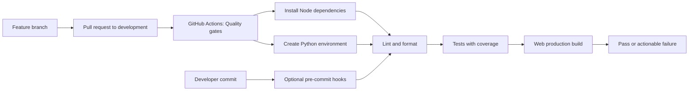

# Story 0.3: CI Baseline

**GitHub issue:** [#15](https://github.com/vrize-poc-demo/call-center-radar/issues/15)

**Status:** In Review

**Owner:** Vipin

**Epic:** Foundation and developer workflow
**Last updated:** 2026-08-21

## 1. Outcome

### User-Visible Goal

Give contributors and reviewers immediate, consistent feedback that a branch can be safely merged into `development`. The CI baseline runs the same essential checks on every pull request and records an initial coverage measurement, while optional local hooks catch simple regressions before a commit is pushed.

### Scope

- Included: GitHub Actions workflow, clean dependency installation, lint, formatting, coverage-enabled tests, web build, local pre-commit hooks, generated-report exclusions, and developer instructions.
- Excluded: mandatory coverage thresholds, test-quality scoring, deployment, release automation, and production monitoring.

### Acceptance Criteria

- [x] CI automatically runs tests and build checks for pull requests into `development` and changes merged there.
- [x] CI step names make failures easy to identify and act on.
- [x] The workflow remains lightweight for rapid POC iteration.
- [x] Contributors can run the same core checks locally and optionally install commit-time checks.

## 2. Design

### Flow



### Components and Ownership

| Area | Files or module | Responsibility |
| --- | --- | --- |
| CI | `.github/workflows/ci.yml` | Runs named quality gates for PRs and `development` pushes. |
| Root commands | `package.json` | Exposes test coverage and pre-commit installation commands. |
| Web tests | `apps/web/package.json`, `eslint.config.js` | Runs Vitest V8 coverage and ignores generated reports. |
| API tests | `apps/api/pyproject.toml` | Supplies `pytest-cov` and pre-commit as development tools. |
| Local hooks | `.pre-commit-config.yaml` | Runs lint, formatting, and fast tests before a commit. |
| Documentation | `docs/Developer_Notes.md`, `docs/stories` | Explains project rules and per-story delivery records. |
| Governance | `AGENTS.md`, `docs/Engineering_Governance.md`, PR template | Enforces the feature-branch, documentation, verification, and human-merge workflow. |

### Contracts and Data

No manager API, persistence schema, or runtime configuration changes are introduced. New root commands are:

```bash
npm run test:coverage
npm run precommit:install
```

Web reports are generated under `apps/web/coverage/`; API XML is generated at `coverage/api-coverage.xml`; Python also generates `.coverage`. All three are explicitly ignored. CI uses `.nvmrc`, Node 20.15, Python 3.12, `npm ci`, and an isolated `.venv` to keep the result reproducible.

## 3. Operational Behavior

### Logging and Privacy

GitHub Actions uses explicit step names: checkout, Node setup, Python setup, install, lint, format, tests with coverage, and build. Output is limited to dependency and quality-check diagnostics. The workflow neither reads sample audio nor emits call records, full transcripts, customer PII, secrets, or tokens.

### Failure and Recovery

A failed quality gate blocks a clean merge until the feature branch is corrected and pushed again. A contributor reproduces the failed named command locally using the documented quality gate. If a local hook cannot be installed because of workstation permissions, the developer can still run `./.venv/bin/pre-commit run --all-files`; CI remains the authoritative merge check. Generated reports can be discarded safely because they are recreated on the next run.

## 4. Verification

### Automated Tests

| Check | Result | Notes |
| --- | --- | --- |
| `npm run lint` | Passed | ESLint and Ruff passed. |
| `npm run format:check` | Passed | Prettier and Ruff format checks passed. |
| `npm run test:coverage` | Passed | 1 web test and 3 API tests passed; API baseline coverage is 79%. |
| `npm run build` | Passed | Vite production build completed. |
| `pre-commit run --all-files` | Passed | Lint, format, and fast test hooks passed. |
| GitHub Actions quality gate | Passed | PR #45 completed successfully in 51 seconds. |
| Accuracy evaluation | Not applicable | This story makes no call-quality or AI decision. |

The bootstrap web UI currently has one smoke test, so its coverage measurement is intentionally low. This story exposes that gap rather than disguising it. Story 10.2 owns coverage thresholds and the broader test strategy.

### Manual Verification and Demo Path

1. Open [PR #45](https://github.com/vrize-poc-demo/call-center-radar/pull/45) and show the successful `Quality gates` check.
2. Run `npm run test:coverage` locally to show both web and API coverage output.
3. Run `./.venv/bin/pre-commit run --all-files` to show the same local pre-commit checks.
4. Explain that a new call-analysis feature must pass this gate before it reaches `development`.

### Known Gaps and Follow-Up Boundaries

- Story 10.2 owns the 100% unit-test target, coverage threshold, test layers, and enforcement policy.
- Story 10.3 owns analysis-accuracy evaluation against labeled calls.
- The initial GitHub workflow is intentionally a single fast quality job; deployment, security scanning, and release automation are outside this POC story.

## 5. Delivery Record

- Branch: `feature/story-0.3-ci-baseline`
- Pull request: [#45](https://github.com/vrize-poc-demo/call-center-radar/pull/45)
- Commit(s): `1469dc8`
- Review result: Draft PR open; GitHub Actions quality gate passed

### Change Log

| Commit | What changed | Why |
| --- | --- | --- |
| `1469dc8` | Added GitHub Actions, coverage reporting, and local pre-commit checks. | Establish a repeatable CI baseline before product stories start. |
| `4ce3215` | Added separate documentation records and the required story template. | Make each story independently auditable and easy to hand over. |
| Pending | Added repository governance, PR template, and readiness verifier. | Make the agreed Git flow, human merge boundary, and pre-review checks repeatable for all contributors. |

### PR Readiness and Review

- Mergeability verification: Passed before the governance update; rerun after this commit is pushed.
- Code quality grade: A. Focused implementation, clear authority boundary, explicit workflow, and no manager-facing regression.
- Testing quality grade: B. The verifier was exercised against a live clean PR and the full quality gate passed; automated negative-case fixtures for GitHub CLI responses remain a follow-up.
- Review findings and follow-up: No blocking finding. Add fixture-driven tests for wrong base branch, missing checks, and conflict states if the verifier grows beyond this POC.
