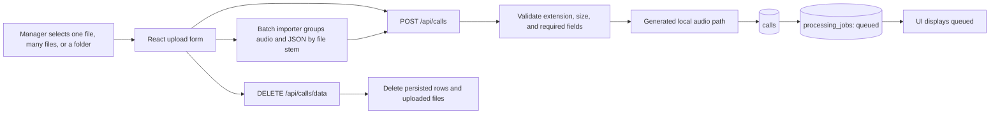

# Story 1.1: Upload and Register Call

**GitHub issue:** [#16](https://github.com/vrize-poc-demo/call-center-radar/issues/16)

**Status:** In Progress

**Owner:** Susmitha

**Epic:** Call intake and processing pipeline
**Last updated:** 2026-08-27

## 1. Outcome

### User-Visible Goal

A manager can upload one call, many calls, or an entire sample folder of MP3/WAV and Call Radar JSON files, then immediately see each call registered with a queued processing job. A manager can also clear all stored call data for a clean demo reset.

### Scope

- Included: MP3/WAV and Call Radar JSON metadata upload form, batch import of multiple files or a folder, API validation, local generated-name audio/metadata storage, call and queued-job persistence, safe registration logs, immediate UI status, clear-all reset, and focused tests.
- Excluded: audio inspection, transcription, speaker detection, job execution, retries, job-event history, transcript persistence, and AI analysis.

### Acceptance Criteria

- [x] A supported audio file can be uploaded with the required metadata.
- [x] Multiple supported audio or metadata files can be imported in one batch.
- [x] The system creates linked call and processing job records.
- [x] The UI shows the initial job status immediately after submission.
- [x] Stored call data can be cleared from SQLite and the uploaded file store.

## 2. Design

### Flow

### Components and Ownership

| Area | Files or module | Responsibility |
| --- | --- | --- |
| UI | `apps/web/src/features/calls/CallUploadForm.tsx` | Captures single-call uploads, batch imports, folder imports, and clear-all reset state. |
| Web API client | `apps/web/src/api/calls.ts` | Sends multipart data, batch reset requests, and exposes typed responses. |
| API | `apps/api/src/app/calls.py` | Validates and registers uploads, exposes a clear-all endpoint, and keeps persistence local. |
| Persistence | `migrations/002_upload_jobs.sql` | Adds the minimal linked `processing_jobs` record. |
| Configuration | `config.py`, `.env.example` | Defines local upload directory and maximum upload size. |
| Tests | `apps/api/tests/test_calls.py`, `apps/web/src/features/calls/CallUploadForm.test.tsx` | Covers successful registration, batch import, clear-all behavior, and safe rejection paths. |

### Contracts and Data

`POST /api/calls` accepts `audio`, editable `agent_name`/`customer_name`, and optional `metadata`. A `.json` Call Radar export containing `agent.metadata.agent_name` and `caller.metadata["first and last name"]` fills the UI fields and becomes the submitted source when present. Without metadata, the entered names are required. It returns HTTP 201 with generated `call_id`, `job_id`, and `status: "queued"`. The service accepts `.mp3` and `.wav` files and an optional JSON metadata file up to `CALL_RADAR_MAX_UPLOAD_BYTES`, stores files under generated IDs, and records either the metadata path or a `manual://` source marker in `source_metadata_path`.

`DELETE /api/calls/data` clears persisted call rows, processing rows, analysis rows, trace rows, and uploaded files from the local SQLite-backed store.

## 3. Operational Behavior

### Logging and Privacy

Events are `call_upload_received`, `call_upload_rejected`, `call_registered`, and `call_data_cleared`. Registration logs contain only technical IDs and validation status codes. They exclude original filenames, audio bytes, agent/customer names, and other PII. Clear-all logs record only deleted-row counts and removed-file counts.

### Failure and Recovery

Unsupported, empty, oversized, or malformed metadata files return a clear 4xx response and create no database records. If persistence fails after files are written, both generated local files are removed before the error is propagated. Orphaned files after a process crash can be removed manually from the ignored upload directory. The clear-all endpoint removes stored rows and upload files together so the demo can be reset without recreating the database. Story 1.2 owns retries and durable job events.

## 4. Verification

### Automated Tests

| Check | Result | Notes |
| --- | --- | --- |
| API happy-path registration | Passed | Verifies call, queued job, and generated audio storage are linked. |
| Batch import and reset | Passed | Verifies repeated registration and clear-all behavior across SQLite and upload files. |
| Unsupported-file validation | Passed | Verifies no records are created. |
| Size-limit validation | Passed | Verifies no call record is created. |
| Existing API workflow tests | Passed | Migration and health behavior remain valid. |
| API lint and format | Passed | Ruff check and format check passed. |
| Web lint, test, and build | Passed | ESLint, Vitest, and Vite production build passed. |
| Accuracy evaluation | Not applicable | This story does not make an AI judgment. |

### Manual Verification and Demo Path

1. Start the web and API services.
2. Upload a short MP3 or WAV. Enter agent/customer names manually, or choose its paired JSON file from `sample-data/callradar-data/metadata` to fill those fields.
3. Use the batch upload inputs or folder picker to import multiple sample files.
4. Show the immediate `Queued` status.
5. Use the clear-all action to reset the demo and show the SQLite rows and uploaded files are removed.

### Known Gaps and Follow-Up Boundaries

- Story 1.2 owns actual processing lifecycle states, audio validation, channel detection, and job events.
- Story 1.3 owns transcript turns and immutable evidence IDs.
- The extension check is intentionally lightweight; deep audio decoding belongs to Story 1.2.
- Local audio upload files are ignored by Git and are not a production retention strategy.
- Folder selection depends on browser support for `webkitdirectory`; users on unsupported browsers can still import audio and metadata through the separate batch inputs.

## 5. Delivery Record

- Branch: `feature/bulk-upload-persistence`
- Pull request: TBD
- Commit(s): TBD
- Review result: Pending

### Change Log

Update this table before every commit. Explain both the change and its reason; do not use generic entries such as "updates" or "fixes".

| Commit | What changed | Why |
| --- | --- | --- |
| Pending | Added batch upload inputs, folder import, and a clear-all data reset path. | Support sample-data-style bulk onboarding and a reliable SQLite-backed demo reset. |
| Pending | Replaced the root `concurrently` runner with a cross-platform Node launcher. | Keep the single dev command working on macOS, Linux, and Windows without shell-specific assumptions. |
| Pending | Merged latest `development` into PR #103 and applied Prettier formatting to the upload form and tests. | GitHub CI failed on `npm run format:check` for `CallUploadForm.tsx` and `CallUploadForm.test.tsx`; the branch also needed current target-branch changes. |
| Pending | Split the register page into `Single call upload` and `Batch upload` tabs, and removed the sample-folder picker. | The demo should present a simple choice: one call, or multiple audio files paired with multiple metadata files; folder upload was confusing for managers. |

### PR Readiness and Review

- Mergeability verification: Pending - `npm run pr:verify -- <pr-number>`
- Code quality grade: Pending - A to F
- Testing quality grade: Pending - A to F
- Review findings and follow-up: Pending full local quality-gate results.
