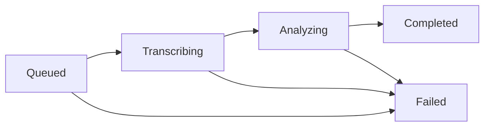

# Story 1.2: Processing Pipeline Skeleton

**GitHub issue:** [#17](https://github.com/vrize-poc-demo/call-center-radar/issues/17)

**Status:** In Progress

**Owner:** Susmitha

**Epic:** Call intake and processing pipeline
**Last updated:** 2026-08-21

## 1. Outcome

### User-Visible Goal

An uploaded call can move through a durable processing-state skeleton and expose a safe failure outcome before transcript or AI work begins.

### Scope

- Included: job states, persisted events, WAV validation, mono/stereo detection, and processing endpoint.
- Excluded: transcription, speaker attribution, AI analysis, retries, and UI timeline.

### Acceptance Criteria

- [x] A call moves through the defined lifecycle states in a durable way.
- [x] Job events are persisted so failures can be inspected later.
- [ ] The state model stays focused on the call pipeline and avoids unrelated orchestration work.

## 2. Design

### Flow

### Components and Ownership

| Area | Files or module | Responsibility |
| --- | --- | --- |
| UI | `apps/web/src/features/calls/CallUploadForm.tsx` | Starts and displays the skeleton result. |
| API | `app/calls.py` | Starts a processing job. |
| Pipeline | `app/pipeline.py` | Validates WAV audio and performs durable transitions. |
| Persistence | `003_processing_pipeline.sql` | Stores audio metadata and transition events. |
| Tests | `apps/api/tests` | Covers migration and pipeline behavior. |

### Contracts and Data

`POST /api/calls/{job_id}/process` starts a queued job and returns its terminal skeleton result. The upload UI invokes this endpoint after registration and shows its safe result. `processing_job_events` records every transition. No transcript or raw audio content is persisted in events.

## 3. Operational Behavior

### Logging and Privacy

State changes and failure reasons are logged with job IDs only. Audio bytes, filenames, names, and transcript content are excluded.

### Failure and Recovery

Invalid or unsupported audio transitions the job to `failed` and persists the reason. Retry orchestration is not applicable to this story and belongs to a later story.

## 4. Verification

### Automated Tests

| Check | Result | Notes |
| --- | --- | --- |
| API lint and format | Passed | Ruff checks passed. |
| Pipeline transition tests | Passed | Valid mono WAV completes and persists all transitions; invalid audio fails with an event. |
| Existing API tests | Passed | 9 tests passed. |
| Accuracy evaluation | Not applicable | No AI judgment is made. |

### Manual Verification and Demo Path

1. Register a WAV call.
2. Invoke its process endpoint.
3. Inspect its job and event records without exposing audio content.

### Known Gaps and Follow-Up Boundaries

- MP3 deep validation and channel detection require a dedicated decoder integration.
- Story 1.3 owns transcript persistence.

## 5. Delivery Record

- Branch: `feature/story-1.2-processing-pipeline`
- Pull request: Pending
- Commit(s): Pending
- Review result: Pending

### Change Log

| Commit | What changed | Why |
| --- | --- | --- |
| Pending | Added the initial durable processing pipeline skeleton and migration. | Establish the Story 1.2 state-machine foundation before transcript or AI behavior. |
| Pending | Added a visible processing action and result status to the upload UI. | Make the durable pipeline skeleton demonstrable without implementing AI behavior. |

### PR Readiness and Review

- Mergeability verification: Pending
- Code quality grade: Pending
- Testing quality grade: Pending
- Review findings and follow-up: Transition-specific tests and MP3 support remain pending.
