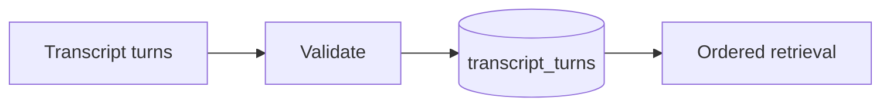

# Story 1.3: Transcript Persistence

**GitHub issue:** [#18](https://github.com/vrize-poc-demo/call-center-radar/issues/18)

**Status:** In Progress

**Owner:** Susmitha

**Epic:** Call intake and processing pipeline
**Last updated:** 2026-08-21

## 1. Outcome

### User-Visible Goal

The system stores and reliably retrieves ordered transcript turns for a call, providing immutable identifiers for later playback and analysis.

### Scope

- Included: transcript schema, immutable IDs, timing/speaker validation, save and retrieval APIs, tests.
- Excluded: transcription generation, evidence extraction, semantic analysis, and UI transcript rendering.

### Acceptance Criteria

- [x] Transcript turns are stored per call with speaker and timing data.
- [x] Each turn has a stable immutable identifier.
- [x] Transcript retrieval works reliably for later playback and analysis.

## 2. Design

### Flow

### Components and Ownership

| Area | Files or module | Responsibility |
| --- | --- | --- |
| API | `app/transcripts.py` | Save and retrieve transcript turns. |
| Persistence | `004_transcript_turns.sql` | Immutable turn IDs and call/timing index. |
| Tests | `apps/api/tests/test_transcripts.py` | Persistence, ordering, and invalid timing. |

### Contracts and Data

`PUT /api/calls/{call_id}/transcript` replaces a call’s transcript with validated turns and generated `turn_` IDs. `GET /api/calls/{call_id}/transcript` returns turns ordered by start time. Generated IDs are never changed after creation.

## 3. Operational Behavior

### Logging and Privacy

`transcript_saved` logs call ID and count only. It excludes transcript text, names, audio, and other PII.

### Failure and Recovery

Unknown calls and invalid timing return 4xx responses without persistence. Re-submitting a transcript is an explicit replacement operation; prior turn rows are deleted only within the same database transaction.

## 4. Verification

### Automated Tests

| Check | Result | Notes |
| --- | --- | --- |
| API lint and format | Passed | Ruff passed. |
| Persistence/retrieval tests | Passed | IDs, ordering, and invalid timing are covered. |
| Full API tests | Passed | 11 passed. |
| Accuracy evaluation | Not applicable | No AI judgment is made. |

### Manual Verification and Demo Path

1. Register a call.
2. PUT two transcript turns with different timestamps.
3. GET the transcript and verify ordered results and stable IDs.

### Known Gaps and Follow-Up Boundaries

- Story 1.3 persists supplied turns; it does not generate a transcript.
- Evidence and semantic analysis are later stories.

## 5. Delivery Record

- Branch: `feature/story-1.3-transcript-persistence`
- Pull request: Pending
- Commit(s): Pending
- Review result: Pending

### Change Log

| Commit | What changed | Why |
| --- | --- | --- |
| Pending | Added transcript-turn persistence, immutable IDs, ordered retrieval, and tests. | Establish trusted transcript evidence for later stories without adding AI behavior. |

### PR Readiness and Review

- Mergeability verification: Pending
- Code quality grade: Pending
- Testing quality grade: Pending
- Review findings and follow-up: UI rendering and transcription generation are intentionally deferred.
