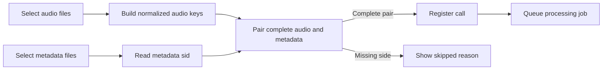

# Story 1.4: Upload Pair Validation and Batch Skip Reporting

**GitHub issue:** #TBD

**Status:** In Progress

**Owner:** Vipin

**Epic:** Call intake and processing pipeline
**Last updated:** 2026-08-31

## 1. Outcome

### User-Visible Goal

A manager can upload one call or a batch of calls with confidence that audio and metadata belong together. Batch upload processes only complete pairs and clearly shows which files were skipped before processing starts.

### Scope

- Included: metadata/audio pairing validation, duplicate-copy suffix normalization, batch ready/skipped counts, incomplete-pair skip messages, server-side sid validation, and focused tests.
- Excluded: server-side batch endpoint, parallel transcription scheduling changes, transcript accuracy evaluation, and new database schema.

### Acceptance Criteria

- [x] Single-call upload validates supported audio, valid metadata, and metadata sid pairing when sid is available.
- [x] Batch upload pairs files by metadata sid or normalized filename.
- [x] Batch upload skips audio files without metadata and metadata files without audio.
- [x] Skipped files are shown before processing and included in the completion message.
- [x] Only complete pairs are registered and queued for processing.

## 2. Design

### Flow

### Components and Ownership

| Area | Files or module | Responsibility |
| --- | --- | --- |
| UI | `apps/web/src/features/calls/CallUploadForm.tsx` | Build batch plan, pair files, show skipped files, and submit complete pairs only. |
| API | `apps/api/src/app/calls.py` | Validate metadata shape and enforce sid/audio pairing when metadata sid exists. |
| Persistence | Not applicable | Existing calls and processing job tables are reused. |
| Tests | `apps/api/tests/test_calls.py`, `apps/web/src/features/calls/CallUploadForm.test.tsx` | Cover server sid validation and UI batch skip behavior. |

### Contracts and Data

`POST /api/calls` keeps the same request and response shape. When uploaded metadata includes `sid`, the API now validates that the normalized audio filename matches that sid. Normalization removes the duplicate-copy suffix ` 2`, matching the observed sample-data pattern. Batch upload remains client-orchestrated through repeated `POST /api/calls` calls for complete pairs.

## 3. Operational Behavior

### Logging and Privacy

Existing upload logs remain unchanged: `call_upload_received`, `call_upload_rejected`, and `call_registered`. Logs include safe technical status only and do not include filenames, raw audio, metadata content, customer names, agent names, transcripts, or secrets.

### Failure and Recovery

Single-call sid mismatch returns HTTP 422 with `Metadata sid must match the selected audio filename.` Batch upload does not fail the whole batch for missing counterparts; it lists skipped files and processes complete pairs. Invalid metadata JSON is skipped before registration in the batch flow.

## 4. Verification

### Automated Tests

| Check | Result | Notes |
| --- | --- | --- |
| Unit tests | Passed | `npm run test` -> 46 web tests and 109 API tests passed. |
| Integration tests | Passed | Batch UI verifies complete-pair processing and skipped-file reporting. |
| Lint and format | Passed | `npm run lint` and `npm run format:check` passed. |
| Build | Passed | `npm run build` passed. |
| Accuracy evaluation | Passed | Sample-data pairing check found 1,441 unique audio ids, 1,441 unique metadata ids, and zero unmatched ids. |

### Manual Verification and Demo Path

1. Open Register Call.
2. Choose Batch upload.
3. Select matching audio and metadata files from sample data.
4. Confirm ready-pair count increases.
5. Add one unmatched audio or metadata file.
6. Confirm the skipped list explains the missing counterpart.
7. Upload batch and confirm only ready pairs are queued.

### Known Gaps and Follow-Up Boundaries

- A dedicated server-side batch endpoint could reduce network round trips later, but repeated single-call registration keeps the POC small and testable.
- Worker concurrency and transcription throughput optimization remain owned by the processing queue stories.

## 5. Delivery Record

- Branch: `codex/upload-pair-validation`
- Pull request: #117
- Commit(s): `df81a19`
- Review result: Pending

### Change Log

Update this table before every commit. Explain both the change and its reason; do not use generic entries such as "updates" or "fixes".

| Commit | What changed | Why |
| --- | --- | --- |
| Pending | Added server-side sid/audio validation and client-side batch pairing with skipped-file reporting. | Prevent wrong audio/metadata combinations and avoid wasting processing on incomplete batch items. |
| Pending | Verified full local quality gate and sample-data pairing counts. | Confirm the change is stable and aligned to the real dataset shape before review. |

### PR Readiness and Review

- Mergeability verification: `Pending - npm run pr:verify -- 117`
- Code quality grade: `A`
- Testing quality grade: `A`
- Review findings and follow-up: No blocking self-review findings. A future server-side batch endpoint could optimize very large uploads, but the current client-side pairing avoids unnecessary API calls for incomplete items.
