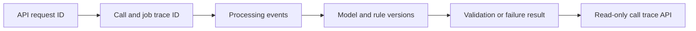

# Story 10.1: Logs and Traceability

**GitHub issue:** [#38](https://github.com/vrize-poc-demo/call-center-radar/issues/38)

**Status:** In Review

**Owner:** Vipin

**Epic:** Observability, testing, and accuracy
**Last updated:** 2026-08-23

## 1. Outcome

### User-Visible Goal

The delivery team can trace an uploaded call from its API request through local
transcription and evidence-backed analysis using stable IDs, model and rule
versions, validation outcomes, and safe failure reasons.

### Scope

- Included: server-generated request IDs, immutable per-job trace IDs, a
  SQLite-backed trace event ledger, processing and analysis version markers,
  validation outcomes, stable failure reasons, and a read-only call trace API.
- Excluded: a manager-facing trace UI, distributed tracing infrastructure,
  production log shipping, raw model output, transcript text, audio, participant
  names, and secrets.

### Acceptance Criteria

- [x] Each run can be traced end to end with IDs and version stamps.
- [x] Failures preserve enough safe context for debugging and demo support.
- [x] Traceability data is available through an API without searching ad hoc logs.
- [x] Success and failure tests verify required trace fields.

## 2. Design

### Flow

### Components and Ownership

| Area | Files or module | Responsibility |
| --- | --- | --- |
| API lifecycle | `main.py`, `logging.py` | Generate request IDs, return the correlation header, and enrich structured logs. |
| Trace contract | `traceability.py` | Persist privacy-safe trace events and expose a typed call timeline. |
| Call intake | `calls.py` | Create the immutable trace ID atomically with the call and processing job. |
| Processing | `pipeline.py` | Record state transitions, STT model version, and stable failure reasons. |
| Analysis | `analysis.py` | Record local model/rule versions and accepted or rejected validation outcomes. |
| Persistence | `015_traceability.sql` | Add job trace IDs and the append-only SQLite trace event ledger. |
| Tests | `test_traceability.py`, related API tests | Protect success, failure, privacy, correlation, and migration behavior. |

### Contracts and Data

`POST /api/calls` now includes `trace_id` alongside `call_id` and `job_id`.
Every API response includes `X-Request-ID`. `GET /api/calls/{call_id}/trace`
returns the latest job's `trace_id`, public job ID, schema version, and ordered
events. Events contain only event/status identifiers, request ID, model/rule
versions, validation result, stable failure reason, and timestamp.

Migration `015_traceability.sql` adds nullable `processing_jobs.trace_id` for
backward compatibility and creates `trace_events`. New uploaded jobs always
receive a unique trace ID. A legacy queued job receives a stable trace ID when
processing starts; an unprocessed legacy record returns a clear trace-not-found
response instead of receiving invented historical events.

## 3. Operational Behavior

### Logging and Privacy

Structured logs automatically include the active request ID. The durable ledger
stores no audio, transcript text, quotes, customer or agent names, raw model
output, stack traces, or secrets. Provider and decoder details are normalized to
stable reasons such as `analysis_provider_unavailable`, `invalid_model_output`,
`invalid_audio`, and `transcription_failed`.

### Failure and Recovery

Trace events are written in the same SQLite transaction as registration,
processing transitions, and successful analysis. Rejected analysis commits its
diagnostic event before returning the recoverable API error. Trace reads are
ordered by append-only event ID. Missing legacy or unknown traces return HTTP
404 without affecting the underlying call.

## 4. Verification

### Automated Tests

| Check | Result | Notes |
| --- | --- | --- |
| Unit tests | Passed | Request IDs, trace serialization, privacy, failure paths, and legacy jobs covered. |
| Integration tests | Passed | Upload through STT and structured-analysis trace coverage passed. |
| Full regression | Passed | 41 web tests and 92 API tests passed; API coverage is 91%. |
| Lint and format | Passed | ESLint, Ruff, Prettier, and Ruff format checks passed. |
| Build | Passed | TypeScript and Vite production build passed. |
| Accuracy evaluation | Not applicable | This story records versions and outcomes but does not evaluate model accuracy. |

### Manual Verification and Demo Path

1. Upload a local call and retain the returned call, job, and trace IDs.
2. Process the call and request structured analysis.
3. Open `/api/calls/{call_id}/trace` in API docs.
4. Confirm ordered registration, processing, model, rule, and validation markers.
5. Repeat with invalid audio or rejected analysis and confirm a safe failure reason.

The live HTTP smoke test uploaded repository sample
`d35d0b40f99b47be.mp3` to the isolated API on port 8007. Registration returned
call ID `96fb716d275049689c8ee3c901cad752`, job ID
`job_88784afb00994bc5b8987e584de065d3`, and trace ID
`trace_2de44a3b67ef421fb92711db440bdf81`. The trace endpoint returned the same
identifiers and its persisted registration request ID matched the upload
response's `X-Request-ID`; the later trace read received a distinct request ID.

### Known Gaps and Follow-Up Boundaries

- The POC exposes traceability through the API; a dedicated UI is outside Story 10.1.
- Existing calls created before migration 015 do not receive invented historical events.
- Multi-service OpenTelemetry export is a production concern, not required for this local POC.

## 5. Delivery Record

- Branch: `feature/story-10.1-logs-traceability`
- Pull request: [#99](https://github.com/vrize-poc-demo/call-center-radar/pull/99)
- Commit(s): `6668a84`, `7f483b6`
- Review result: A/A self-review recorded; GitHub CI passed and PR #99 is
  cleanly mergeable. Human review and merge remain pending.

### Change Log

Update this table before every commit. Explain both the change and its reason; do not use generic entries such as "updates" or "fixes".

| Commit | What changed | Why |
| --- | --- | --- |
| `6668a84` | Added request correlation, durable trace persistence/API, pipeline and analysis markers, tests, and this story record. | Make the P0 trust path inspectable end to end without persisting sensitive call content. |
| `7f483b6` | Recorded PR #99, delivery evidence, and the A/A self-review result. | Keep the repository history complete and independently reviewable before project status changes. |
| Pending | Recorded passing GitHub CI, clean mergeability, required PR verification, and the transition to review. | Preserve final delivery evidence before moving the GitHub Project item to In Review. |

### PR Readiness and Review

- Mergeability verification: Passed - `npm run pr:verify -- 99` confirmed the
  PR targets `development`, is cleanly mergeable, and has passing checks.
- Code quality grade: A - cohesive typed trace contract, transactional persistence, and bounded integration points.
- Testing quality grade: A - success, processing failure, validation rejection, privacy, migration, and legacy-job regressions covered.
- Review findings and follow-up: No blocking findings. A legacy null-trace upgrade edge case was found during self-review, fixed, and regression-tested.
