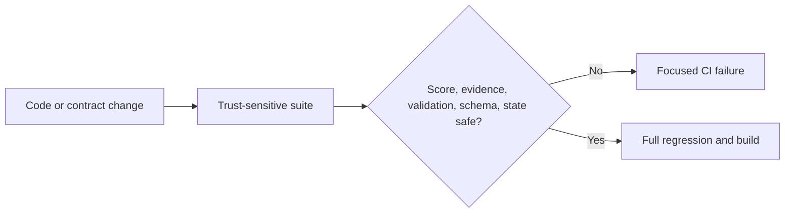

# Story 10.2: Trust-Sensitive Unit Tests

**GitHub issue:** [#39](https://github.com/vrize-poc-demo/call-center-radar/issues/39)

**Status:** In Progress

**Owner:** Vipin

**Epic:** Observability, testing, and accuracy
**Last updated:** 2026-08-23

## 1. Outcome

### User-Visible Goal

The delivery team can change the POC quickly while CI independently protects
the deterministic score, immutable evidence, validator, API contracts, and
durable processing state machine that make manager-facing results trustworthy.

### Scope

- Included: focused boundary and regression tests for the five Story 10.2 trust
  areas, a dedicated local command, a 90% focused coverage floor, and a separate
  CI failure summary.
- Excluded: production behavior changes, broad 100% vanity coverage, browser E2E
  infrastructure, model-accuracy evaluation, and load or production security testing.

### Acceptance Criteria

- [x] The highest-risk logic paths are covered by automated unit tests.
- [x] Tests are stable and readable enough to support rapid iteration.
- [x] Coverage stays focused on trust-sensitive behavior instead of broad quantity.
- [x] CI reports trust-suite failures separately from broad regression failures.

## 2. Design

### Flow

### Components and Ownership

| Area | Files or module | Responsibility |
| --- | --- | --- |
| Score engine | `test_priority.py` | Protect zero, single, capped, unknown-rule, evidence-link, and recalculation behavior. |
| Validator | `test_validation.py`, `test_false_resolution.py` | Protect immutable references, chronology, mood shifts, and speaker constraints. |
| Evidence | `test_evidence.py` | Protect matching, stable IDs, exact saved timing/quotes, and no-match behavior. |
| API schema | `test_api_contracts.py` | Protect required OpenAPI fields and privacy-safe trace schemas. |
| Job state | `test_pipeline.py` | Protect valid flows, failures, recovery, FIFO behavior, and atomic rejection. |
| CI | `package.json`, `.github/workflows/ci.yml` | Run a separately named trust suite with a focused coverage floor. |
| Persistence | Not applicable | This story adds no migration or persisted data. |

### Contracts and Data

No runtime API or SQLite contract changes are made. The tests freeze selected
existing OpenAPI requirements: call/job/trace registration identifiers, job
status fields, Radar Priority breakdown fields, and trace timeline fields. The
new `npm run test:trust` command runs only the trust-sensitive tests and measures
`app.priority`, `app.validation`, `app.false_resolution`, `app.evidence`, and
`app.pipeline`, failing below 90% aggregate statement coverage.

## 3. Operational Behavior

### Logging and Privacy

Tests use generated identifiers, temporary SQLite databases, synthetic audio,
and synthetic transcript text. They do not read real customer calls, emit raw
audio, contact external models, or add production logging. CI output contains
test names, assertions, missing source lines, and coverage only.

### Failure and Recovery

A trust-suite failure appears in its own GitHub Actions step before broad tests,
making the affected contract visible. Developers reproduce it with
`npm run test:trust`, fix the focused behavior or test expectation, then rerun
the full quality gate. Tests are deterministic and require no network service.

## 4. Verification

### Automated Tests

| Check | Result | Notes |
| --- | --- | --- |
| Unit tests | Passed | 37 focused trust tests passed at 93.97% coverage, above the 90% floor. |
| Integration tests | Passed | 103 API tests and 41 web tests passed; API coverage is 92%. |
| Lint and format | Passed | ESLint, Ruff, Prettier, and Ruff format checks passed. |
| Build | Passed | TypeScript and Vite production build passed. |
| Accuracy evaluation | Not applicable | Story 10.3 owns measured model accuracy. |

### Manual Verification and Demo Path

1. Run `npm run test:trust` from the repository root.
2. Confirm the output names each trust-sensitive test file and shows focused coverage.
3. Confirm the command exits successfully only at or above the 90% floor.
4. Run the complete quality gate and confirm no existing behavior regressed.

Manual developer-path verification ran `npm run test:trust` from this feature
worktree. Pytest listed all six focused files, all 37 tests passed, the five
measured modules reached 93.97% aggregate coverage, and the command enforced the
90% minimum before the full 103-test API regression and web suite ran.

### Known Gaps and Follow-Up Boundaries

- Unit coverage does not prove STT or LLM semantic accuracy; Story 10.3 evaluates that.
- Browser workflow automation and production concurrency/load tests remain separate concerns.
- The overall repository may remain below 100%; this story intentionally gates critical modules.

## 5. Delivery Record

- Branch: `feature/story-10.2-trust-sensitive-unit-tests`
- Pull request: [#100](https://github.com/vrize-poc-demo/call-center-radar/pull/100)
- Commit(s): `a71b41f`
- Review result: A/A self-review recorded; GitHub CI and human review pending.

### Change Log

Update this table before every commit. Explain both the change and its reason; do not use generic entries such as "updates" or "fixes".

| Commit | What changed | Why |
| --- | --- | --- |
| `a71b41f` | Added trust-sensitive boundary tests, a focused coverage command and CI step, and this story record. | Make trust regressions fail quickly and clearly without pursuing low-value blanket coverage. |
| Pending | Recorded PR #100, verification evidence, and the A/A self-review result. | Keep the test-hardening delivery independently reviewable before project status changes. |

### PR Readiness and Review

- Mergeability verification: `Pending - npm run pr:verify -- <pr-number>`
- Code quality grade: A - test-only scope, one reusable command, and no runtime contract changes.
- Testing quality grade: A - deterministic boundaries, focused coverage floor, full regression, and privacy checks.
- Review findings and follow-up: No blocking findings. Privacy schema assertions were strengthened during self-review to reject prohibited fragments in future field names.
