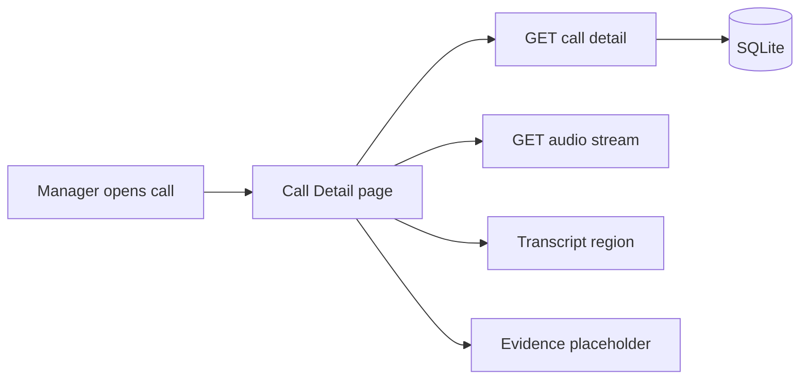

# Story 2.1: Call Detail Page Shell

**GitHub issue:** [#19](https://github.com/vrize-poc-demo/call-center-radar/issues/19)

**Status:** In Progress

**Owner:** Vipin

**Epic:** Call Detail core experience

## 1. Outcome

Managers can open a registered call into a readable review screen with a recording player, processing state, transcript region, and evidence placeholder. The page establishes the POC's central inspection experience without claiming analysis that does not yet exist.

### Scope

- Included: call-detail API, protected audio stream, page shell, loading/missing states, upload-to-detail link, logs, and API unit tests.
- Excluded: transcript rendering and sync, transcript search, evidence claims, score explanations, and AI analysis.

### Acceptance Criteria

- [x] The page loads a call and renders the major layout regions.
- [x] Loading and missing-call states are clear and readable.
- [x] The design stays ready for later evidence-driven enhancements.

## 2. Design

| Area | Files or module | Responsibility |
| --- | --- | --- |
| UI | `features/call-detail/CallDetailPage.tsx` | Renders loading, missing, and loaded manager views. |
| API | `app/calls.py` | Loads safe call metadata and serves the stored recording. |
| Web client | `api/calls.ts` | Fetches detail and derives the audio URL. |
| Tests | `apps/api/tests/test_calls.py` | Covers loaded, missing, and audio responses. |

## 3. Operational Behavior

`call_detail_loaded`, `call_detail_missing`, and `call_audio_missing` logs include only the generated call ID. They exclude audio bytes, transcript content, customer names, and agent names. Missing records or audio return clear 404 responses; the UI shows a readable unavailable state.

## 4. Verification

| Check | Result | Notes |
| --- | --- | --- |
| Call-detail API tests | Passed | Loaded, missing, and audio paths. |
| Call Detail component tests | Passed | Loading, loaded shell, and missing-call states; 94.62% component coverage. |
| Full quality gate | Passed | 12 API tests, 4 web tests, lint, format, coverage, and build. |
| Manual demo | Passed | Live API returns the saved recording, processing state, and transcript count. |

## 5. Delivery Record

- Branch: `feature/story-2.1-call-detail-page-shell`
- Pull request: Pending

### Change Log

| Commit | What changed | Why |
| --- | --- | --- |
| Pending | Added the Call Detail API, audio stream, manager page shell, and focused API tests. | Deliver the review centerpiece while retaining later transcript and evidence boundaries. |

### PR Readiness and Review

- Mergeability verification: Pending
- Code quality grade: Pending
- Testing quality grade: Pending
