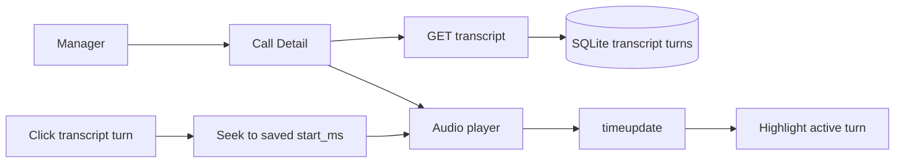

# Story 2.2: Audio and Transcript Sync

**GitHub issue:** [#20](https://github.com/vrize-poc-demo/call-center-radar/issues/20)

**Status:** In Progress

**Owner:** Vipin

**Epic:** Call Detail core experience
**Last updated:** 2026-08-22

## 1. Outcome

### User-Visible Goal

A manager can play a call, see its current timestamp, and select any saved transcript turn to jump the recording to that evidence timestamp. The active turn is visibly highlighted while the recording is playing, so review remains grounded in the immutable saved transcript rather than an AI-generated summary.

### Scope

- Included: native audio play and pause controls, current playback position, saved transcript rendering, transcript-to-audio seeking, active-turn highlighting, and an evidence-region jump control for the current placeholder state.
- Excluded: transcript search and filtering, auto-scroll to the active turn, generated evidence findings, score explanations, speaker diarization, and AI analysis.

### Acceptance Criteria

- [x] Managers can use the native player to play and pause the call.
- [x] The page exposes the current playback timestamp.
- [x] Selecting a transcript turn seeks the recording to the turn's persisted `start_ms` timestamp and starts playback.
- [x] The active transcript turn is highlighted while playback time falls within its persisted time range.
- [x] The evidence region includes a working jump-to-audio control without inventing evidence findings.

## 2. Design

### Flow

### Components and Ownership

| Area | Files or module | Responsibility |
| --- | --- | --- |
| UI | `apps/web/src/features/call-detail/CallDetailPage.tsx` | Loads transcript turns, renders the synchronized review experience, seeks audio, and derives the active turn from playback time. |
| Web API client | `apps/web/src/api/calls.ts` | Defines `TranscriptTurn` and loads persisted transcript turns for a call. |
| Styling | `apps/web/src/styles.css` | Makes transcript turns usable and clearly marks the active evidence context. |
| Tests | `apps/web/src/features/call-detail/CallDetailPage.test.tsx` | Covers loaded transcript display, timestamp updates, missing calls, active-turn state, and player seeking. |

### Contracts and Data

`GET /api/calls/{call_id}/transcript` returns a list of persisted turns containing `transcript_turn_id`, `speaker`, `start_ms`, `end_ms`, and `text`. The UI uses only these saved turn timestamps to seek and highlight. It does not accept timestamps or quotes from an LLM, and no database schema or backend endpoint changes are required for this story.

## 3. Operational Behavior

### Logging and Privacy

The browser emits `call_audio_load_failed` if the recording cannot load and `call_audio_playback_failed` when programmatic playback after a seek is rejected. These logs contain no audio bytes, transcript text, customer or agent names, or secrets. API transcript retrieval follows the existing server-side logging and access behavior.

### Failure and Recovery

If transcript retrieval fails, the Call Detail page remains usable and displays its existing empty transcript state. If audio playback cannot start after a transcript selection, the selected timestamp is retained and the manager can use the native player controls. A missing call still renders the established readable unavailable state. Developers can inspect browser warnings alongside existing API logs using the generated call ID, without exposing call content in logs.

## 4. Verification

### Automated Tests

| Check | Result | Notes |
| --- | --- | --- |
| Web unit tests | Passed | 6 tests cover the loaded view, missing call, transcript display, playback timestamp, transcript seek, and active-turn highlight. |
| Repository lint | Passed | ESLint and Ruff completed with no findings. |
| Format check | Passed | Prettier and Ruff formatting checks passed. |
| Coverage suite | Passed | 6 web tests and 12 API tests completed; component coverage is 94% for Call Detail. |
| Production build | Passed | TypeScript build and Vite production bundle completed. |
| Accuracy evaluation | Not applicable | This story does not create or score AI findings. |

### Manual Verification and Demo Path

1. Start the API and web app, then open an uploaded call's detail URL.
2. Confirm the recording is visible and the playback position starts at `0:00`.
3. Use the player controls and confirm the displayed timestamp changes.
4. Select a saved transcript turn and confirm the player seeks to its timestamp, begins playback where supported, and highlights that turn.
5. Select `Jump to call start` in the Evidence region and confirm playback seeks to `0:00`.

### Known Gaps and Follow-Up Boundaries

- Story 2.3 adds transcript search, filtering, and auto-scroll to the active turn.
- Evidence links will replace the placeholder jump control in Stories 3.1 through 4.2; every link must retain an immutable `transcript_turn_id`.
- Native media controls vary slightly by browser. The application’s timestamp and turn highlighting are kept in application state for consistent review context.

## 5. Delivery Record

- Branch: `feature/story-2.2-audio-transcript-sync`
- Pull request: [#50](https://github.com/vrize-poc-demo/call-center-radar/pull/50) (draft, targets `development`)
- Commit(s): `97dda35` - synchronized call audio and transcript turns
- Review result: Approved for human review; no blocking findings.

### Change Log

Update this table before every commit. Explain both the change and its reason; do not use generic entries such as "updates" or "fixes".

| Commit | What changed | Why |
| --- | --- | --- |
| `97dda35` | Added persisted transcript retrieval, synchronized audio controls, active-turn highlighting, component tests, and this delivery record. | Let managers inspect the recording against saved evidence timestamps while preserving the POC's evidence-first boundary. |
| Pending | Recorded the verified pull request and self-review result. | Keep the story delivery record auditable through human review and merge. |

### PR Readiness and Review

- Mergeability verification: Passed - `npm run pr:verify -- 50` confirms a clean merge into `development` with passing CI.
- Code quality grade: A - focused, typed client contract; persisted timestamps are the sole source for seeks and highlights; failure behavior is explicit.
- Testing quality grade: A - focused component tests cover loaded, unavailable, playback timestamp, transcript seek, active state, and evidence jump behavior; the full repository quality gate passed.
- Review findings and follow-up: No blocking findings. Story 2.3 owns search, filtering, and active-turn auto-scroll.
