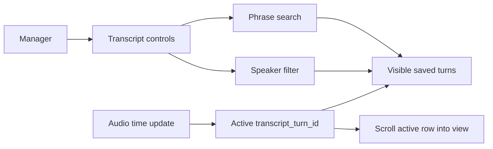

# Story 2.3: Transcript Usability

**GitHub issue:** [#21](https://github.com/vrize-poc-demo/call-center-radar/issues/21)

**Status:** In Progress

**Owner:** Vipin

**Epic:** Call Detail core experience
**Last updated:** 2026-08-22

## 1. Outcome

### User-Visible Goal

A manager can quickly scan a call transcript by speaker and timestamp, search for a phrase, narrow the view to an agent or customer, and retain visual focus on the active playback turn. The feature reduces review time without changing the saved transcript or making any AI claim.

### Scope

- Included: persisted speaker and timestamp context, transcript phrase search, agent/customer filter, result count, active-turn retention despite filters, and automatic scroll to the active turn.
- Excluded: cross-call search, semantic/LLM search, transcript editing, speaker diarization, analysis findings, evidence generation, and dashboard filtering.

### Acceptance Criteria

- [x] Transcript rows clearly show speaker and timestamp context.
- [x] Search and speaker filtering help a reviewer narrow the transcript quickly.
- [x] The active playback turn remains visible when it would otherwise be excluded by search or speaker filters.
- [x] The active turn scrolls into view when playback enters it or a reviewer navigates to it.

## 2. Design

### Flow

### Components and Ownership

| Area | Files or module | Responsibility |
| --- | --- | --- |
| UI | `apps/web/src/features/call-detail/CallDetailPage.tsx` | Applies local search and speaker filtering to saved turns, preserves the active turn, and scrolls the active row into view. |
| Styling | `apps/web/src/styles.css` | Provides compact, responsive transcript controls and active-context feedback. |
| Tests | `apps/web/src/features/call-detail/CallDetailPage.test.tsx` | Verifies labels, timestamp context, search, speaker filtering, active-turn retention, logging, and scrolling. |
| API and persistence | Existing transcript API and SQLite records | No contract or schema changes; this story consumes existing immutable turns only. |

### Contracts and Data

The UI continues to consume `transcript_turn_id`, `speaker`, `start_ms`, `end_ms`, and `text` from `GET /api/calls/{call_id}/transcript`. Search is local to the loaded call and is case-insensitive. The active row is derived only from persisted `start_ms` and `end_ms`; it is retained in the visible list even when current filters do not match. No query text, transcript content, audio, PII, secrets, or generated analysis is sent to another service.

## 3. Operational Behavior

### Logging and Privacy

The browser logs `transcript_search_updated` with only `query_length` and `speaker_filter`; it never logs the search phrase or transcript text. `transcript_load_failed` records an existing transcript fetch failure without content. `transcript_active_turn_scroll_failed` records a browser scroll failure without content. Audio logging remains as delivered in Story 2.2.

### Failure and Recovery

If the transcript cannot load, Call Detail retains its existing empty-state message and the recording remains usable. If no saved turn matches the manager's search/filter selection, the page states that clearly. If a browser cannot scroll the active turn programmatically, the turn remains visibly highlighted and can still be selected manually. Search and filtering are view-only and never change saved transcript data.

## 4. Verification

### Automated Tests

| Check | Result | Notes |
| --- | --- | --- |
| Web unit tests | Passed | 7 tests cover loading, missing calls, timestamp playback, transcript seek, labels, search, speaker filter, active-turn retention, and scrolling. |
| Repository lint | Passed | ESLint and Ruff completed with no findings. |
| Format check | Passed | Prettier and Ruff formatting checks passed. |
| Coverage suite | Passed | 7 web tests and 12 API tests completed; Call Detail line coverage is 95.39%. |
| Production build | Passed | TypeScript build and Vite production bundle completed. |
| Accuracy evaluation | Not applicable | This story filters saved transcript text and makes no AI judgement. |

### Manual Verification and Demo Path

1. Open an uploaded call's Call Detail page with multiple saved transcript turns.
2. Confirm each row shows its speaker and timestamp.
3. Search for a phrase and confirm the result count and visible rows update without changing the saved transcript.
4. Select `Agent` or `Customer` from `Show speaker` and confirm only that speaker's matching rows are shown.
5. Play or select a turn, then apply a filter that excludes it; confirm the active row remains visible and the page explains why.
6. Confirm the active row scrolls into view when playback moves into it.

The isolated Story 2.3 UI is available locally at `http://127.0.0.1:5174/?call=e8b6d65ed7fa48d7b80a24cc30d9f4bb`; the sample API returned two persisted transcript turns for this call during verification.

### Known Gaps and Follow-Up Boundaries

- Search is intentionally local to one already loaded call and performs simple phrase matching.
- The browser's `scrollIntoView` behavior varies slightly by platform; highlighting remains the fallback context cue.
- Evidence-backed filters and analysis categories belong to later evidence-engine stories, not this transcript usability story.

## 5. Delivery Record

- Branch: `feature/story-2.3-transcript-usability`
- Pull request: [#51](https://github.com/vrize-poc-demo/call-center-radar/pull/51) (draft, targets `development`)
- Commit(s): `2a0e1fd` - transcript usability controls and tests
- Review result: Approved for human review; no blocking findings.

### Change Log

Update this table before every commit. Explain both the change and its reason; do not use generic entries such as "updates" or "fixes".

| Commit | What changed | Why |
| --- | --- | --- |
| `2a0e1fd` | Added searchable and filterable transcript controls, active-turn visibility/scroll behavior, focused tests, and this delivery record. | Help managers find the relevant moment without widening the POC into broader search or changing evidence data. |
| Pending | Recorded the verified pull request and self-review result. | Keep Story 2.3 delivery traceable through human review and merge. |

### PR Readiness and Review

- Mergeability verification: Passed - `npm run pr:verify -- 51` confirms a clean merge into `development` with passing CI.
- Code quality grade: A - the feature is limited to a single persisted transcript, respects active playback context, and does not expose transcript search terms in logs.
- Testing quality grade: A - focused tests cover labels, timestamps, local search, speaker filter, active-turn retention, scroll behavior, and safe search logging; the full repository quality gate passed.
- Review findings and follow-up: No blocking findings. Semantic or cross-call search remains out of scope.
