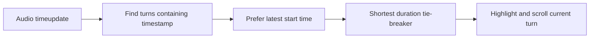

# Story 2.4: Playback Transcript Synchronization

**GitHub issue:** #66

**Status:** In Progress

**Owner:** vipinv-dev

**Epic:** #3 Call Detail core experience
**Last updated:** 2026-08-22

## 1. Outcome

### User-Visible Goal

While a manager plays a call recording, Call Detail highlights the transcript turn currently being
spoken, including recordings whose separately transcribed stereo channels overlap in time.

### Scope

- Included: Active-turn selection logic and focused Call Detail regression tests.
- Excluded: Changing raw audio, transcript persistence, STT model timestamps, or analysis output.

### Acceptance Criteria

- [x] The selected active turn matches the most recently started segment that contains the current audio timestamp.
- [x] Equal-start overlaps use the shortest duration as a deterministic tie-breaker.
- [x] Existing seek and playback behavior remains verified through the full frontend suite.

## 2. Design

### Flow

### Components and Ownership

| Area | Files or module | Responsibility |
| --- | --- | --- |
| UI | `apps/web/src/features/call-detail/CallDetailPage.tsx` | Deterministically select and render the current active turn. |
| Tests | `apps/web/src/features/call-detail/CallDetailPage.test.tsx` | Reproduce overlapping stereo turn timing and equal-start tie behavior. |

### Contracts and Data

No API, database, migration, or evidence contract changes. The UI reads existing immutable
`start_ms` and `end_ms` values and does not modify persisted transcript turns.

## 3. Operational Behavior

### Logging and Privacy

No new logs. Playback continues to use existing non-content diagnostic events; no raw audio or
transcript content is added to logs.

### Failure and Recovery

When no turn contains the playback timestamp, no transcript item is highlighted. This is the
expected state for silence or gaps between generated segments.

## 4. Verification

### Automated Tests

| Check | Result | Notes |
| --- | --- | --- |
| Unit tests | Passed | 16 frontend tests and 34 API tests passed; the new timing selector is fully statement/function/line covered. |
| Integration tests | Not applicable | No API contract change. |
| Lint and format | Passed | `npm run lint` and `npm run format:check` passed. |
| Build | Passed | `npm run build` passed. |
| Accuracy evaluation | Not applicable | Corrects rendering selection, not STT accuracy. |

### Manual Verification and Demo Path

1. Open a completed stereo call in Call Detail.
2. Play through a point where agent and customer turn ranges overlap.
3. Confirm the active highlight follows the latest segment start rather than staying on the older long segment.

**Executed browser evidence:** On the completed local stereo call, jumping to the known overlapping
timestamp selected the current customer turn at 16.3 seconds and displayed playback position
`0:16`. The prior first-match implementation selected the earlier agent segment that also covered
that timestamp.

### Known Gaps and Follow-Up Boundaries

- The UI can only honor persisted STT timing. Improving inaccurate underlying segment boundaries is a transcription-model concern.

## 5. Delivery Record

- Branch: `fix/story-2.4-playback-sync`
- Pull request: #67 (draft, targets `development`)
- Commit(s): `f431244` playback-sync implementation
- Review result: Code quality A; testing quality A; no blocking self-review findings.

### Change Log

| Commit | What changed | Why |
| --- | --- | --- |
| `f431244` | Added deterministic active-turn selection, a separate pure playback module, regression tests for overlapping stereo ranges, and browser verification. | The previous first-match rule could highlight a prior long segment even when a newer overlapping segment was the speech currently being played. |
| Pending | Recorded the draft PR and self-review outcome. | Keeps the in-repository delivery record aligned with the reviewable GitHub change. |

### PR Readiness and Review

- Mergeability verification: Pending - `npm run pr:verify -- 67` after GitHub CI completes.
- Code quality grade: `A`
- Testing quality grade: `A`
- Review findings and follow-up: No blocking findings. The change is deliberately limited to UI
  selection; improving raw segment boundaries remains a transcription-pipeline concern.
