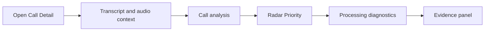

# Story 2.4: Prioritize call analysis above processing

**GitHub issue:** #105

**Status:** In Progress

**Owner:** vipinv-dev

**Epic:** Call Detail core experience
**Last updated:** 2026-08-24

## 1. Outcome

### User-Visible Goal

Managers opening Call Detail see the business answer first: call analysis, then score, then processing diagnostics. The technical processing status remains available, but it no longer interrupts the manager-first reading flow.

### Scope

- Included: Reorder Call Detail page panels so Call analysis appears before Processing.
- Included: Keep Radar Priority, Processing, and Evidence panels visible and functional.
- Included: Add a unit test that protects the intended section order.
- Excluded: Changing analysis content, processing status behavior, API contracts, or persisted data.

### Acceptance Criteria

- [x] Call Detail renders Call analysis before Processing in the page order.
- [x] Processing information remains visible and unchanged after the analysis section.
- [x] Existing evidence, audio, transcript, analysis, and processing interactions continue to work.
- [x] Unit tests confirm the section order.
- [x] Story documentation explains what changed and why.

## 2. Design

### Flow

### Components and Ownership

| Area | Files or module | Responsibility |
| --- | --- | --- |
| UI | `apps/web/src/features/call-detail/CallDetailPage.tsx` | Renders the Call Detail panel order. |
| API | Not applicable | No API behavior changed. |
| Persistence | Not applicable | No database schema or saved data changed. |
| Tests | `apps/web/src/features/call-detail/CallDetailPage.test.tsx` | Verifies the manager-first section order. |

### Contracts and Data

No API, database, request, response, or immutable evidence contract changed. The same analysis, priority, processing, transcript, audio, and evidence data is rendered in a different order.

## 3. Operational Behavior

### Logging and Privacy

No logging behavior changed. The UI continues to avoid logging raw audio, full transcripts, customer PII, or secrets.

### Failure and Recovery

No error handling changed. If analysis is unavailable, the existing analysis fallback message remains visible above Processing. If processing failed, the existing processing failure reason remains visible below the manager-facing analysis area.

## 4. Verification

### Automated Tests

| Check | Result | Notes |
| --- | --- | --- |
| Unit tests | Passed | `npm run test --workspace=@call-center-radar/web -- --run CallDetailPage` passed 20 tests. |
| Integration tests | Passed | DOM order is covered by the Call Detail section-order test. |
| Lint and format | Passed | `npm run lint`. |
| Build | Passed | `npm run build`. |
| Accuracy evaluation | Not applicable | Layout-only change. |

### Manual Verification and Demo Path

1. Start the app with `npm run dev`.
2. Open a completed call detail page.
3. Confirm the visible order is Transcript, Call analysis, Radar Priority, Processing, Evidence.
4. Confirm Processing still shows status and audio validation/failure text.
5. Confirm analysis and evidence buttons still work.

### Known Gaps and Follow-Up Boundaries

- This does not improve the analysis unavailable error text; it only changes panel priority.
- This does not change mobile-specific layouts beyond the natural document order.

## 5. Delivery Record

- Branch: `codex/story-2.4-call-analysis-first`
- Pull request: #106
- Commit(s): Feature branch commit in PR #106
- Review result: TBD

### Change Log

Update this table before every commit. Explain both the change and its reason; do not use generic entries such as "updates" or "fixes".

| Commit | What changed | Why |
| --- | --- | --- |
| Feature branch commit | Reordered Call Detail panels and updated the section-order test. | Managers should see call analysis before technical processing diagnostics. |

### PR Readiness and Review

- Mergeability verification: `Pending - npm run pr:verify -- <pr-number>`
- Code quality grade: `Pending - A to F`
- Testing quality grade: `Pending - A to F`
- Review findings and follow-up: TBD
