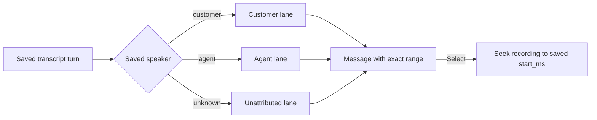

# Story 2.5: Split Transcript Into Customer and Agent Conversation Lanes

**GitHub issue:** [#68](https://github.com/vrize-poc-demo/call-center-radar/issues/68)

**Status:** In Progress

**Owner:** Vipin

**Epic:** Call Detail core experience
**Last updated:** 2026-08-22

## 1. Outcome

### User-Visible Goal

A manager reviewing a call can scan customer and agent speech in two simple
side-by-side lanes. Every message displays the complete, persisted audio range
and can still be selected to seek the recording to its saved start time.

### Scope

- Included: customer and agent lanes, a readable full timestamp range on every
  message, an unattributed-speaker fallback lane, responsive single-column
  presentation, and preserved transcript-to-audio seeking.
- Excluded: transcript editing, changing STT timestamps or ordering, speaker
  diarization changes, fabricated chronology, new API routes, and database
  changes.

### Acceptance Criteria

- [x] Customer and agent messages are presented in distinct, compact columns.
- [x] Each message shows its complete persisted range, for example
  `22.02s–44.90s`.
- [x] Selecting a message seeks audio to its persisted start timestamp.
- [x] Unknown-speaker turns remain visible without being attributed to either
  party.
- [x] The layout remains usable as one column on narrow screens.

## 2. Design

### Flow

### Components and Ownership

| Area | Files or module | Responsibility |
| --- | --- | --- |
| UI | `apps/web/src/features/call-detail/CallDetailPage.tsx` | Partitions already visible persisted turns by speaker and renders an accessible lane per speaker. |
| Styling | `apps/web/src/styles.css` | Renders two stable responsive columns and compact timestamp-first messages. |
| Tests | `apps/web/src/features/call-detail/CallDetailPage.test.tsx` | Verifies speaker-lane placement and the exact persisted-range display. |
| API and persistence | Existing transcript API and SQLite records | No contract or schema change; the UI reads immutable saved turn data. |

### Contracts and Data

`GET /api/calls/{call_id}/transcript` remains unchanged. The UI derives a lane
only from each saved `speaker` value and displays the saved `start_ms` and
`end_ms` values. It does not reorder, split, or alter transcript turns, and it
does not generate a timestamp or speaker assignment.

## 3. Operational Behavior

### Logging and Privacy

This story adds no new logs. Existing transcript-search and audio-playback logs
continue to omit raw audio, transcript text, customer PII, and secrets.

### Failure and Recovery

An empty lane says `No matching messages.` when search or speaker filtering
removes its turns. Unknown turns appear in a separate full-width lane rather
than being misrepresented as customer or agent speech. Existing transcript and
audio failure states are unchanged; selecting a visible message continues to
use the existing safe audio-seek behavior.

## 4. Verification

### Automated Tests

| Check | Result | Notes |
| --- | --- | --- |
| Web unit tests | Passed | 15 tests, including speaker-lane placement and exact-range regression coverage. |
| API unit tests | Passed | 34 tests; no API behavior changed. |
| Repository lint | Passed | ESLint and Ruff completed with no findings. |
| Format check | Passed | Prettier and Ruff formatting checks passed. |
| Production build | Passed | TypeScript and Vite production bundle completed. |
| Accuracy evaluation | Not applicable | The UI presents immutable evidence data and makes no AI judgement. |

### Manual Verification and Demo Path

1. Open a completed call with agent and customer transcript turns.
2. Confirm `Customer` and `Agent` lanes render side by side on desktop.
3. Confirm the agent message beginning at 22.02 seconds shows
   `22.02s–44.90s` directly above its text.
4. Select that message and confirm the recording seeks to 22.02 seconds.
5. Narrow the browser viewport and confirm the lanes stack without clipping.
6. Open a mono/unknown-speaker call and confirm it remains visibly
   unattributed.

Automated UI verification covers the lane layout because the currently running
local queue database contains no completed call with saved transcript turns.
No production-like transcript was manufactured merely to make the manual page
look populated.

### Known Gaps and Follow-Up Boundaries

- Lanes clarify who spoke, but they intentionally preserve raw STT timing.
  Sentence-level segmentation is the required future solution for overlapping
  or incorrectly bounded source segments.
- This story does not include the overlapping-turn active-highlight correction
  from the separate Story 2.4 bug fix.

## 5. Delivery Record

- Branch: `feature/story-2.5-conversation-lanes`
- Pull request: [#69](https://github.com/vrize-poc-demo/call-center-radar/pull/69) (draft, targets `development`)
- Commit(s): `88d84eb` - speaker lanes, timestamp range presentation, tests, and delivery record; `412d4eb` - verification record
- Review result: Ready for human review; no blocking findings.

### Change Log

Update this table before every commit. Explain both the change and its reason;
do not use generic entries such as "updates" or "fixes".

| Commit | What changed | Why |
| --- | --- | --- |
| `88d84eb` | Added speaker conversation lanes, full saved timestamp ranges, responsive styling, regression coverage, and this delivery record. | Let managers scan each side of a call without rewriting the evidence-backed transcript. |
| `412d4eb` | Recorded the verified quality gate before raising the pull request. | Keep implementation, verification, and the human review handoff traceable. |
| Pending | Recorded the passing CI and merge-readiness verification for PR #69. | Give the human reviewer a complete, auditable handoff. |

### PR Readiness and Review

- Mergeability verification: Passed - `npm run pr:verify -- 69` confirms a clean merge into `development` with passing CI.
- Code quality grade: A - the UI only rearranges immutable saved turns, preserves audio seeking, and treats unknown speakers explicitly.
- Testing quality grade: A - direct regression coverage proves customer, agent, and unattributed placement plus exact saved-range display; the full repository gate passed.
- Review findings and follow-up: No blocking findings. Sentence-level resegmentation remains the correct future fix for inaccurate or overlapping source timestamps.
