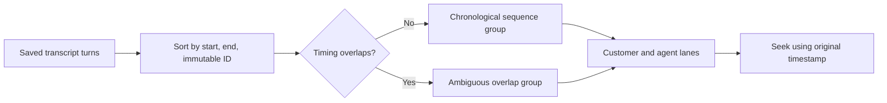

# Story 2.6: Chronological Transcript Order

**GitHub issue:** [#70](https://github.com/vrize-poc-demo/call-center-radar/issues/70)

**Status:** In Progress

**Owner:** Vipin

**Epic:** Call Detail core experience
**Last updated:** 2026-08-23

## 1. Outcome

### User-Visible Goal

A manager can read transcript events in a deterministic chronological sequence.
When saved stereo STT ranges overlap, the interface groups the turns and clearly
states that exact sentence order is unavailable instead of presenting a false
order.

### Scope

- Included: deterministic display ordering, overlap grouping, ambiguity wording,
  preserved speaker lanes, original timestamps, click-to-seek, responsive layout,
  and focused tests.
- Excluded: modifying persisted transcript turns, estimating sentence timestamps,
  changing STT output, and the precise cross-lane time scale owned by issue #71.

### Acceptance Criteria

- [x] Overlapping agent and customer source ranges have a deterministic display-order rule.
- [x] A long source segment and contained customer speech appear in one explicitly ambiguous sequence group.
- [x] Selecting a displayed item still seeks to its immutable saved audio timestamp.
- [x] Unit tests cover the reported overlapping-range scenario.
- [x] The UI explains when source timing cannot establish exact sentence order.

## 2. Design

### Flow

### Components and Ownership

| Area | Files or module | Responsibility |
| --- | --- | --- |
| UI ordering | `transcriptSequence.ts` | Build deterministic overlap-aware sequence groups without mutating turns. |
| Call Detail | `CallDetailPage.tsx` | Render groups, speaker lanes, ambiguity text, and seek actions. |
| Styling | `styles.css` | Keep sequence groups readable on desktop and mobile. |
| API | Not applicable | The existing transcript response remains unchanged. |
| Persistence | Not applicable | Immutable saved transcript turns remain authoritative. |
| Tests | `transcriptSequence.test.ts`, `CallDetailPage.test.tsx` | Protect ordering, overlap handling, evidence timing, and UI behavior. |

### Contracts and Data

There is no API or database contract change. The UI derives temporary sequence
groups from `TranscriptTurn` records. It preserves each `transcript_turn_id`,
speaker, quote, `start_ms`, and `end_ms`; it never invents sentence-level timing.

## 3. Operational Behavior

### Logging and Privacy

No new logging is required. Existing transcript loading and playback failure
events remain unchanged. The feature does not add transcript text, audio,
customer names, agent names, PII, or secrets to logs.

### Failure and Recovery

Empty and filtered transcript states retain their existing messages. Invalid or
missing server data continues through the existing transcript load failure path.
An overlap is not treated as an error: the UI preserves both turns and exposes
the timing ambiguity. Reloading the call reconstructs the same sequence from
persisted turns.

## 4. Verification

### Automated Tests

| Check | Result | Notes |
| --- | --- | --- |
| Unit tests | Passed | 3 sequence tests; the new module has 100% statement, branch, function, and line coverage. |
| Integration tests | Passed | 20 Call Detail tests include overlap messaging and immutable click-to-seek timing. |
| Full regression | Passed | 38 web tests and 83 API tests passed with coverage. |
| Lint and format | Passed | ESLint, Ruff, Prettier, and Ruff format checks passed. |
| Build | Passed | TypeScript and the Vite production build passed. |
| Accuracy evaluation | Not applicable | This story preserves source timing and makes ambiguity explicit; it does not evaluate AI accuracy. |

### Manual Verification and Demo Path

1. Open a call containing a long agent segment that overlaps a customer turn.
2. Confirm both turns appear in the same numbered sequence group.
3. Confirm the overlap note says exact sentence order is unavailable.
4. Select each message and confirm playback seeks to its saved start time.
5. Apply search and speaker filters and confirm the active turn remains visible.

Live verification used the reported shape: an agent range at
`22.02s-44.90s`, a customer address at `30.00s-32.00s`, and a later agent turn
at `45.00s-47.00s`. The first two appeared together in Sequence 1 with the
ambiguity notice. Selecting them updated playback to `0:22` and `0:30`.
Desktop and 390px-wide production-bundle checks showed no horizontal overflow;
the mobile view displayed explicit speaker labels.

### Known Gaps and Follow-Up Boundaries

- Source STT ranges cannot establish sentence order inside one long segment.
- Issue #71 owns stronger shared-time visual alignment between the two lanes.

## 5. Delivery Record

- Branch: `feature/story-2.6-chronological-transcript-order`
- Pull request: Pending
- Commit(s): Pending
- Review result: Pending

### Change Log

Update this table before every commit. Explain both the change and its reason; do not use generic entries such as "updates" or "fixes".

| Commit | What changed | Why |
| --- | --- | --- |
| Pending | Added deterministic overlap-aware transcript groups, ambiguity messaging, responsive Call Detail rendering, tests, and this record. | Prevent the UI from implying an exact sentence order that the saved STT timing cannot support. |

### PR Readiness and Review

- Mergeability verification: `Pending - npm run pr:verify -- <pr-number>`
- Code quality grade: `Pending - A to F`
- Testing quality grade: `Pending - A to F`
- Review findings and follow-up: Pending focused and full verification.
