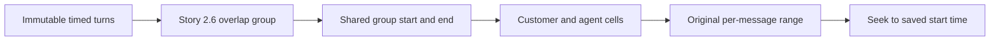

# Story 2.7: Time-Aligned Transcript Lanes

**GitHub issue:** [#71](https://github.com/vrize-poc-demo/call-center-radar/issues/71)

**Status:** In Progress

**Owner:** Vipin

**Epic:** Call Detail core experience
**Last updated:** 2026-08-23

## 1. Outcome

### User-Visible Goal

A manager can compare customer and agent messages inside the same explicit time
window when their saved stereo transcription ranges overlap, including one long
agent interval containing several customer messages.

### Scope

- Included: shared overlap-window wording, cross-lane timing context, preserved
  full message ranges, immutable click-to-seek behavior, narrow-screen checks,
  and the multiple-customer regression case.
- Excluded: changing saved transcript data, inventing sentence timing, acoustic
  diarization, evidence changes, and proportional timeline visualization.

### Acceptance Criteria

- [x] A manager can compare customer and agent messages against the same time context.
- [x] Overlapping saved ranges are visually identifiable across both lanes.
- [x] Every message retains its complete saved range and click-to-seek behavior.
- [x] Narrow-screen behavior remains readable without hiding timing context.
- [x] Tests cover a long agent interval overlapping multiple customer messages.

## 2. Design

### Flow

### Components and Ownership

| Area | Files or module | Responsibility |
| --- | --- | --- |
| Call Detail | `CallDetailPage.tsx` | Show the shared time window above overlapping customer/agent lanes. |
| Sequence model | `transcriptSequence.ts` | Existing immutable overlap groups remain the source of group boundaries. |
| Styling | `styles.css` | Stack shared timing metadata on narrow screens to prevent horizontal overflow. |
| API | Not applicable | Existing transcript API contract is unchanged. |
| Persistence | Not applicable | Existing immutable transcript turns remain authoritative. |
| Tests | Call Detail and sequence tests | Cover one long range overlapping multiple customer messages and shared context. |

### Contracts and Data

There is no API, SQLite, or persisted-data change. The UI displays the existing
derived group `start_ms` and `end_ms`. Every message continues to use its own
immutable `transcript_turn_id`, quote, `start_ms`, and `end_ms` for display and
audio seeking.

## 3. Operational Behavior

### Logging and Privacy

No new logging is required. Existing safe transcript load, active-scroll, and
audio playback failure events remain unchanged. No raw audio, transcript text,
customer or agent name, PII, or secret is added to logs.

### Failure and Recovery

Calls without overlapping turns retain ordinary numbered sequence rows and do
not show shared-window wording. Overlap rows derive their window locally from
saved turns, so reloading reconstructs the same result. Existing empty, loading,
filter, and transcript failure states remain unchanged.

## 4. Verification

### Automated Tests

| Check | Result | Notes |
| --- | --- | --- |
| Unit tests | Passed | Sequence test covers one long agent range with two contained customer turns. |
| Integration tests | Passed | 20 Call Detail tests cover shared time, complete ranges, and click-to-seek. |
| Full regression | Passed | 41 web tests and 86 API tests passed with coverage. |
| Lint and format | Passed | ESLint, Ruff, Prettier, and Ruff format checks passed. |
| Build | Passed | TypeScript and Vite production build passed. |
| Accuracy evaluation | Not applicable | The feature exposes saved timing without evaluating or changing model accuracy. |

### Manual Verification and Demo Path

1. Open a call with one long agent range containing two customer ranges.
2. Confirm all messages appear in one overlap group.
3. Confirm the group displays one shared start/end window.
4. Confirm every message still displays its own full start/end range.
5. Select each message and confirm audio seeks to its immutable start time.
6. Repeat at a narrow viewport and confirm timing remains visible and readable.

Live production-bundle verification used an agent range at `22.02s-44.90s`
containing customer ranges at `25.00s-27.00s` and `30.00s-32.00s`. All three
messages appeared under `Shared time 22.02s-44.90s`; customer selections moved
playback to `0:25` and `0:30`. At 390px, shared timing and speaker labels were
visible with no horizontal overflow.

### Known Gaps and Follow-Up Boundaries

- Saved segment ranges cannot prove sentence-level order inside an overlap.
- A proportional waveform/timeline view is intentionally outside this POC bug fix.

## 5. Delivery Record

- Branch: `feature/story-2.7-time-aligned-transcript-lanes`
- Pull request: Pending
- Commit(s): Pending
- Review result: Pending

### Change Log

Update this table before every commit. Explain both the change and its reason; do not use generic entries such as "updates" or "fixes".

| Commit | What changed | Why |
| --- | --- | --- |
| Pending | Added shared overlap-window wording, multiple-customer regression coverage, narrow-screen metadata stacking, and this delivery record. | Make cross-speaker timing directly comparable without inventing sentence order or causing mobile overflow. |

### PR Readiness and Review

- Mergeability verification: `Pending - npm run pr:verify -- <pr-number>`
- Code quality grade: `Pending - A to F`
- Testing quality grade: `Pending - A to F`
- Review findings and follow-up: Pending focused and full verification.
