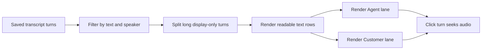

# Story 2.9: Agent-first time-ruler conversation timeline

**GitHub issue:** #111

**Status:** In Progress

**Owner:** vipinv-dev

**Epic:** Call Detail core experience
**Last updated:** 2026-08-25

## 1. Outcome

### User-Visible Goal

Managers and technical reviewers can read the call as a clean two-column conversation, with the agent lane first and the customer lane second. The UI keeps the spoken text readable and avoids visible timing clutter.

### Scope

- Included: Rename the Call Detail transcript section to **Conversation Timeline**.
- Included: Render text-only Agent and Customer communication lanes.
- Included: Keep agent on the left and customer on the right.
- Included: Split long multi-sentence turns for display readability without changing saved transcript evidence.
- Included: Preserve chronological ordering, search/filter, active playback highlighting, click-to-seek, and evidence jump behavior.
- Included: Update Call Detail tests for the new timeline semantics.
- Excluded: Changing transcript generation, diarization, persistence, or audio synchronization logic.

### Acceptance Criteria

- [x] Rename transcript section to **Conversation Timeline**.
- [x] Render three columns: `Time`, `Agent`, and `Customer`.
- [x] Agent lane appears left of Customer lane.
- [x] Visible timing labels are removed from the conversation view to prevent overlap and clutter.
- [x] Each saved transcript turn appears in the correct speaker lane.
- [x] Conversation messages remain in readable dialogue order even when STT returns one long overlapping turn.
- [x] Overlapping agent/customer speech remains timestamped without adding misleading sequence blocks or labels.
- [x] Clicking a turn seeks the audio to that timestamp.
- [x] The active playback turn remains highlighted.
- [x] Evidence jump scrolls/highlights the correct turn.
- [x] Search/filter still works.
- [x] Unit tests cover lane placement, hidden accessible timing labels, active highlight, and click-to-seek.
- [x] Story documentation explains the UI choice and constraints.

## 2. Design

### Flow

### Components and Ownership

| Area | Files or module | Responsibility |
| --- | --- | --- |
| UI | `apps/web/src/features/call-detail/CallDetailPage.tsx` | Renders the Conversation Timeline and preserves seek/highlight behavior. |
| Display ordering | `apps/web/src/features/call-detail/conversationDisplay.ts` | Builds readable display messages from saved transcript turns without mutating transcript evidence. |
| Styling | `apps/web/src/styles.css` | Owns the lane columns, speaker styling, and responsive layout. |
| Timeline grouping | Not applicable | The Call Detail screen intentionally avoids sequence/group containers so the UI reads as a continuous conversation. |
| API | Not applicable | Existing transcript API contract is unchanged. |
| Persistence | Not applicable | Existing saved transcript turns are reused. |
| Tests | `apps/web/src/features/call-detail/CallDetailPage.test.tsx` | Verifies section naming, lane order, time labels, search, active state, and seek behavior. |

### Contracts and Data

No API or database contract changed. The UI still consumes saved transcript turns with `transcript_turn_id`, `speaker`, `start_ms`, `end_ms`, and `text`. Evidence links still resolve by immutable `transcript_turn_id`. Display-only message splitting keeps a `source_turn_id` back to the saved transcript turn.

## 3. Operational Behavior

### Logging and Privacy

Existing search and evidence logs are unchanged. No raw audio, full transcript payload, customer PII, or secrets are added to logs.

### Failure and Recovery

Existing empty, loading, and failed transcript states remain. Unknown-speaker turns still render as unattributed content in the timeline so mono or uncertain transcript data is not hidden.

## 4. Verification

### Automated Tests

| Check | Result | Notes |
| --- | --- | --- |
| Unit tests | Passed | `npm run test --workspace=@call-center-radar/web -- --run CallDetailPage conversationDisplay` passed 21 focused Call Detail and display-ordering tests. |
| Integration tests | Passed | Component tests cover section naming, timeline list semantics, lane order, hidden visible timing, overlap-label removal, search, active state, evidence behavior, and click-to-seek. |
| Lint and format | Passed | `npm run lint` completed with ESLint and Ruff passing. `npm run format:check` completed with Prettier and Ruff format checks passing. |
| Build | Passed | `npm run build` completed the TypeScript and Vite production build. |
| Accuracy evaluation | Not applicable | UI-only presentation change. |

### Manual Verification and Demo Path

1. Start the app with `npm run dev`.
2. Open a completed Call Detail page.
3. Confirm the section title is **Conversation Timeline**.
4. Confirm the timeline columns are Time, Agent, and Customer.
5. Confirm no visible time labels overlap the conversation text.
6. Click an agent or customer turn and confirm the audio jumps to that timestamp.
7. Use search and speaker filter and confirm matching turns remain visible.
8. Click evidence from analysis and confirm it highlights the correct timeline turn.

### Known Gaps and Follow-Up Boundaries

- Visible timing is intentionally hidden in the conversation view; timestamps remain in accessible button labels and click-to-seek behavior.
- This does not add diarization for unknown-speaker mono audio.

## 5. Delivery Record

- Branch: `codex/story-2.9-conversation-timeline`
- Pull request: #112
- Commit(s): `e216245`
- Review result: TBD

### Change Log

Update this table before every commit. Explain both the change and its reason; do not use generic entries such as "updates" or "fixes".

| Commit | What changed | Why |
| --- | --- | --- |
| `e216245` | Replaced the sequence transcript presentation with an agent-first time-ruler conversation timeline. | Call audio can overlap, so a lane-based timeline is clearer and more truthful than chat bubbles. |
| Pending | Simplified the timeline into chronological turn rows and removed sequence containers and overlap text. | The grouped presentation looked confusing for managers and made one long agent turn visually swallow several customer turns. |
| Pending | Replaced repeated per-turn time ranges with one graph-style time axis and plotted speaker messages by timestamp. | Managers need one readable call timeline from start to end, not repeated row labels that look like a table. |
| Pending | Removed the visible time axis and kept a text-only two-column conversation. | The plotted graph caused close messages to overlap; for the demo, readable text is more important than visible timing. |
| Pending | Added display-only sentence splitting and readable ordering for long overlapping STT turns. | The sample call had one long agent turn that visually appeared before the customer question; managers need the conversation to read naturally. |

### PR Readiness and Review

- Mergeability verification: `Passed - npm run pr:verify -- 112`
- Code quality grade: `A`
- Testing quality grade: `A`
- Review findings and follow-up: No blocking findings from self-review. Human review and CI verification remain required before merge.
