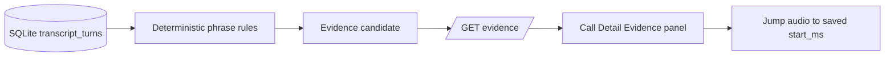

# Story 3.1: Deterministic Evidence Extraction

**GitHub issue:** [#22](https://github.com/vrize-poc-demo/call-center-radar/issues/22)  
**Status:** In Progress  
**Owner:** Vipin  
**Epic:** Evidence Engine and Single Call AI Analysis

## 1. Outcome

### User-Visible Goal

Managers can see rule-based evidence candidates in Call Detail and jump directly to the saved audio timestamp. Every quote, time, and transcript reference is derived from a persisted turn; no model is used or allowed to invent evidence.

### Scope

- Included: unresolved/problem phrase rules, deterministic IDs, exact quote and timestamp extraction, read-only evidence API, Evidence panel rendering, audio jumps, logs, and tests.
- Excluded: LLM analysis, scoring, resolution decisions, evidence editing, and any claim not supported by a saved transcript turn.

### Acceptance Criteria

- [x] Evidence candidates are produced from saved transcript data before any LLM output.
- [x] Each candidate contains a real `transcript_turn_id`, saved timestamp range, and exact saved quote.
- [x] Extraction rules and IDs are deterministic and explainable.

## 2. Design

| Area | Files | Responsibility |
| --- | --- | --- |
| Rules/API | `apps/api/src/app/evidence.py` | Extracts candidates and exposes a read-only evidence response. |
| API registration | `apps/api/src/app/main.py` | Adds the evidence router. |
| UI | `apps/web/src/features/call-detail/CallDetailPage.tsx` | Shows candidates and seeks audio from their persisted time. |
| Client contract | `apps/web/src/api/calls.ts` | Defines and fetches `EvidenceCandidate`. |
| Tests | `apps/api/tests/test_evidence.py`, Call Detail test | Covers matching, exact saved fields, endpoint, UI rendering, and jump. |

## 3. Operational Behavior

`evidence_rule_hit` logs call ID, rule ID, and transcript turn ID only. `evidence_extracted` logs candidate count. Quotes, transcript text, audio, PII, and search terms are never logged. An unavailable evidence request leaves a readable empty panel and emits `evidence_load_failed` without call content.

## 4. Verification

| Check | Result | Notes |
| --- | --- | --- |
| API evidence tests | Passed | Exact turn IDs, quotes, rules, and endpoint behavior. |
| Web tests | Pending rerun | Includes Evidence panel timestamp jump. |
| Full quality gate | Pending rerun | Lint, format, coverage, and build before PR. |
| Accuracy evaluation | Not applicable | This is deterministic extraction, not an AI judgement. |

Manual demo: upload or seed a transcript with `issue`, `error`, `help`, `still not working`, or `not resolved`; open Call Detail, select an Evidence candidate, and verify the player seeks to its shown timestamp.

## 5. Delivery Record

- Branch: `feature/story-3.1-deterministic-evidence-extraction`
- Pull request: Pending
- Commit(s): Pending
- Review result: Pending

| Commit | What changed | Why |
| --- | --- | --- |
| Pending | Added deterministic evidence extraction, API/UI contracts, tests, and this story record. | Ensure every later AI claim can be grounded in stored transcript evidence. |

- Mergeability verification: Pending - `npm run pr:verify -- <pr-number>`
- Code quality grade: Pending
- Testing quality grade: Pending
