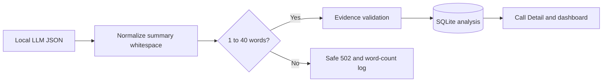

# Story 3.10: Enforce Concise Manager Call Summary

**GitHub issue:** [#78](https://github.com/vrize-poc-demo/call-center-radar/issues/78)

**Status:** In Review

**Owner:** Vipin

**Epic:** Evidence-backed AI analysis
**Last updated:** 2026-08-23

## 1. Outcome

### User-Visible Goal

Managers see a concise, plain-language call summary of one to forty words in
Call Detail and dashboard lists, so they can triage a call quickly before
opening its evidence.

### Scope

- Included: deterministic whitespace normalization, word-count enforcement,
  recoverable model-output rejection, SQLite persistence, safe diagnostic
  logging, and manager-facing summary rendering.
- Excluded: rewriting historical analysis, priority changes, Issue Radar,
  replacing manager brief or recommended action, and adding claims to a
  summary.

### Acceptance Criteria

- [x] Every newly persisted analysis has a one through forty word summary.
- [x] Over-limit output is rejected before SQLite persistence.
- [x] Summary whitespace is normalized without splitting words.
- [x] Call Detail and dashboard lists expose the saved summary.
- [x] Tests cover word boundaries, punctuation, malformed output, and
  persistence behavior.

## 2. Design

### Flow

### Components and Ownership

| Area | Files or module | Responsibility |
| --- | --- | --- |
| Summary rule | `apps/api/src/app/summary.py` | Normalize whitespace and enforce one to forty words. |
| Analysis | `apps/api/src/app/analysis.py` | Apply the rule before evidence validation and persistence. |
| Dashboard | `apps/api/src/app/dashboard.py` | Expose saved summary in the manager triage read model. |
| Manager UI | `apps/web/src/features/call-detail/CallDetailPage.tsx`, `TodayDashboard.tsx` | Display the bounded summary without client-side truncation. |
| Tests | API and web suites | Cover boundary, failure, persistence, and rendering behavior. |

### Contracts and Data

`summary` remains a persisted analysis field. Newly generated values are
whitespace-normalized and restricted to one through forty whitespace-delimited
words before SQLite write. The API returns 502 for invalid local-model output;
existing persisted analysis is not replaced. No database migration or historical
backfill is needed.

## 3. Operational Behavior

### Logging and Privacy

Successful analysis logs include `summary_word_count`, model/version metadata,
and latency. Validation failures log only a stable reason and optional word
count. Summary text, transcript text, audio, names, and secrets are excluded.

### Failure and Recovery

An empty, non-text, or over-limit summary causes a recoverable analysis 502.
The manager can retry after the local model is available again; the old
persisted analysis remains intact. There is intentionally no content-truncation
fallback because it could change the model's meaning.

## 4. Verification

### Automated Tests

| Check | Result | Notes |
| --- | --- | --- |
| API unit tests | Passed | 58 API tests include boundary, normalization, persistence, invalid-output, and dashboard read-model coverage. |
| Web unit tests | Passed | 27 web tests include Call Detail and manager-list rendering. |
| Lint and format | Passed | `npm run lint` and `npm run format:check` completed cleanly. |
| Build | Passed | `npm run build` completed the production bundle. |
| Live local LLM | Passed | `ollama:qwen2.5:7b` generated a twelve-word summary accepted by the deterministic validator. |
| Accuracy evaluation | Not applicable | This story controls presentation length, not semantic model quality. |

### Manual Verification and Demo Path

1. Analyze a new call with local Ollama running.
2. Confirm Call Detail shows Summary above Manager brief.
3. Open Today and confirm the same saved summary appears in manager lists.
4. Use a test provider with forty-one words and confirm the API returns a
   recoverable error without replacing an existing analysis.

### Known Gaps and Follow-Up Boundaries

- The limit improves scanning; it does not prove summary semantic accuracy.
- Story #82 owns corpus-wide model accuracy benchmarking.

## 5. Delivery Record

- Branch: `feature/story-3.10-concise-manager-summary`
- Pull request: [#83](https://github.com/vrize-poc-demo/call-center-radar/pull/83)
  (draft, targets `development`)
- Commit(s): `9918111` - concise-summary rule, rendering, tests, and record.
- Review result: local full gate, live local-LLM check, and GitHub CI passed;
  mergeability verification and human review are pending.

### Change Log

| Commit | What changed | Why |
| --- | --- | --- |
| Pending | Added deterministic concise-summary enforcement, manager rendering, tests, and this record. | Keep generated call summaries scannable without trusting client-side truncation. |
| Pending | Ran the complete test, lint, format, build, and live local-Ollama checks. | Confirm the bounded-summary contract works in both automated and real-model paths. |
| Pending | Created draft PR #83 after a passing GitHub Quality Gates run. | Preserve a human-review step before any merge to `development`. |

### PR Readiness and Review

- Mergeability verification: Pending
- Code quality grade: Pending
- Testing quality grade: Pending
- Review findings and follow-up: Pending implementation verification.
