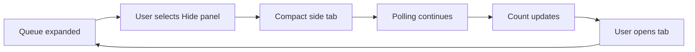

# Story 3.11: Collapse global processing and recent calls

**GitHub issue:** #109

**Status:** In Progress

**Owner:** vipinv-dev

**Epic:** Call intake and processing pipeline
**Last updated:** 2026-08-25

## 1. Outcome

### User-Visible Goal

Managers and demo users can hide the always-visible call-processing / recent-calls side panel when they need more room for the main page, then expand it again without losing queue status or completed-call navigation.

### Scope

- Included: Add a collapse control to the expanded Global Processing Queue.
- Included: Add a compact side-tab state that shows the current recent-call count.
- Included: Preserve polling while the panel is collapsed.
- Included: Add unit tests for collapse, expand, and polling/count behavior.
- Excluded: Changing queue API responses, processing worker behavior, or completed-call navigation rules.

### Acceptance Criteria

- [x] Global Processing Queue / Recent Calls has a clear hide/collapse control.
- [x] Collapsed state renders as a compact side tab with a visible item count.
- [x] Users can expand the panel again from the side tab.
- [x] Queue polling continues while collapsed.
- [x] Recent calls / completed calls remain navigable after expanding.
- [x] Unit tests cover collapse, expand, and item count behavior.
- [x] Story documentation explains the UX and implementation choices.

## 2. Design

### Flow

### Components and Ownership

| Area | Files or module | Responsibility |
| --- | --- | --- |
| UI | `apps/web/src/features/processing/GlobalProcessingQueue.tsx` | Owns expanded/collapsed queue state and controls. |
| Styling | `apps/web/src/styles.css` | Owns the side-tab layout and responsive behavior. |
| API | Not applicable | Existing queue polling API is unchanged. |
| Persistence | Not applicable | No database or local storage changes. |
| Tests | `apps/web/src/features/processing/GlobalProcessingQueue.test.tsx` | Verifies collapse, expand, count, and polling behavior. |

### Contracts and Data

No API or database contract changed. The component continues to call `getProcessingQueue()` on the existing interval. Collapsed state is local UI state only and intentionally resets on page reload.

## 3. Operational Behavior

### Logging and Privacy

No logging behavior changed. Existing queue-to-detail logging remains limited to `call_id`; raw audio, transcripts, customer PII, and secrets are not logged.

### Failure and Recovery

Existing queue polling and dismissal failure messages are unchanged. If polling fails while collapsed, the latest count remains visible until the panel is expanded and the existing status message can be seen.

## 4. Verification

### Automated Tests

| Check | Result | Notes |
| --- | --- | --- |
| Unit tests | Passed | `npm run test --workspace=@call-center-radar/web -- --run GlobalProcessingQueue` passed 7 tests. |
| Integration tests | Passed | Component tests cover collapsed tab count, expand behavior, and polling while collapsed. |
| Lint and format | Passed | `npm run lint`. |
| Build | Passed | `npm run build`. |
| Accuracy evaluation | Not applicable | UI-only change. |

### Manual Verification and Demo Path

1. Start the app with `npm run dev`.
2. Confirm the Global Processing Queue / Recent Calls panel is visible.
3. Select **Hide panel**.
4. Confirm the panel becomes a compact side tab with the recent-call count.
5. Select the side tab.
6. Confirm recent calls and completed-call navigation are visible again.

### Known Gaps and Follow-Up Boundaries

- The collapsed state is not persisted across page reloads.
- This does not change queue filtering or sorting.

## 5. Delivery Record

- Branch: `codex/story-3.11-collapsible-processing`
- Pull request: TBD
- Commit(s): TBD
- Review result: TBD

### Change Log

Update this table before every commit. Explain both the change and its reason; do not use generic entries such as "updates" or "fixes".

| Commit | What changed | Why |
| --- | --- | --- |
| Pending | Added a collapsible Global Processing Queue side tab, responsive styles, and queue tests. | Users need to hide the recent-calls panel without stopping background processing visibility. |

### PR Readiness and Review

- Mergeability verification: `Pending - npm run pr:verify -- <pr-number>`
- Code quality grade: `Pending - A to F`
- Testing quality grade: `Pending - A to F`
- Review findings and follow-up: TBD
