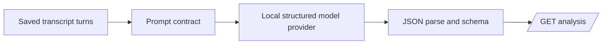

# Story 3.2: Structured LLM Analysis

**GitHub issue:** [#23](https://github.com/vrize-poc-demo/call-center-radar/issues/23)

## Outcome

The API returns one structured, manager-ready call analysis with intent, mood, resolution, summary, manager brief, recommended action, and model version. The local demo provider is free and replaceable; it creates no evidence, timestamps, scores, or cross-call trends.

## Design

`apps/api/src/app/analysis.py` owns the JSON schema, prompt contract, parser, local demo provider, and endpoint. The endpoint loads a single call only. The local provider makes the POC runnable for free; a production/local LLM adapter can replace it without changing `CallAnalysis`.

## Safety, Logging, and Recovery

`analysis_generated` logs only call ID, model version, and latency. `analysis_schema_failed` logs the same safe metadata. Raw transcripts, prompts, quotes, PII, and model output are not logged. Invalid JSON/schema yields a clear 502 response; Story 3.3 will validate any future model claims against evidence.

## Verification

- Unit tests cover valid schema parsing and malformed output rejection.
- Full quality gate: Pending before PR.
- Manual: `GET /api/calls/{call_id}/analysis` returns the stable JSON fields for one persisted call.

## Delivery Record

- Branch: `feature/story-3.2-structured-llm-analysis`
- Pull request: Pending
- Commit: Pending
