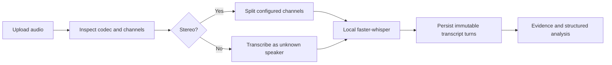

# Story 3.4: Local Audio Transcription and Speaker Attribution

**GitHub issue:** #55

**Status:** In Progress

**Owner:** vipinv-dev

**Epic:** #2 Call intake and processing pipeline
**Last updated:** 2026-08-22

## 1. Outcome

### User-Visible Goal

After uploading a call, a manager can run processing and receive a persisted, timestamped
transcript from a free local speech-to-text model. Stereo channels are attributed only when the
recording supplies that evidence; mono speech remains explicitly unknown.

### Scope

- Included: Local `faster-whisper` provider, audio inspection, mono/stereo routing, durable
  transcript persistence, processing failure states, structured operational logs, and API tests.
- Excluded: Paid STT APIs, hosted LLMs, mono diarization, production worker queues, and changes to
  downstream evidence or analysis rules.

### Acceptance Criteria

- [x] A supported uploaded audio file produces persisted text, timestamps, and stable turn IDs.
- [x] The existing transcript endpoint returns the generated turns for evidence and analysis.
- [x] Stereo channel attribution is deterministic when mapping is configured.
- [x] Mono output uses `unknown`, never fabricated agent or customer labels.
- [x] Invalid audio and model failures become inspectable failed jobs.
- [x] Automated unit tests cover success, routing, persistence, and failure behavior.
- [x] A documented real-model smoke test processes at least five sample recordings.

## 2. Design

### Flow

### Components and Ownership

| Area | Files or module | Responsibility |
| --- | --- | --- |
| API | `app/calls.py` | Start the durable processing path already exposed to the UI. |
| Pipeline | `app/pipeline.py` | Inspect audio, call the provider, persist results, and own status transitions. |
| STT provider | `app/transcription.py` | Isolate local `faster-whisper`, channel extraction, and model-specific failures. |
| Persistence | `app/transcripts.py`, migration `006` | Store and retrieve turns, including evidence-honest `unknown` speakers. |
| Tests | `tests/test_pipeline.py`, `tests/test_transcription.py` | Exercise orchestration and provider routing without downloading a model in CI. |

### Contracts and Data

`POST /api/calls/{job_id}/process` continues to return the job status. Its resulting transcript is
available from the existing `GET /api/calls/{call_id}/transcript` contract. The migration expands
the speaker check to accept `unknown`; this is necessary to avoid unsupported identity claims for
mono recordings. Runtime configuration selects `CALL_RADAR_TRANSCRIPTION_MODEL` (default
`base.en`) and `CALL_RADAR_TRANSCRIPTION_DEVICE` (default `cpu`).

## 3. Operational Behavior

### Logging and Privacy

Events: `transcription_started`, `audio_inspected`, `transcription_completed`, and
`transcription_failed`. Context includes call/job IDs, model version, channels, duration, latency,
turn count, and failure reason. Raw audio, participant names, and transcript text are excluded.

### Failure and Recovery

Unsupported or unreadable audio finishes as `failed` with `invalid_audio`. Missing local model
dependencies, unavailable model assets, or STT runtime failures finish as `failed` with
`transcription_failed`. A new upload creates a fresh job; retry orchestration is deliberately
outside this POC story.

## 4. Verification

### Automated Tests

| Check | Result | Notes |
| --- | --- | --- |
| Unit tests | Passed | 9 frontend tests and 27 API tests passed; new tests cover provider routing, persistence, and failure handling. |
| Integration tests | Passed | Five real sample MP3s completed through upload, processing, persistence, and retrieval. |
| Lint and format | Passed | `npm run lint` and `npm run format:check` passed. |
| Build | Passed | `npm run build` completed successfully. |
| Accuracy evaluation | Not measurable yet | The 1,441-file source set has metadata but no human reference transcript. Pipeline success was 5/5 (100%); WER requires labelled text. |

### Five-File Local Model Smoke Test

The free local `faster-whisper:base.en` model processed five stereo MP3 files with persisted,
non-empty agent/customer turns. The test used the real upload and processing API path and asserted
completed status, stereo inspection, durable turn count, and valid speaker labels.

| Sample | Turns | Processing time |
| --- | ---: | ---: |
| `004860b1ab2e4c88.mp3` | 8 | 4.14 s |
| `0091a706bc604188.mp3` | 5 | 2.18 s |
| `00d676d7058c49bb.mp3` | 5 | 2.63 s |
| `00f7dce6fc3849a2.mp3` | 4 | 2.18 s |
| `010d38f5ada54e0d.mp3` | 5 | 2.30 s |

**Measured result:** 5/5 recordings completed with persisted transcript output, or **100% pipeline
success** for this smoke test. This is not a transcription word-accuracy score. To calculate
accuracy, Story 10.3 must provide a human-labelled reference transcript set and calculate word
error rate (WER).

### Manual Verification and Demo Path

1. Upload a new MP3 or WAV call.
2. Invoke processing and observe `transcribing` then `completed`.
3. Open the transcript and audio playback view.
4. Use the saved transcript as the input to evidence and analysis.

### Known Gaps and Follow-Up Boundaries

- Model download is required once on the demo machine and is intentionally not a CI step.
- A word-error-rate percentage cannot be claimed without human-labelled ground truth.
- Mono speaker diarization is a separate future story.

## 5. Delivery Record

- Branch: `feature/story-3.4-local-audio-transcription`
- Pull request: #57 (draft, targets `development`)
- Commit(s): `659dbbf` local transcription implementation; `5d8354d` local CORS fix
- Review result: Code quality A; testing quality A; no blocking self-review findings.

### Change Log

Update this table before every commit. Explain both the change and its reason; do not use generic entries such as "updates" or "fixes".

| Commit | What changed | Why |
| --- | --- | --- |
| `659dbbf` | Added local faster-whisper transcription, durable generated turns, stereo routing, UI terminology/type support, tests, and developer documentation. | Replaces the placeholder processing path with evidence-ready local STT and proves the behavior without model downloads in CI. |
| `140a890` | Recorded the draft PR, exact commit, and self-review outcome. | Keeps the story record aligned with the reviewable GitHub delivery. |
| `5d8354d` | Allowed the alternate local Vite port and added a CORS preflight regression test. | Ensures the manual app running on `127.0.0.1:5174` can reach the API instead of failing in the browser. |
| Pending | Rebased on current development and moved the transcription speaker migration from `005` to `006`. | Preserves the merged Radar Priority migration and removes the PR migration-number conflict. |

### PR Readiness and Review

- Mergeability verification: `Pending - npm run pr:verify -- 57` after GitHub CI completes.
- Code quality grade: `A`
- Testing quality grade: `A`
- Review findings and follow-up: No blocking findings. Mono diarization and WER evaluation remain
  explicitly deferred to later scoped stories.
