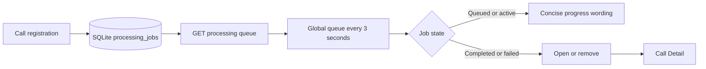

# Story 3.5: Global Processing Queue

**GitHub issue:** #58

**Status:** In Review

**Owner:** vipinv-dev

**Epic:** #2 Call intake and processing pipeline
**Last updated:** 2026-08-22

## 1. Outcome

### User-Visible Goal

A manager can keep working anywhere in the POC while a simple, always-visible queue shows the
latest durable state of recently submitted calls. When a call completes or fails, the manager can
open its Call Detail view from the queue.

### Scope

- Included: Persisted queue-list API, shared polling UI, readable processing-state wording,
  loading/empty/error states, completed/failed call navigation, safe terminal-item dismissal, local
  CORS support, and tests.
- Excluded: Background scheduling, worker ownership, retry controls, notifications, queue
  prioritisation, and any analysis or transcript content in the queue.

### Acceptance Criteria

- [x] The queue remains visible on the implemented upload and Call Detail screens.
- [x] A manager sees recent processing state updates without refreshing the browser.
- [x] Queue data comes from persistent SQLite `processing_jobs` records, not browser state.
- [x] Loading, empty, failed, and completed states are understandable for a non-technical user.
- [x] The queue exposes no transcript text, audio bytes, agent name, or unnecessary call content.
- [x] A manager can remove completed or failed items from the queue without deleting call data.
- [x] Active calls cannot be removed from the queue.

## 2. Design

### Flow



### Components and Ownership

| Area | Files or module | Responsibility |
| --- | --- | --- |
| API | `apps/api/src/app/calls.py` | Select visible jobs and soft-dismiss terminal jobs without deleting call data. |
| Logging | `apps/api/src/app/calls.py` | Emit queue-list retrieval counts and state counts without user content. |
| CORS | `apps/api/src/app/main.py` | Permit standard local Vite ports through `5175` for browser API access. |
| UI | `apps/web/src/features/processing/GlobalProcessingQueue.tsx` | Poll, render readable status, and link actionable calls to Call Detail. |
| App composition | `apps/web/src/App.tsx` | Render the shared queue above upload and detail routes. |
| Persistence | migration `007_processing_queue_dismissal.sql` | Store the timestamp that hides a terminal job from the manager queue. |
| Tests | `apps/api/tests/test_calls.py`, `apps/api/tests/test_main.py`, `apps/api/tests/test_workflow.py`, `apps/web/src/features/processing/GlobalProcessingQueue.test.tsx` | Verify persisted API data, CORS, status states, polling, and safe dismissal. |

### Contracts and Data

`GET /api/calls/processing-queue` returns at most 20 recent items:

```json
{
  "items": [
    {
      "job_id": "job_...",
      "call_id": "...",
      "customer_name": "Visible call name",
      "status": "queued|transcribing|analyzing|completed|failed",
      "updated_at": "SQLite timestamp",
      "failure_reason": "optional stable reason"
    }
  ]
}
```

The list reads existing durable `calls` and `processing_jobs` rows. Migration `007` adds the
nullable `queue_dismissed_at` retention marker used only to hide terminal items. The browser polls
every three seconds. `customer_name` is deliberately limited to the existing call display name;
agent name, raw audio, transcripts, evidence, and analysis output are not returned.

`DELETE /api/calls/{job_id}/queue-item` is permitted only for `completed` and `failed` jobs. It
sets `queue_dismissed_at`; it never deletes the call, audio, transcript, evidence, analysis, or
processing-event records. The queue list omits dismissed jobs.

## 3. Operational Behavior

### Logging and Privacy

`processing_queue_loaded` records only `item_count` and counts by processing status. Browser poll
errors log `processing_queue_poll_failed` without IDs, names, audio, or transcript content. The
queue response excludes raw audio, transcript turns, evidence, analysis, and agent names.
`processing_queue_item_dismissed` records only the job ID and terminal state.

### Failure and Recovery

If the API request fails, the previous visible queue remains and the manager sees `Queue status is
temporarily unavailable.` The next poll attempts recovery. A processing failure is shown as `Needs
attention` and includes an `Open call` path to inspect the existing failed Call Detail state. Story
3.6 owns durable worker scheduling; this story neither starts nor retries jobs.

The removal API rejects queued, transcribing, and analyzing jobs with a clear conflict response.
Repeated removal is idempotent. The manager can still access a dismissed call by its existing Call
Detail URL, and audit data remains available in SQLite.

## 4. Verification

### Automated Tests

| Check | Result | Notes |
| --- | --- | --- |
| Unit tests | Passed | 14 frontend tests and 35 API tests passed. The new queue component has 100% statement, function, and line coverage. |
| Integration tests | Passed | Queue API test creates durable jobs, verifies completed and failed data, and verifies excluded content. |
| Lint and format | Passed | `npm run lint` and `npm run format:check` passed. |
| Build | Passed | `npm run build` completed successfully. |
| Accuracy evaluation | Not applicable | This story renders persisted job states; it makes no AI-quality claim. |

### Manual Verification and Demo Path

1. Start the API and web app with the web app configured for its API URL.
2. Confirm the global queue shows the empty state on the upload page.
3. Upload a call and submit it; remain on the page.
4. Within one polling interval, confirm the queue shows the customer display name and `Waiting to
   start`/`queued` state.
5. Process the call. Confirm a failed call reads `Needs attention` and provides `Open call`.
6. Select `Open call`; confirm the URL changes to `?call=<call_id>`, Call Detail opens, and the
   queue remains visible above it.
7. Select `Remove from queue` on a completed or failed item. Confirm it disappears immediately;
   navigate directly to Call Detail to confirm the underlying call remains available.

**Executed browser evidence:** A temporary non-sensitive MP3 was registered as `Queue Test
Customer`. The queue changed from empty to `queued` after polling, then to `failed` after intentional
invalid-audio processing, and `Open call` navigated to
`?call=589887099b884731b7f5bc81988da3d9` while retaining the global queue.

**Executed dismissal evidence:** Removed the intentionally failed test item from the browser queue.
It disappeared immediately, while the completed call remained visible and its Call Detail data was
unchanged. The test item was not deleted from SQLite.

### Known Gaps and Follow-Up Boundaries

- Polling is intentionally simple for the POC; realtime push and browser notifications are out of scope.
- The UI displays all recent durable jobs but Story 3.6 owns background worker FIFO execution.
- Failed jobs remain actionable but cannot be retried in this story; removal is a visibility action.
- Repository-wide web coverage is 58.50% and API coverage is 89%; the project's overall 100% coverage goal requires tests for pre-existing modules outside Story 3.5.

## 5. Delivery Record

- Branch: `feature/story-3.5-global-processing-queue`
- Pull request: #63 (draft, targets `development`)
- Commit(s): `3973a52` global processing queue; `7ee7ba1` safe terminal-item removal
- Review result: Code quality A; testing quality A; no blocking self-review findings.

### Change Log

Update this table before every commit. Explain both the change and its reason; do not use generic entries such as "updates" or "fixes".

| Commit | What changed | Why |
| --- | --- | --- |
| `3973a52` | Added a SQLite-backed global processing queue API, shared polling UI, readable state mapping, Call Detail actions, CORS coverage, automated tests, and this delivery record. | Managers need to follow call processing across pages without a browser refresh, while keeping queue data evidence-safe and tightly scoped ahead of durable worker scheduling in Story 3.6. |
| `b0c1130` | Recorded the draft PR and self-review outcome. | Keeps the in-repository delivery record aligned with the reviewable GitHub change. |
| `d3ad50a` | Recorded successful GitHub quality gates and mergeability verification. | The project item can move to In Review only after the exact PR head is verified against `development`. |
| `7ee7ba1` | Added safe completed/failed queue dismissal, SQLite retention state, CORS support, API/UI tests, and manual verification. | Managers need to clear terminal queue clutter without destroying evidence, audit history, or calls that remain relevant for review. |
| Pending | Recorded the successful dismissal-update review and readiness outcome. | Keeps implementation, test evidence, and Project status synchronized with the final reviewable PR head. |

### PR Readiness and Review

- Mergeability verification: Passed - `npm run pr:verify -- 63`; targets `development`, is cleanly mergeable, and has passing checks.
- Code quality grade: `A`
- Testing quality grade: `A`
- Review findings and follow-up: No blocking findings. Dismissal is correctly scoped to terminal jobs and preserves all call records. Background worker scheduling, retries, and browser notifications remain deferred to Story 3.6 and later work.
