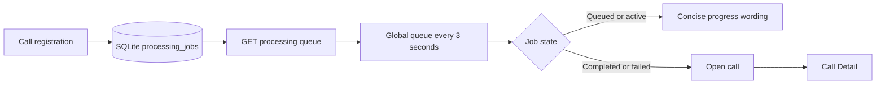

# Story 3.5: Global Processing Queue

**GitHub issue:** #58

**Status:** In Progress

**Owner:** vipinv-dev

**Epic:** #2 Call intake and processing pipeline
**Last updated:** 2026-08-22

## 1. Outcome

### User-Visible Goal

A manager can keep working anywhere in the POC while a simple, always-visible queue shows the
latest durable state of recently submitted calls. When a call completes or fails, the manager can
open its Call Detail view from the queue.

### Scope

- Included: Persisted queue-list API, shared polling UI, readable processing-state wording,
  loading/empty/error states, completed/failed call navigation, local CORS support, and tests.
- Excluded: Background scheduling, worker ownership, retry controls, notifications, queue
  prioritisation, and any analysis or transcript content in the queue.

### Acceptance Criteria

- [x] The queue remains visible on the implemented upload and Call Detail screens.
- [x] A manager sees recent processing state updates without refreshing the browser.
- [x] Queue data comes from persistent SQLite `processing_jobs` records, not browser state.
- [x] Loading, empty, failed, and completed states are understandable for a non-technical user.
- [x] The queue exposes no transcript text, audio bytes, agent name, or unnecessary call content.

## 2. Design

### Flow



### Components and Ownership

| Area | Files or module | Responsibility |
| --- | --- | --- |
| API | `apps/api/src/app/calls.py` | Select the 20 most recent persisted jobs and return minimal queue data. |
| Logging | `apps/api/src/app/calls.py` | Emit queue-list retrieval counts and state counts without user content. |
| CORS | `apps/api/src/app/main.py` | Permit standard local Vite ports through `5175` for browser API access. |
| UI | `apps/web/src/features/processing/GlobalProcessingQueue.tsx` | Poll, render readable status, and link actionable calls to Call Detail. |
| App composition | `apps/web/src/App.tsx` | Render the shared queue above upload and detail routes. |
| Tests | `apps/api/tests/test_calls.py`, `apps/api/tests/test_main.py`, `apps/web/src/features/processing/GlobalProcessingQueue.test.tsx` | Verify persisted API data, CORS, status states, failure feedback, and polling. |

### Contracts and Data

`GET /api/calls/processing-queue` returns at most 20 recent items:

```json
{
  "items": [
    {
      "job_id": "job_...",
      "call_id": "...",
      "customer_name": "Visible call name",
      "status": "queued|transcribing|analyzing|completed|failed",
      "updated_at": "SQLite timestamp",
      "failure_reason": "optional stable reason"
    }
  ]
}
```

No schema migration is needed because the contract reads existing durable `calls` and
`processing_jobs` rows. The browser polls every three seconds. `customer_name` is deliberately
limited to the existing call display name; agent name, raw audio, transcripts, evidence, and
analysis output are not returned.

## 3. Operational Behavior

### Logging and Privacy

`processing_queue_loaded` records only `item_count` and counts by processing status. Browser poll
errors log `processing_queue_poll_failed` without IDs, names, audio, or transcript content. The
queue response excludes raw audio, transcript turns, evidence, analysis, and agent names.

### Failure and Recovery

If the API request fails, the previous visible queue remains and the manager sees `Queue status is
temporarily unavailable.` The next poll attempts recovery. A processing failure is shown as `Needs
attention` and includes an `Open call` path to inspect the existing failed Call Detail state. Story
3.6 owns durable worker scheduling; this story neither starts nor retries jobs.

## 4. Verification

### Automated Tests

| Check | Result | Notes |
| --- | --- | --- |
| Unit tests | Passed | 12 frontend tests and 33 API tests passed. The new queue component has 100% statement, branch, function, and line coverage. |
| Integration tests | Passed | Queue API test creates durable jobs, verifies completed and failed data, and verifies excluded content. |
| Lint and format | Passed | `npm run lint` and `npm run format:check` passed. |
| Build | Passed | `npm run build` completed successfully. |
| Accuracy evaluation | Not applicable | This story renders persisted job states; it makes no AI-quality claim. |

### Manual Verification and Demo Path

1. Start the API and web app with the web app configured for its API URL.
2. Confirm the global queue shows the empty state on the upload page.
3. Upload a call and submit it; remain on the page.
4. Within one polling interval, confirm the queue shows the customer display name and `Waiting to
   start`/`queued` state.
5. Process the call. Confirm a failed call reads `Needs attention` and provides `Open call`.
6. Select `Open call`; confirm the URL changes to `?call=<call_id>`, Call Detail opens, and the
   queue remains visible above it.

**Executed browser evidence:** A temporary non-sensitive MP3 was registered as `Queue Test
Customer`. The queue changed from empty to `queued` after polling, then to `failed` after intentional
invalid-audio processing, and `Open call` navigated to
`?call=589887099b884731b7f5bc81988da3d9` while retaining the global queue.

### Known Gaps and Follow-Up Boundaries

- Polling is intentionally simple for the POC; realtime push and browser notifications are out of scope.
- The UI displays all recent durable jobs but Story 3.6 owns background worker FIFO execution.
- Failed jobs remain actionable but cannot be retried in this story.
- Repository-wide web coverage is 57.04% and API coverage is 89%; the project's overall 100% coverage goal requires tests for pre-existing modules outside Story 3.5.

## 5. Delivery Record

- Branch: `feature/story-3.5-global-processing-queue`
- Pull request: #63 (draft, targets `development`)
- Commit(s): `3973a52` global processing queue implementation
- Review result: Code quality A; testing quality A; no blocking self-review findings.

### Change Log

Update this table before every commit. Explain both the change and its reason; do not use generic entries such as "updates" or "fixes".

| Commit | What changed | Why |
| --- | --- | --- |
| `3973a52` | Added a SQLite-backed global processing queue API, shared polling UI, readable state mapping, Call Detail actions, CORS coverage, automated tests, and this delivery record. | Managers need to follow call processing across pages without a browser refresh, while keeping queue data evidence-safe and tightly scoped ahead of durable worker scheduling in Story 3.6. |
| Pending | Recorded the draft PR and self-review outcome. | Keeps the in-repository delivery record aligned with the reviewable GitHub change. |

### PR Readiness and Review

- Mergeability verification: Pending - `npm run pr:verify -- 63` after GitHub CI completes.
- Code quality grade: `A`
- Testing quality grade: `A`
- Review findings and follow-up: No blocking findings. Durable background worker scheduling, retry
  controls, and browser notifications remain intentionally deferred to Story 3.6 and later work.
