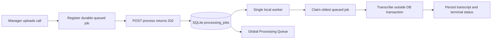

# Story 3.6: Durable Single-Worker Call Queue

**GitHub issue:** [#59](https://github.com/vrize-poc-demo/call-center-radar/issues/59)

**Status:** In Progress

**Owner:** Vipin

**Epic:** Call intake and processing pipeline
**Last updated:** 2026-08-22

## 1. Outcome

### User-Visible Goal

A manager can submit several calls without waiting for transcription. A single local worker processes durable SQLite jobs in FIFO order while the Global Processing Queue remains visible across the POC.

### Scope

- Included: `202 Accepted` process start, local single worker, FIFO claiming, restart recovery, idempotent enqueue, short database transactions, durable state changes, and non-blocking upload UI.
- Excluded: distributed workers, priority scheduling, cross-machine retries, browser notifications, and production-scale orchestration.

### Acceptance Criteria

- [x] Starting processing returns promptly rather than waiting for STT.
- [x] Multiple jobs run one at a time in FIFO SQLite ID order.
- [x] SQLite is not held during audio inspection or inference.
- [x] Duplicate starts do not create duplicate work.
- [x] Queue state and failures remain durable and visible.
- [x] Active work interrupted by restart returns to `queued` with an audit event.

## 2. Design

| Area | Files or module | Responsibility |
| --- | --- | --- |
| Worker | `apps/api/src/app/worker.py` | Starts/stops the worker, wakes it for jobs, and recovers interrupted work. |
| Pipeline | `apps/api/src/app/pipeline.py` | Claims jobs, runs inference outside SQLite transactions, and persists terminal state. |
| API lifecycle | `apps/api/src/app/main.py` | Creates the worker after migrations and starts it for configured runtime use. |
| API contract | `apps/api/src/app/calls.py` | Returns `202 Accepted` for process start and makes duplicate starts safe. |
| Upload UI | `apps/web/src/features/calls/CallUploadForm.tsx` | Starts processing after registration and frees the manager to upload or navigate. |
| Tests | `apps/api/tests/test_pipeline.py`, `apps/web/src/features/calls/CallUploadForm.test.tsx` | Verify the worker and non-blocking UX. |

### Contracts and Data

`POST /api/calls/{job_id}/process` returns `202 Accepted` with the current durable state. SQLite remains authoritative: jobs are claimed from `queued` in `processing_jobs.id` order and transitions are recorded in `processing_job_events`. Restart recovery only requeues interrupted active states; it does not retry terminal failures.

## 3. Operational Behavior

### Logging and Privacy

The worker records enqueue, start/stop, completion, recovery, and existing state-transition events. Context is limited to job IDs, statuses, queue depth, duration, and model version. Raw audio, transcript text, customer names, metadata, and secrets are not logged.

### Failure and Recovery

Audio inspection and transcription failures become durable `failed` jobs with existing stable reasons. On startup, jobs left in `transcribing` or `analyzing` return to `queued` with a `worker_restart_recovery` audit event, preventing a permanently misleading active status.

## 4. Verification

| Check | Result | Notes |
| --- | --- | --- |
| Web unit tests | Passed | 23 tests, including upload-triggered non-blocking process start. |
| API unit tests | Passed | 41 tests; FIFO, duplicate starts, failures, recovery, and SQLite readability during inference. |
| Repository lint | Passed | ESLint and Ruff completed with no findings. |
| Format check | Passed | Prettier and Ruff formatting checks passed. |
| Production build | Passed | TypeScript and Vite bundle completed. |
| Accuracy evaluation | Not applicable | Queue execution makes no analysis-quality claim. |

### Manual Verification and Demo Path

1. Start the API with `CALL_RADAR_PROCESSING_WORKER_ENABLED=true`.
2. Submit three short supported audio files quickly.
3. Confirm each submission returns promptly and the Global Processing Queue shows all jobs.
4. Confirm one job is `transcribing` at a time and terminal jobs become actionable.
5. Restart while a job is active; confirm it returns to `queued` then resumes processing.

Executed local evidence: a supported sample recording was registered and received a `202` queued
response in less than one second. The enabled local worker then completed it asynchronously, and the
durable queue endpoint reported `completed` with no failure reason.

### Known Gaps and Follow-Up Boundaries

- The worker is intentionally in-process and single-machine for the POC.
- Terminal failures are visible but retry controls belong to a later story.
- Forced shutdown during inference may require re-transcription after recovery; persisted evidence remains immutable.

## 5. Delivery Record

- Branch: `feature/story-3.6-durable-worker-queue`
- Pull request: [#72](https://github.com/vrize-poc-demo/call-center-radar/pull/72) (draft, targets `development`)
- Commit(s): `809078d` - durable worker, non-blocking process start, tests, and delivery record
- Review result: Pending CI and merge-readiness verification.

### Change Log

| Commit | What changed | Why |
| --- | --- | --- |
| `809078d` | Added a durable FIFO worker, non-blocking process start, recovery behavior, tests, upload UX update, and this record. | Let managers queue calls without freezing the POC or holding SQLite locks while STT runs. |
| Pending | Recorded the draft PR and local real-sample result. | Keep the review handoff tied to the tested Story 3.6 delivery. |

### PR Readiness and Review

- Mergeability verification: Pending - `npm run pr:verify -- <pr-number>`
- Code quality grade: Pending - A to F
- Testing quality grade: Pending - A to F
- Review findings and follow-up: Pending human review.
