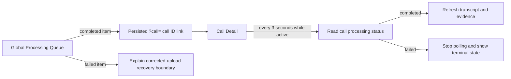

# Story 3.7: Completed Call Detail Navigation

**GitHub issue:** [#60](https://github.com/vrize-poc-demo/call-center-radar/issues/60)

**Status:** In Review

**Owner:** Vipin

**Epic:** Call intake and processing pipeline
**Last updated:** 2026-08-22

## 1. Outcome

### User-Visible Goal

A manager can open the persisted Call Detail directly from a completed item in
the Global Processing Queue. A detail page opened while processing remains
current until it reaches a terminal state, then displays the saved transcript
without a manual browser refresh.

### Scope

- Included: completed-only queue navigation, terminal-state-aware Call Detail
  polling, transcript and evidence refresh after completion, clear failed-job
  guidance, navigation-intent logging, and focused UI tests.
- Excluded: automatic browser redirection, retrying failed calls, browser
  notifications, and changes to the durable queue API or SQLite schema.

### Acceptance Criteria

- [x] Completed queue items have an accessible action which targets their
  persisted call ID.
- [x] Calls still processing do not imply that their detail is ready.
- [x] A Call Detail page opened during processing refreshes until it reaches a
  completed or failed terminal state.
- [x] Completion refreshes saved transcript and deterministic evidence context.
- [x] Failed queue items do not offer a misleading completed-detail action and
  clearly state the recovery boundary.
- [x] Queue navigation continues to use the persisted `?call=<call_id>` URL,
  so it survives browser refresh and sharing within the POC.

## 2. Design

### Flow

### Components and Ownership

| Area | Files or module | Responsibility |
| --- | --- | --- |
| Queue UI | `apps/web/src/features/processing/GlobalProcessingQueue.tsx` | Show a detail link only for completed calls and explain failed calls. |
| Detail UI | `apps/web/src/features/call-detail/CallDetailPage.tsx` | Poll active calls, stop at terminal states, and refresh completed context. |
| Styling | `apps/web/src/styles.css` | Make failure guidance readable without presenting it as a completed action. |
| Tests | `apps/web/src/features/processing/GlobalProcessingQueue.test.tsx`, `apps/web/src/features/call-detail/CallDetailPage.test.tsx` | Verify completed navigation, failed-call boundaries, and terminal refresh. |

### Contracts and Data

No API, database, migration, model, or evidence schema changes are required.
The existing persisted call ID remains the navigation contract. Call Detail
uses the existing read endpoints for the call, transcript, and evidence. It
polls only while status is non-terminal and stops after `completed` or `failed`.
Transcript turns and evidence remain server-persisted records; the browser
never constructs transcript content or evidence references.

## 3. Operational Behavior

### Logging and Privacy

Selecting a completed item emits `queue_to_detail_requested` with the call ID,
which lets developers correlate a navigation intent with queue diagnostics.
Refresh failures emit `call_detail_refresh_failed`, `transcript_load_failed`,
or `evidence_load_failed`. These events never include raw audio, transcript
text, customer or agent names, metadata, or secrets.

### Failure and Recovery

If a queue job fails, the queue shows that processing stopped and directs the
manager to upload a corrected recording; it does not imply a completed Call
Detail is available. If an active detail refresh fails, the current visible
state is retained and the next polling cycle can recover. Terminal calls stop
polling to avoid unnecessary requests. A developer can inspect the browser
event names above alongside the durable queue job state.

## 4. Verification

### Automated Tests

| Check | Result | Notes |
| --- | --- | --- |
| Focused web unit tests | Passed | 19 tests across the Global Processing Queue and Call Detail suites. |
| Full unit tests | Passed | 24 web and 41 API tests passed through `npm run test:coverage`. |
| Lint and format | Passed | `npm run lint` and `npm run format:check` completed with no findings. |
| Build | Passed | `npm run build` completed the TypeScript and Vite production bundle. |
| Accuracy evaluation | Not applicable | This is navigation and refresh behavior, not an AI-quality change. |

### Manual Verification and Demo Path

1. Start the API and web app using a fresh local SQLite database.
2. Upload a supported sample recording and start processing.
3. Open the resulting `?call=<call_id>` page before the job completes.
4. Confirm the processing state changes without reloading the browser and the
   saved transcript appears at completion.
5. Return to the dashboard and confirm only the completed queue item provides
   `Open call detail`; failed items instead show their corrected-upload guidance.
6. Refresh a completed detail URL and confirm it still opens the same persisted
   call.

Executed local evidence: a supplied sample recording and metadata file were
registered against a fresh local SQLite database. Processing returned `202`
promptly and the persisted call detail transitioned from `queued` to
`transcribing`. The web test then verifies the manager-visible terminal
transition and transcript refresh with the same API contract, without storing
sample call content in test output or source control.

### Known Gaps and Follow-Up Boundaries

- Polling is intentionally a three-second local POC cadence; push updates are
  outside this story.
- Failed calls require a corrected re-upload rather than an in-place retry.
- The detail page refreshes transcript and evidence after completion; later
  analysis stories can add their own terminal refresh behavior if needed.

## 5. Delivery Record

- Branch: `feature/story-3.7-completed-call-navigation`
- Pull request: [#73](https://github.com/vrize-poc-demo/call-center-radar/pull/73)
  (draft, targets `development`)
- Commit(s): `21d22a5` - completed call navigation, terminal refresh, tests,
  and delivery record; `bba9fae` - delivery metadata update.
- Review result: GitHub CI and `npm run pr:verify -- 73` passed; pending human
  review and merge.

### Change Log

Update this table before every commit. Explain both the change and its reason;
do not use generic entries such as "updates" or "fixes".

| Commit | What changed | Why |
| --- | --- | --- |
| `21d22a5` | Added completed-only queue navigation, active Call Detail refresh, terminal failure guidance, tests, and this delivery record. | Let managers reach finished calls reliably without accidentally treating failed work as review-ready. |
| `21d22a5` | Ran the full test, lint, format, build, and fresh-SQLite sample-registration checks. | Provide an auditable local handoff before creating the review branch commit. |
| Pending | Recorded the draft PR, passing CI, mergeability check, and project review status. | Preserve an auditable handoff for the human maintainer. |

### PR Readiness and Review

- Mergeability verification: Passed - `npm run pr:verify -- 73` confirmed a
  clean merge into `development` with passing GitHub CI.
- Code quality grade: A - persisted navigation, terminal-aware polling, and
  failure boundaries are small, explicit, and use existing API contracts.
- Testing quality grade: A - focused tests exercise queue actions and active
  detail refresh; full web/API suites, lint, formatting, and build all pass.
- Review findings and follow-up: No blocking findings. The intentional POC
  boundary is polling rather than push updates, and failed uploads require a
  corrected re-upload.
