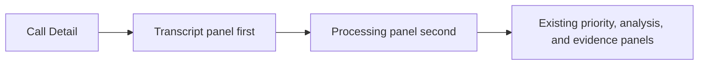

# Story 3.8: Reorder Call Detail Processing and Transcript Panels

**GitHub issue:** [#75](https://github.com/vrize-poc-demo/call-center-radar/issues/75)

**Status:** In Review

**Owner:** Vipin

**Epic:** Call intake and processing pipeline
**Last updated:** 2026-08-22

## 1. Outcome

### User-Visible Goal

A manager reading a Call Detail sees the Transcript panel before the Processing
panel. The conversation is therefore the primary review content, while the
current processing state remains visible alongside it.

### Scope

- Included: swap the Call Detail Transcript and Processing panel order and add
  a focused accessibility-order test.
- Excluded: changes to processing behavior, transcription, audio playback,
  filtering, evidence, analysis, API contracts, database schema, or styling
  rules outside the reordered existing panels.

### Acceptance Criteria

- [x] The Transcript panel appears before the Processing panel in Call Detail
  DOM order and therefore the existing responsive grid layout.
- [x] Processing status text and state behavior remain unchanged.
- [x] Existing transcript, playback, evidence, analysis, and refresh behavior
  are reused unchanged.
- [x] A focused unit test protects the intended panel order.
- [x] Full quality gate passes before the pull request is created.

## 2. Design

### Flow

### Components and Ownership

| Area | Files or module | Responsibility |
| --- | --- | --- |
| Call Detail UI | `apps/web/src/features/call-detail/CallDetailPage.tsx` | Preserve existing panel components while placing Transcript before Processing. |
| Tests | `apps/web/src/features/call-detail/CallDetailPage.test.tsx` | Assert manager-facing heading order and retain all existing detail behavior checks. |
| API | Not applicable | No endpoint or response changes. |
| Persistence | Not applicable | No SQLite, transcript, or evidence changes. |

### Contracts and Data

Not applicable. The UI uses exactly the existing `CallDetail`, transcript,
evidence, priority, and analysis contracts. No request, response, migration,
configuration, immutable evidence reference, or persisted-data behavior changes.

## 3. Operational Behavior

### Logging and Privacy

No new events are introduced. Existing playback, transcript, evidence, and
refresh diagnostics remain unchanged. This story does not log raw audio,
transcript text, customer or agent PII, metadata, or secrets.

### Failure and Recovery

No processing failure behavior changes. The existing Processing panel still
shows the current status and failure reason in its new location. A browser
rendering failure can be diagnosed with the existing Call Detail tests; no
backend recovery action is required for a presentation-only reorder.

## 4. Verification

### Automated Tests

| Check | Result | Notes |
| --- | --- | --- |
| Focused unit test | Passed | `CallDetailPage.test.tsx`: 14 tests, including Transcript-before-Processing heading order. |
| Full unit tests | Passed | 25 web and 41 API tests passed through `npm run test:coverage`. |
| Lint and format | Passed | `npm run lint` and `npm run format:check` completed without findings. |
| Build | Passed | `npm run build` completed the TypeScript and Vite production bundle. |
| Accuracy evaluation | Not applicable | No AI or transcription behavior changes. |

### Manual Verification and Demo Path

1. Open any persisted Call Detail from the dashboard or completed queue action.
2. Confirm the Transcript panel is the first content panel after the recording.
3. Confirm Processing remains directly beside it on desktop and follows it on
   narrow layouts.
4. Search/filter the transcript and play audio to confirm existing controls
   behave as before.

### Known Gaps and Follow-Up Boundaries

- This story deliberately changes panel order only; it does not redesign the
  detail screen.
- The existing CSS grid handles responsive layout without new breakpoint logic.

## 5. Delivery Record

- Branch: `feature/story-3.8-reorder-call-detail`
- Pull request: [#76](https://github.com/vrize-poc-demo/call-center-radar/pull/76)
  (draft, targets `development`)
- Commit(s): `151e9a9` - panel reorder, regression test, and delivery record.
- Review result: GitHub CI and `npm run pr:verify -- 76` passed; pending human
  review and merge.

### Change Log

| Commit | What changed | Why |
| --- | --- | --- |
| Pending | Reordered existing Transcript and Processing panels, added a reading-order test, and documented this story. | Put the manager's conversation review ahead of supporting processing state without changing any behavior. |
| Pending | Ran the complete test, lint, format, and production-build gate. | Confirm the UI-only reorder did not regress the surrounding POC behavior. |
| Pending | Recorded PR #76, passing CI, mergeability verification, and the project review state. | Give the human maintainer an auditable review handoff. |

### PR Readiness and Review

- Mergeability verification: Passed - `npm run pr:verify -- 76` confirmed a
  clean merge into `development` with passing GitHub CI.
- Code quality grade: A - moves existing layout units without touching data,
  state, contracts, or diagnostics.
- Testing quality grade: A - an explicit DOM reading-order assertion and the
  complete quality gate protect the intended user experience.
- Review findings and follow-up: No blocking findings. This intentionally
  retains the existing responsive grid behavior rather than redesigning it.
