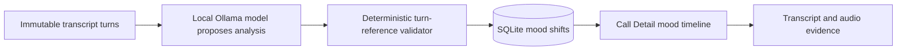

# Story 3.9: Evidence-Backed Mood Timeline and Shift Points

**GitHub issue:** [#77](https://github.com/vrize-poc-demo/call-center-radar/issues/77)

**Status:** In Progress

**Owner:** Vipin

**Epic:** Evidence-backed AI analysis
**Last updated:** 2026-08-22

## 1. Outcome

### User-Visible Goal

A manager can see a call's overall mood and open every detected mood change at
the exact saved transcript turn and audio moment that supports it. Calls with
no defensible change show an explicit no-shift state rather than a fabricated
timeline.

### Scope

- Included: persisted, ordered mood shifts; a local Ollama structured-analysis
  provider; deterministic transcript-reference validation; a small Call Detail
  timeline; and evidence/audio drill-down.
- Excluded: voice-tone emotion inference, cross-call trends, dense charts,
  psychological claims, and changes to dashboard aggregation.

### Acceptance Criteria

- [x] Analysis returns an overall mood and zero or more mood shifts.
- [x] Every shift includes a different source/target mood, reason, persisted
  turn ID, derived quote, and derived start/end timestamps.
- [x] Unsupported turn IDs, quotes, timestamps, same-state shifts, and
  out-of-order shifts are rejected before persistence.
- [x] Mood shifts are persisted separately from claims and reload with the
  existing analysis endpoint.
- [x] Call Detail shows each shift and jumps to matching transcript/audio.
- [x] Full quality gate passed; manual demo check and PR verification are pending.

## 2. Design

### Flow

### Components and Ownership

| Area | Files or module | Responsibility |
| --- | --- | --- |
| Analysis provider | `apps/api/src/app/analysis_provider.py` | Send transcript turns only to local Ollama and require JSON-only output. |
| Analysis contract | `apps/api/src/app/analysis.py` | Parse, validate, persist, and load overall mood and shift events. |
| Evidence validation | `apps/api/src/app/validation.py` | Verify every mood-shift reference against immutable saved transcript turns. |
| Persistence | `apps/api/src/app/migrations/009_analysis_mood_shifts.sql` | Store ordered shift metadata linked to an analysis version. |
| Call Detail UI | `apps/web/src/features/call-detail/CallDetailPage.tsx` | Present simple timeline actions and evidence/audio jumps. |
| Tests | API analysis/validation/workflow and Call Detail suites | Protect persistence, rejection, ordering, and manager drill-down behavior. |

### Contracts and Data

`CallAnalysis` now includes `mood_shifts`: a maximum of six records with
`from_mood`, `to_mood`, `reason`, `transcript_turn_id`, `quote`, `start_ms`,
and `end_ms`. New SQLite table `call_analysis_mood_shifts` is owned by one
analysis record. Quotes and timestamps are not trusted from the model: they
must exactly match a saved transcript turn before persistence. Every analysis
must include at least one claim. The runtime
defaults to free, on-device `qwen2.5:7b` through Ollama. The API never falls
back to keyword matching: an unavailable local model returns a retriable 503.

## 3. Operational Behavior

### Logging and Privacy

Successful analysis events include only analysis version, model version,
latency, and accepted shift count. Provider and validation failures use stable
reason codes and a rejected-shift indicator. Logs never include raw audio,
transcript text, quotes, customer or agent names, or secrets.

### Failure and Recovery

An unavailable Ollama runtime produces a clear retriable 503 without falling
back to a heuristic. Invalid model output or shifts fail before they reach
SQLite; the prior persisted analysis remains intact. A no-shift result is valid
and renders explanatory copy. Replacing transcript turns continues to
invalidate the parent analysis, including its dependent shift records through
SQLite cascade deletion.

## 4. Verification

### Automated Tests

| Check | Result | Notes |
| --- | --- | --- |
| Focused API tests | Passed | 10 analysis/provider tests cover the schema, provider request, unavailable-model response, and evidence contract. |
| Focused web tests | Passed | 15 Call Detail tests passed, including mood-shift audio jump. |
| Full unit tests | Passed | 26 web and 49 API tests passed through `npm run test:coverage`. |
| Lint and format | Passed | `npm run lint` and `npm run format:check` completed with no findings. |
| Build | Passed | `npm run build` completed the TypeScript and Vite production bundle. |
| Live local integration | Passed | A synthetic three-turn call completed Ollama analysis, evidence validation, SQLite persistence, and API retrieval using `ollama:qwen2.5:7b`. |
| Accuracy evaluation | Pending | Local LLM labels require a held-out, human-labelled evaluation set before any accuracy percentage is claimed. |

### Manual Verification and Demo Path

1. Start local Ollama and pull the free `qwen2.5:7b` model once.
2. Upload or register a call with a saved problem turn followed by a supported
   recovery turn.
2. Open Call Detail and locate the Mood timeline under Call analysis.
3. Select a shift and confirm the evidence drawer and audio player seek to its
   stored transcript timestamp.
4. Use a neutral-only call and confirm no mood-shift timeline is fabricated.

### Known Gaps and Follow-Up Boundaries

- Mood is text-based and evidence-backed; it does not claim to infer emotion
  from voice tone.
- The local model can improve semantic labels, but a human-labelled evaluation
  set is still required to measure accuracy across calls.
- Any future local or hosted provider remains subject to the same
  transcript-reference validation contract.
- Issue Radar owns cross-call mood patterns and trends.

## 5. Delivery Record

- Branch: `feature/story-3.9-mood-timeline`
- Pull request: [#80](https://github.com/vrize-poc-demo/call-center-radar/pull/80)
  (draft, targets `development`)
- Commit(s): `a84388e` - mood shift persistence, validation, UI, tests, and delivery record.
- Review result: GitHub CI and `npm run pr:verify -- 80` passed; pending human
  review and merge.

### Change Log

| Commit | What changed | Why |
| --- | --- | --- |
| Pending | Added mood-shift persistence, validation, local-demo detection, Call Detail drill-down, tests, and this delivery record. | Make mood changes explainable at a real transcript/audio moment instead of relying on an opaque overall label. |
| Pending | Ran the complete automated test, lint, format, and production-build gate. | Confirm the new analysis contract and UI drill-down do not regress the POC. |
| Pending | Recorded PR #80, passing CI, mergeability verification, and the project review state. | Preserve a complete human-review handoff. |
| Pending | Replaced the keyword-based local detector with a free Ollama structured-analysis provider, configuration, failure handling, and provider/API tests. | Let the POC make semantic call judgments locally without treating keyword matches as intelligence. |
| Pending | Required at least one immutable transcript-backed claim and verified the complete live API path using local `qwen2.5:7b`. | Prevent an analysis from presenting manager conclusions without an evidence anchor. |

### PR Readiness and Review

- Mergeability verification: Passed - `npm run pr:verify -- 80` confirmed a
  clean merge into `development` with passing GitHub CI.
- Code quality grade: A - validation and persistence reuse existing immutable
  transcript contracts; the UI stays a small evidence drill-down.
- Testing quality grade: A - API persistence/reload, evidence validation,
  invalid shifts, migration flow, UI drill-down, and the full gate are covered.
- Review findings and follow-up: No blocking findings. The local detector is a
  transparent POC heuristic; future model providers remain subject to the same
  deterministic validation.
