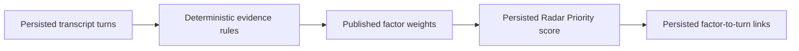

# Story 4.1: Attention Score Engine

**GitHub issue:** [#25](https://github.com/vrize-poc-demo/call-center-radar/issues/25)

**Status:** In Progress

**Owner:** susmitha0510

**Epic:** [#5 Radar Priority and Show Me Why](https://github.com/vrize-poc-demo/call-center-radar/issues/5)
**Last updated:** 2026-08-22

## 1. Outcome

### User-Visible Goal

The API calculates and saves an explainable Radar Priority score for a call. Every score contribution keeps the exact transcript evidence reference needed for a later explanation experience.

### Scope

- Included: deterministic factor weights, score calculation, score and factor persistence, score retrieval, privacy-safe calculation logging, and API tests.
- Excluded: dashboard presentation, explanation drawer, and audio controls; these belong to Story 4.2.

### Acceptance Criteria

- [x] Each scored call receives a persisted Radar Priority score.
- [x] The score stores factor contributions that can be displayed later.
- [x] The scoring model stays explainable and does not hide logic inside the LLM.

## 2. Design

### Flow

### Components and Ownership

| Area | Files or module | Responsibility |
| --- | --- | --- |
| UI | Not applicable | Story 4.2 owns presentation. |
| API | `apps/api/src/app/priority.py` | Calculate, persist, and return the score. |
| Persistence | `apps/api/src/app/migrations/005_radar_priority.sql` | Store one current score and its evidence-linked factors. |
| Tests | `apps/api/tests/test_priority.py` | Verify weights, persistence, and missing-score behavior. |

### Contracts and Data

`POST /api/calls/{call_id}/priority` calculates and persists a score. `GET /api/calls/{call_id}/priority` returns the persisted score or `404` when it has not been calculated. Version `radar-priority-v1` uses deterministic weights: `unresolved_phrase` = 60 and `problem_phrase` = 40. Each saved factor includes its generated evidence ID, transcript turn ID, and time range; raw transcript text is not duplicated in the score tables.

## 3. Operational Behavior

### Logging and Privacy

`radar_priority_calculated` logs the call ID, final score, scoring version, and factor keys. It excludes audio, transcript text, customer names, and all other PII.

### Failure and Recovery

Unknown calls return `404`. A score requested before calculation returns `404` and can be recovered by calling the POST endpoint. Recalculation replaces the old score and factor rows atomically through the score record's cascade relationship.

## 4. Verification

### Automated Tests

| Check | Result | Notes |
| --- | --- | --- |
| Unit tests | Passed | `pytest apps/api`: 24 passed; priority and migration-focused run: 5 passed. |
| Integration tests | Passed | POST calculation and GET retrieval run against a migrated temporary SQLite database. |
| Lint and format | Passed (API) | `ruff check apps/api` and `ruff format --check apps/api` passed. |
| Build | Blocked (pre-existing web dependency) | Web build cannot resolve existing `@testing-library/react` import; Story 4.1 changes no web files. |
| Accuracy evaluation | Not applicable | Deterministic rules are covered by unit tests. |

### Manual Verification and Demo Path

1. Create a call and save a transcript containing an unresolved problem phrase.
2. `POST /api/calls/{call_id}/priority`, then `GET` the same endpoint.
3. Confirm score `100` and factors with the saved transcript turn ID and timestamps.

### Known Gaps and Follow-Up Boundaries

- Story 4.2 will render the saved explanation and seek the audio using the stored timestamp.
- Weight configuration is deliberately versioned in code for this POC; changing weights requires a scoring-version update and recalculation.
- The repository's web test and build gates are currently blocked by the missing existing `@testing-library/react` dependency in `CallDetailPage.test.tsx`.

## 5. Delivery Record

- Branch: `feature/story-4.1-attention-score-engine`
- Pull request: [#56](https://github.com/vrize-poc-demo/call-center-radar/pull/56) (draft, targets `development`)
- Commit(s): `a3a1b19 feat: add explainable radar priority scoring`
- Review result: Pending

### Change Log

Update this table before every commit. Explain both the change and its reason; do not use generic entries such as "updates" or "fixes".

| Commit | What changed | Why |
| --- | --- | --- |
| `a3a1b19` | Added the deterministic priority engine, persistence schema, tests, and API contract. | Make Radar Priority reproducible and preserve each contribution's evidence link for Story 4.2. |
| Pending | Recorded draft PR #56, the completed backend checks, and the existing web dependency blocker. | Give reviewers an accurate delivery and verification record without changing unrelated web dependencies. |

### PR Readiness and Review

- Mergeability verification: `Pending - npm run pr:verify -- <pr-number>`
- Code quality grade: `Pending - A to F`
- Testing quality grade: `Pending - A to F`
- Review findings and follow-up: Pending implementation verification.
