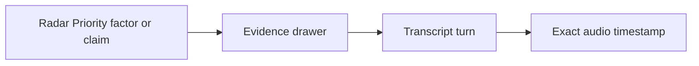

# Story 4.2: Show Me Why

**GitHub issue:** [#26](https://github.com/vrize-poc-demo/call-center-radar/issues/26)

**Status:** In Progress

**Owner:** susmitha0510

**Epic:** [#5 Radar Priority and Show Me Why](https://github.com/vrize-poc-demo/call-center-radar/issues/5)
**Last updated:** 2026-08-22

## 1. Outcome

### User-Visible Goal

A reviewer can select Radar Priority or an analysis claim, see linked transcript evidence, and jump the recording to the exact supporting moment.

### Scope

- Included: priority explanation entry point, factor and claim drawer, transcript-turn traceability, exact audio seeking, client event logging, and UI tests.
- Excluded: new scoring factors, dashboard analytics, score-model changes, and LLM behavior.

### Acceptance Criteria

- [x] A reviewer can open an explanation flow for a score or claim.
- [x] Each explanation links back to transcript evidence and the matching audio moment.
- [x] The experience is concise for non-technical reviewers while exposing stable IDs and timestamps for judges.

## 2. Design

### Flow

### Components and Ownership

| Area | Files or module | Responsibility |
| --- | --- | --- |
| UI | `apps/web/src/features/call-detail/CallDetailPage.tsx` | Score, claims, drawer, and audio jump. |
| API | `apps/web/src/api/calls.ts` | Request priority and structured analysis contracts. |
| Persistence | Not applicable | Story 4.1 stores score-factor evidence links. |
| Tests | `apps/web/src/features/call-detail/CallDetailPage.test.tsx` | Verify drawer and audio seeking. |

### Contracts and Data

The UI calls `POST /api/calls/{call_id}/priority`, `GET /analysis`, and existing transcript/audio endpoints. It relies only on persisted factor IDs, transcript-turn IDs, and timestamps; no client-side evidence mapping is invented.

## 3. Operational Behavior

### Logging and Privacy

`evidence_opened` logs the call ID, source, transcript-turn ID, and evidence ID when applicable. `evidence_trace_link_broken` logs the same stable identifiers when no saved turn exists. Neither logs transcript text, audio, names, or PII.

### Failure and Recovery

If priority or analysis cannot load, its panel displays an unavailable state while call playback and transcript remain usable. A broken trace displays an alert and disables the audio jump; refreshing the transcript and recalculating priority restores valid links.

## 4. Verification

### Automated Tests

| Check | Result | Notes |
| --- | --- | --- |
| Unit tests | Passed | `npm run test --workspace=@call-center-radar/web`: 10 passed. |
| Integration tests | Passed | Component tests exercise the priority and analysis API wiring through mocks. |
| Lint and format | Passed | Web lint and Prettier completed with no errors. |
| Build | Passed | `npm run build --workspace=@call-center-radar/web` completed successfully. |
| Accuracy evaluation | Not applicable | The story consumes the deterministic score. |

### Manual Verification and Demo Path

1. Open a processed call with saved transcript turns.
2. Select **Show me why** or a claim.
3. Confirm the drawer shows evidence and the recording seeks to that timestamp.

### Known Gaps and Follow-Up Boundaries

- The drawer is intentionally scoped to call detail; portfolio-level prioritization belongs to a later dashboard story.

## 5. Delivery Record

- Branch: `feature/story-4.2-show-me-why`
- Pull request: Pending
- Commit(s): Pending
- Review result: Pending

### Change Log

| Commit | What changed | Why |
| --- | --- | --- |
| Pending | Added score and claim explanation flows with transcript and audio traceability. | Let reviewers verify the evidence behind a score or claim. |

### PR Readiness and Review

- Mergeability verification: `Pending - npm run pr:verify -- <pr-number>`
- Code quality grade: `Pending - A to F`
- Testing quality grade: `Pending - A to F`
- Review findings and follow-up: Pending implementation verification.
