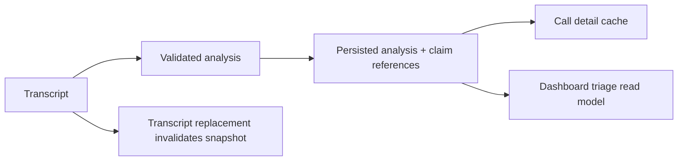

# Story 5.0: Persist analysis for dashboard triage

**GitHub issue:** [#62](https://github.com/vrize-poc-demo/call-center-radar/issues/62)

**Status:** In Progress

**Owner:** susmitha0510

**Epic:** [#6 Manager dashboard](https://github.com/vrize-poc-demo/call-center-radar/issues/6)
**Last updated:** 2026-08-22

## 1. Outcome

### User-Visible Goal

Manager-dashboard consumers receive a stable, evidence-traceable analysis snapshot for each analyzed call without causing a model run every time the dashboard loads.

### Scope

- Included: persisted structured analysis and claim references, cache read, explicit analysis refresh, transcript-change invalidation, and the non-transcript dashboard triage API.
- Excluded: dashboard UI, ranked-list presentation, new scoring rules, and the Story 5.1/5.2 user experience.

### Acceptance Criteria

- [x] A scored/analyzed call has a persisted analysis summary available for dashboard use.
- [x] Stored mood, resolution, risk context, and recommended action are reproducible without rerunning the model for every dashboard load.
- [x] Persisted claims retain exact transcript-turn and timestamp references.
- [x] Recalculation replaces stale analysis deterministically and records its model/version metadata.

## 2. Design

### Flow

### Components and Ownership

| Area | Files or module | Responsibility |
| --- | --- | --- |
| UI | Not applicable | Stories 5.1 and 5.2 own dashboard presentation. |
| API | `apps/api/src/app/analysis.py`, `dashboard.py` | Cached analysis, explicit refresh, and aggregate-safe read model. |
| Persistence | `007_persisted_call_analysis.sql` | Snapshot and claim-reference tables. |
| Tests | `apps/api/tests/test_analysis.py` | Persistence, refresh, dashboard data, and invalidation coverage. |

### Contracts and Data

`GET /api/calls/{call_id}/analysis` returns the stored analysis when present and generates it only when absent. `POST /api/calls/{call_id}/analysis` explicitly refreshes it. `GET /api/dashboard/triage` exposes mood, resolution, manager brief, recommended action, metadata, and persisted priority context without transcript quotes or participant names. Claims persist the claim text, immutable transcript-turn ID, and timestamps; quoted transcript text is rebuilt from the saved turn for call detail and is never duplicated in the analysis tables.

## 3. Operational Behavior

### Logging and Privacy

`analysis_persisted` and `analysis_refreshed` log call ID, model/version metadata, and latency only. Raw audio, transcript text, quotes, participant names, and other PII are excluded. Database errors retain the existing API error behavior and are diagnosable from server logs without sensitive content.

### Failure and Recovery

Invalid model output returns HTTP 502 and does not replace the prior snapshot. Replacing transcript turns deletes the old analysis snapshot atomically so a dashboard cannot read claims attached to removed turns; the next analysis request recreates it. A developer can trigger a deterministic local refresh with `POST /api/calls/{call_id}/analysis`.

## 4. Verification

### Automated Tests

| Check | Result | Notes |
| --- | --- | --- |
| Unit tests | Passed | API suite: 34 passed; focused coverage includes cache, refresh, evidence traceability, triage data, priority context, and transcript invalidation. |
| Integration tests | Passed | `GET /api/dashboard/triage` is covered alongside persisted priority and analysis state. |
| Lint and format | Passed with baseline gap | Ruff lint and formatting passed for all touched API files. Web lint passed. The repository web formatter reports pre-existing differences in 16 untouched files. |
| Build | Passed | `npm run build --workspace=@call-center-radar/web` completed successfully. |
| Accuracy evaluation | Not applicable | No model/prompt behavior change. |

### Manual Verification and Demo Path

1. Save transcript turns for a call and open `GET /api/calls/{call_id}/analysis`.
2. Confirm a later GET returns the stored snapshot and `POST` advances `analysis_version`.
3. Open `GET /api/dashboard/triage` and confirm it has no transcript quotes or participant names.
4. Replace the transcript and confirm the call disappears from triage until regenerated.

### Known Gaps and Follow-Up Boundaries

- Story 5.1 consumes the read model for KPIs and Needs Attention; Story 5.2 owns ranked-list controls.

## 5. Delivery Record

- Branch: `feature/story-5.0-persist-analysis-triage`
- Pull request: TBD
- Commit(s): Pending
- Review result: Pending

### Change Log

| Commit | What changed | Why |
| --- | --- | --- |
| Pending (next commit) | Added persistent analysis snapshots, trace references, refresh/cache behavior, transcript invalidation, and a dashboard-safe read model. | Give Epic 5 stable triage data without duplicating transcript text or rerunning analysis on every load. |

### PR Readiness and Review

- Mergeability verification: Pending - `npm run pr:verify -- <pr-number>`
- Code quality grade: Pending - A to F
- Testing quality grade: Pending - A to F
- Review findings and follow-up: Pending implementation verification.
