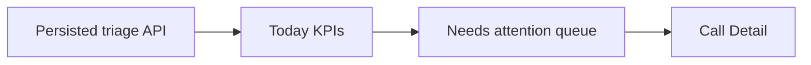

# Story 5.1: Today view

**GitHub issue:** [#27](https://github.com/vrize-poc-demo/call-center-radar/issues/27)

**Status:** In Progress

**Owner:** susmitha0510

**Epic:** [#6 Manager dashboard](https://github.com/vrize-poc-demo/call-center-radar/issues/6)
**Last updated:** 2026-08-22

## 1. Outcome

### User-Visible Goal

A manager lands on a concise Today screen, understands current high-risk and unresolved work at a glance, and can open the next call requiring attention.

### Scope

- Included: top KPI cards, a maximum three-item needs-attention queue, simple risk labels, loading/error/empty states, and Call Detail links.
- Excluded: charts, historical reporting, full ranked-call controls, and new analysis or priority rules.

### Acceptance Criteria

- [x] A manager can understand the day’s top risk signals quickly.
- [x] The summary emphasizes clarity over density.
- [x] The view stays aligned to triage, not historical reporting.

## 2. Design

### Flow

### Components and Ownership

| Area | Files or module | Responsibility |
| --- | --- | --- |
| UI | `apps/web/src/features/dashboard/TodayDashboard.tsx` | Manager-first KPI summary and short action queue. |
| API | `apps/api/src/app/dashboard.py` | Triage-load diagnostics without PII. |
| Persistence | Not applicable | Story 5.0 owns the persisted analysis read model. |
| Tests | `TodayDashboard.test.tsx` | Summary, queue limit, empty, and failure states. |

### Contracts and Data

The view consumes `GET /api/dashboard/triage` from Story 5.0. It displays counts for needs attention, high risk, unresolved, and analyzed calls; it limits the queue to three high-risk or unresolved calls. Queue links use `/?call={call_id}` and do not expose participant names or transcript quotes.

## 3. Operational Behavior

### Logging and Privacy

The UI logs `dashboard_loaded` with a count and `dashboard_load_failed` without response data. The API logs `dashboard_triage_loaded` with a count and `dashboard_triage_load_failed` on database failure. No names, transcript text, audio, or other PII are logged.

### Failure and Recovery

The view shows a readable loading state, a no-urgent-calls state, or a dashboard-load error. A manager can return to registration from the error state. Dashboard data is sourced only from persisted snapshots; refreshing an individual analysis remains the recovery path for stale source data.

## 4. Verification

### Automated Tests

| Check | Result | Notes |
| --- | --- | --- |
| Unit tests | Passed | Web suite: 14 tests; covers KPIs, queue cap, empty state, error state, and detail link. |
| Integration tests | Passed | API analysis persistence suite: 5 passed. |
| Lint and format | Passed | Web ESLint, API Ruff, and format checks for every changed file passed. |
| Build | Passed | `npm run build --workspace=@call-center-radar/web` completed successfully. |
| Accuracy evaluation | Not applicable | The story presents existing analysis and priority outputs. |

### Manual Verification and Demo Path

1. Open `/` with analyzed calls present.
2. Confirm the KPI cards and no more than three queue items render.
3. Select a queue item and confirm Call Detail opens.
4. Open against an empty database and confirm the no-urgent-calls message.

### Known Gaps and Follow-Up Boundaries

- Story 5.2 owns the full ranked-call list, sorting, and filters.

## 5. Delivery Record

- Branch: `feature/story-5.1-today-view`
- Pull request: TBD
- Commit(s): Pending
- Review result: Pending

### Change Log

| Commit | What changed | Why |
| --- | --- | --- |
| Pending (next commit) | Added the manager Today screen, concise KPIs, a short attention queue, triage logging, tests, and responsive styles. | Let managers identify urgent calls in seconds without turning the dashboard into a report. |

### PR Readiness and Review

- Mergeability verification: Pending - `npm run pr:verify -- <pr-number>`
- Code quality grade: Pending - A to F
- Testing quality grade: Pending - A to F
- Review findings and follow-up: Pending implementation verification.
