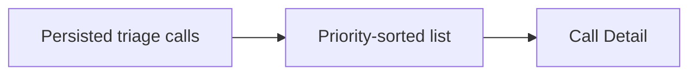

# Story 5.2: Ranked call list

**GitHub issue:** [#28](https://github.com/vrize-poc-demo/call-center-radar/issues/28)

**Status:** In Progress

**Owner:** susmitha0510

**Epic:** [#6](https://github.com/vrize-poc-demo/call-center-radar/issues/6)
**Last updated:** 2026-08-22

## 1. Outcome

### User-Visible Goal

Managers can see every analyzed call ranked by Radar Priority and open the evidence-backed detail directly.

### Scope

- Included: priority order, mood/resolution/risk labels, and drill-down links.
- Excluded: trends, charts, and historical reporting.

### Acceptance Criteria

- [x] Calls appear in Radar Priority order.
- [x] The list shows concise status and risk context.
- [x] A manager can open Call Detail directly.

## 2. Design

### Flow

### Components and Ownership

| Area | Files or module | Responsibility |
| --- | --- | --- |
| UI | `TodayDashboard.tsx` | Sorted list and badges. |
| API | Existing dashboard triage API | Supplies persisted priority and analysis fields. |
| Persistence | Not applicable | Story 5.0 owns it. |
| Tests | `TodayDashboard.test.tsx` | Ranking and navigation. |

### Contracts and Data

The dashboard sorts `GET /api/dashboard/triage` calls descending by `radar_priority`; rows display existing mood, resolution, and risk data and link to `/?call={call_id}`.

## 3. Operational Behavior

### Logging and Privacy

Existing dashboard load diagnostics remain count-only. The list displays no names or transcript quotes.

### Failure and Recovery

Existing dashboard error state handles triage load failure; a row link opens Call Detail for evidence recovery.

## 4. Verification

### Automated Tests

| Check | Result | Notes |
| --- | --- | --- |
| Unit tests | Passed | Focused dashboard suite: 4/4. |
| Integration tests | Not applicable | Uses tested persisted triage API. |
| Lint and format | Pending | Before commit. |
| Build | Pending | Before commit. |
| Accuracy evaluation | Not applicable | No scoring change. |

### Manual Verification and Demo Path

1. Open Today with analyzed calls of different priority.
2. Confirm descending order and badges.
3. Open a row and confirm Call Detail.

### Known Gaps and Follow-Up Boundaries

- No cross-call trend view is included.

## 5. Delivery Record

- Branch: `feature/story-5.2-ranked-call-list`
- Pull request: TBD
- Commit(s): Pending
- Review result: Pending

### Change Log

| Commit | What changed | Why |
| --- | --- | --- |
| Pending | Added a priority-sorted full triage list and ranking/navigation test. | Let managers find and open the most important calls quickly. |

### PR Readiness and Review

- Mergeability verification: Pending
- Code quality grade: Pending
- Testing quality grade: Pending
- Review findings and follow-up: Pending
