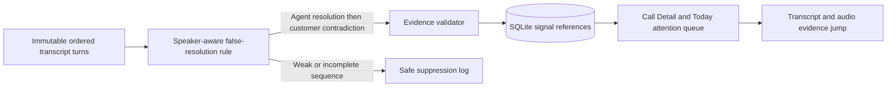

# Story 6.1: False Resolution

**GitHub issue:** [#29](https://github.com/vrize-poc-demo/call-center-radar/issues/29)

**Status:** In Review

**Owner:** Vipin

**Epic:** Quality signals
**Last updated:** 2026-08-23

## 1. Outcome

### User-Visible Goal

A manager can identify a call where an agent states that an issue is resolved
but a later customer turn clearly contradicts it, then open both saved
transcript turns and their audio moments before taking action.

### Scope

- Included: speaker-aware deterministic detection, immutable evidence
  validation, SQLite persistence, manager attention triage, Call Detail
  evidence jumps, privacy-safe operational logs, and regression tests.
- Excluded: model-confidence scoring, voice-tone analysis, cross-call trends,
  and claiming every unresolved call is a false resolution.

### Acceptance Criteria

- [x] Detect an agent's completed-resolution phrase followed by a later
  customer's strong contradiction in the same call.
- [x] Show the signal only when both saved transcript references validate.
- [x] Give managers understandable access to each side of the contradiction
  and its matching audio timestamp.
- [x] Suppress ambiguous language instead of forcing a quality judgement.
- [x] Log detection and borderline suppression without transcript text.
- [x] Cover positive and false-positive paths with unit and integration tests.

## 2. Design

### Flow

### Components and Ownership

| Area | Files or module | Responsibility |
| --- | --- | --- |
| Detection | `apps/api/src/app/false_resolution.py` | Match a narrow completed agent resolution followed by a later customer contradiction. |
| Validation | `apps/api/src/app/validation.py` | Enforce immutable evidence, speaker roles, and chronology. |
| Persistence | `apps/api/src/app/analysis.py`, `010_false_resolution_signals.sql` | Persist only rule and turn IDs; rebuild quotes/timestamps on reads. |
| Manager UI | `CallDetailPage.tsx`, `TodayDashboard.tsx` | Explain the signal and provide evidence/audio drill-down. |
| Tests | API and web suites | Protect detection, suppression, validation, persistence, triage, and navigation. |

### Contracts and Data

`CallAnalysis.false_resolution` is nullable. When present it returns a stable
rule ID with `resolution` and `contradiction` evidence claims. SQLite stores
only the rule and two immutable `transcript_turn_id` values. Quotes and timing
are always derived from the saved transcript; the dashboard exposes only a
Boolean flag, never transcript content.

## 3. Operational Behavior

### Logging and Privacy

`false_resolution_detected` records only call ID, rule ID, and turn IDs.
`false_resolution_suppressed` records a stable reason when a completed agent
resolution lacks a later customer contradiction. No raw audio, transcript text,
quotes, customer or agent names, PII, or secrets are logged.

### Failure and Recovery

Detection is local and independent of the LLM. Validation blocks an invalid
signal before persistence. Replacing a transcript deletes its analysis and
dependent signal by foreign-key cascade. No signal is a normal outcome and is
not shown as a warning.

## 4. Verification

### Automated Tests

| Check | Result | Notes |
| --- | --- | --- |
| API unit tests | Passed | 63 API tests cover detection, suppression, validation, persistence, migration, and triage. |
| API integration tests | Passed | A synthetic call persisted and reloaded both immutable evidence references. |
| Web unit tests | Passed | 29 web tests cover the Call Detail evidence jump and attention queue. |
| Lint and format | Passed | `npm run lint` and `npm run format:check` completed with no findings. |
| Build | Passed | `npm run build` completed the TypeScript and Vite production bundle. |
| Accuracy evaluation | Not applicable | Corpus measurement remains Story #82. |

### Manual Verification and Demo Path

1. Save an agent turn: "Your card is fixed now," followed by a customer turn:
   "It still is not working."
2. Open Call Detail and confirm Resolution check appears.
3. Open both evidence controls and verify transcript selection and audio seek.
4. Open Today and confirm the call appears in Needs attention as Resolution
   conflict.
5. Try only a resolution statement or a vague promise and confirm no signal.

### Known Gaps and Follow-Up Boundaries

- Phrase coverage is intentionally narrow; new language needs labelled examples
  and precision testing before it is added.
- This does not replace local LLM analysis or human QA.
- Story #82 owns corpus-wide accuracy measurement against a human-labelled set.

## 5. Delivery Record

- Branch: `feature/story-6.1-false-resolution`
- Pull request: Pending
- Commit(s): Pending
- Review result: Pending

### Change Log

| Commit | What changed | Why |
| --- | --- | --- |
| Pending | Added speaker-aware false-resolution detection, validated persistence, manager evidence drill-down, and tests. | Make a high-risk outcome visible only when managers can inspect both sides of a concrete contradiction. |
| Pending | Ran the full test, lint, format, build, and live local-Ollama integration checks. | Verify the new signal works through the same runtime path used for the demo. |

### PR Readiness and Review

- Mergeability verification: `Pending - npm run pr:verify -- <pr-number>`
- Code quality grade: `A - narrow deterministic detection, immutable evidence validation, and small vertical UI changes.`
- Testing quality grade: `A - positive, suppression, speaker guard, validation, persistence, dashboard, UI, and live local-model paths are covered.`
- Review findings and follow-up: No blocking findings. Phrase expansion requires labelled examples and precision evaluation before adding coverage.
