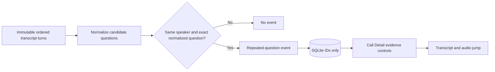

# Story 6.2: Repeated Questions

**GitHub issue:** [#30](https://github.com/vrize-poc-demo/call-center-radar/issues/30)

**Status:** In Review

**Owner:** Vipin

**Epic:** Quality signals
**Last updated:** 2026-08-23

## 1. Outcome

### User-Visible Goal

A manager can see when the same agent or customer repeats the same information
request in a call, then open the original and repeated saved transcript turns
at their matching audio timestamps.

### Scope

- Included: same-speaker exact-question normalization, immutable evidence
  references, SQLite persistence, Call Detail drill-down, logging, and tests.
- Excluded: semantic similarity guesses, cross-call Issue Radar grouping,
  dashboard scoring changes, and treating a statement as a question.

### Acceptance Criteria

- [x] A repeated information request creates a persisted event with two saved
  transcript references.
- [x] Case and terminal punctuation do not prevent a repeat match.
- [x] Different speakers and different questions do not match.
- [x] Call Detail clearly exposes original and repeat evidence jumps.
- [x] Detection logs event count and rule ID without transcript content.

## 2. Design

### Components and Ownership

| Area | Files or module | Responsibility |
| --- | --- | --- |
| Detection | `apps/api/src/app/repeated_questions.py` | Find high-precision same-speaker repeated information requests. |
| Analysis | `apps/api/src/app/analysis.py` | Build validated API events, persist IDs, log counts, and reload evidence. |
| Persistence | `011_repeated_question_events.sql` | Store one analysis-version event with original/repeated immutable turn IDs. |
| UI | `CallDetailPage.tsx` | Show clear original/repeat evidence controls. |
| Tests | API and web suites | Protect match, non-match, persistence, migration, and audio-jump behavior. |

### Contracts and Data

`CallAnalysis.repeated_questions` is an array with `rule_id`, `speaker`,
`original`, and `repeated`. SQLite stores only rule, speaker, and two immutable
turn IDs. Response quotes and timestamps are rebuilt from saved turns, not
trusted from a model or stored separately.

## 3. Operational Behavior

### Logging and Privacy

`repeated_questions_detected` includes only call ID, rule ID, and event count.
No audio, transcript text, quotes, names, PII, or secrets are logged.

### Failure and Recovery

This deterministic signal is independent of the local LLM. A call with no
exact same-speaker repeat returns an empty list. Transcript replacement deletes
its parent analysis and event rows through foreign-key cascade.

## 4. Verification

### Automated Tests

| Check | Result | Notes |
| --- | --- | --- |
| Focused API tests | Passed | 20 tests cover match, normalization, non-match, persistence, and migration. |
| Focused web tests | Passed | 30 web tests include repeated-request evidence/audio jump. |
| Full quality gate | Passed | 72 API tests, 30 web tests, lint, format, and production build passed. |
| Live local verification | Passed | Local Ollama analysis persisted a customer event with original `1.0s` and repeat `3.0s` references. |

### Manual Verification and Demo Path

1. Save a customer turn: "What time is my appointment?"
2. Save a later customer turn with the same question.
3. Open Call Detail and select Show original, then Show repeat.
4. Confirm the evidence drawer and audio player use each saved timestamp.
5. Change the later question or speaker and confirm no event appears.

### Known Gaps and Follow-Up Boundaries

- Exact normalized matching is intentional for POC precision. Semantic
  similarity needs a labelled evaluation set before it can be added.
- This is a single-call quality signal, not Issue Radar or a manager score.

## 5. Delivery Record

- Branch: `feature/story-6.2-repeated-questions`
- Pull request: [#87](https://github.com/vrize-poc-demo/call-center-radar/pull/87)
  (targets `development`; human merge only)
- Commit(s): `6293b54` - detection, persistence, Call Detail controls, tests,
  and developer record.
- Review result: Local full gate and live local-Ollama verification passed;
  GitHub Quality Gates passed before this documentation update.

### Change Log

| Commit | What changed | Why |
| --- | --- | --- |
| `6293b54` | Added deterministic repeated-question detection, SQLite event persistence, Call Detail evidence controls, tests, and this record. | Make repeated information requests visible without relying on an opaque semantic model. |
| `6293b54` | Completed full automated gate and local Ollama API smoke test. | Verify the event is persisted and returned through the real demo pipeline. |
| Pending | Opened PR #87 and confirmed GitHub Quality Gates passed. | Hand the work to human review only after independent repository checks complete. |

### PR Readiness and Review

- Mergeability verification: `Pending - npm run pr:verify -- <pr-number>`
- Code quality grade: `A - narrow deterministic matching, immutable references, and no cross-call scope expansion.`
- Testing quality grade: `A - detector, non-match guards, persistence, migration, UI evidence jump, full gate, and live path are covered.`
- Review findings and follow-up: No blocking findings. Semantic repeat detection requires labelled evaluation before any expansion beyond exact normalized matches.
