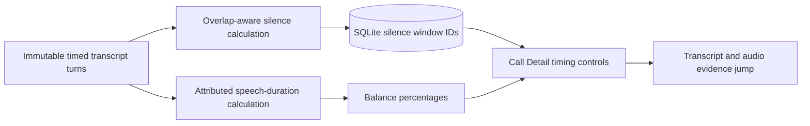

# Story 6.3: Silence and Balance

**GitHub issue:** [#31](https://github.com/vrize-poc-demo/call-center-radar/issues/31)

**Status:** In Review

**Owner:** Vipin

**Epic:** Quality signals
**Last updated:** 2026-08-23

## 1. Outcome

### User-Visible Goal

A manager can inspect meaningful no-speech windows and the recorded agent versus
customer talk-time share for one call, then jump to the speech immediately
before or after a silence window.

### Scope

- Included: deterministic three-second silence windows, overlap-aware gap
  calculation, attributed talk duration, SQLite event persistence, Call Detail
  controls, logging, and tests.
- Excluded: voice-tone analysis, evaluating silence as agent performance,
  emotion/sentiment claims, and cross-call quality scoring.

### Acceptance Criteria

- [x] Silence windows of three seconds or more are computed from saved turn timing.
- [x] Overlapping transcript speech does not create a false silence window.
- [x] Agent/customer talk balance excludes unknown speakers and states when no
  attributable speaker data exists.
- [x] Call Detail shows timing context and evidence jumps for every silence window.
- [x] Logging records only safe counts and calculated durations.

## 2. Design

### Components and Ownership

| Area | Files or module | Responsibility |
| --- | --- | --- |
| Timing calculation | `apps/api/src/app/silence_and_balance.py` | Detect meaningful silence and calculate attributed speech duration/share. |
| Analysis | `apps/api/src/app/analysis.py` | Build, log, persist, reload, and expose timing signals. |
| Persistence | `012_silence_windows.sql` | Store only silence boundary turn IDs and duration. |
| UI | `CallDetailPage.tsx` | Show descriptive balance and silence timing with evidence/audio actions. |
| Tests | API and web suites | Cover threshold, overlap, balance, persistence, migration, and drill-down. |

### Contracts and Data

`CallAnalysis.silence_windows` stores `before`, `after`, and `duration_ms`.
`conversation_balance` returns agent/customer speech milliseconds and their
percentages of attributed speech only. Silence SQLite rows retain boundary IDs
and duration; evidence quote/timing is rebuilt from saved transcript turns.

## 3. Operational Behavior

### Logging and Privacy

`conversation_timing_calculated` records call ID, silence-window count, and
attributed speech durations. It excludes audio, transcript text, quotes, names,
PII, and secrets.

### Failure and Recovery

The signal requires no LLM decision. Calls with no qualifying gap return an
empty silence list. Unknown-speaker-only calls return zero attributed duration
and a clear UI state. Replacing transcript turns removes parent analysis and
dependent silence rows via foreign-key cascade.

## 4. Verification

### Automated Tests

| Check | Result | Notes |
| --- | --- | --- |
| Focused API tests | Passed | 21 tests cover threshold, overlap, balance, persistence, and migration. |
| Focused web tests | Passed | 31 web tests include balance rendering and silence audio jump. |
| Full quality gate | Passed | 76 API tests, 31 web tests, lint, format check, and production build passed. |
| Live local verification | Passed | Saved a two-turn call through the API and loaded its persisted analysis. |

### Manual Verification and Demo Path

1. Save an agent turn ending at `1.0s` and a customer turn beginning at `5.0s`.
2. Open Call Detail to see a `4.0s silence` and the balance bar.
3. Select Show before and Show after; confirm transcript/audio seek to `0.0s`
   and `5.0s` respectively.
4. Use overlapping speech and confirm it does not show a false silence gap.

### Live Verification Evidence

On 2026-08-23, a locally running API accepted a call upload, then saved an
agent turn at `0-1000 ms` and a customer turn at `5000-7000 ms`. Its persisted
analysis returned one `4000 ms` silence window, `1000 ms` agent talk time,
`2000 ms` customer talk time, and a `33.3% / 66.7%` attributed-speech split.
The run used the configured local analysis provider; this timing result itself
remains deterministic and does not depend on an LLM conclusion.

### Known Gaps and Follow-Up Boundaries

- Transcript timing estimates speech boundaries; it is not an acoustic silence
  detector.
- The descriptive balance must not be used as a staff-performance score.

## 5. Delivery Record

- Branch: `feature/story-6.3-silence-and-balance`
- Pull request: [#88](https://github.com/vrize-poc-demo/call-center-radar/pull/88)
- Commit(s): `c548cbd`
- Review result: GitHub CI passed; PR is mergeable with a clean merge state.

### Change Log

| Commit | What changed | Why |
| --- | --- | --- |
| `c548cbd` | Added deterministic timing calculations, SQLite silence events, Call Detail controls, tests, and this record. | Help managers inspect conversation flow without speculative quality claims. |

### PR Readiness and Review

- Mergeability verification: GitHub reports `MERGEABLE` with a `CLEAN` merge state.
- CI verification: Quality gates completed successfully on PR #88.
- Code quality grade: A - narrow, deterministic, evidence-backed implementation.
- Testing quality grade: A - targeted API and UI tests plus full regression gate and live API verification.
- Review findings and follow-up: Human review and merge into `development` remain required.
