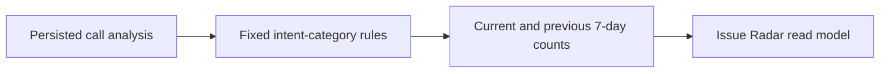

# Story 7.1: Issue grouping

**GitHub issue:** #32

**Status:** In Progress

**Owner:** SusmithaKM

**Epic:** #8 - Issue Radar
**Last updated:** 2026-08-23

## 1. Outcome

### User-Visible Goal

Provide a stable, explainable Issue Radar data model that groups persisted call analyses into a small set of operational categories and indicates whether each issue is emerging, declining, stable, or lacks enough history.

### Scope

- Included: deterministic intent-to-category mapping, a read-only Issue Radar API, seven-day trend comparison, representative call selection, and API/unit tests.
- Excluded: dashboard cards, labels, and navigation to call detail (Story 7.2); model retraining; raw transcript search.

### Acceptance Criteria

- [x] Calls are grouped into a small set of issue categories.
- [x] Trend direction uses simple, explainable logic.
- [x] The POC scope remains narrow and deterministic.
- [x] Category assignment and trend calculation are logged without transcript or PII content.
- [x] Category and trend logic have automated coverage.

## 2. Design

### Flow

### Components and Ownership

| Area | Files or module | Responsibility |
| --- | --- | --- |
| UI | Not applicable | Story 7.2 owns the Issue Radar user interface. |
| API | `apps/api/src/app/dashboard.py` | Supplies grouped categories, trends, and representative call IDs. |
| Persistence | Existing `calls`, `call_analyses`, `radar_priority_scores` | Uses already-persisted analysis and priority data; no new tables. |
| Tests | `apps/api/tests/test_issue_grouping.py` | Verifies taxonomy, trend rules, API result, and representative selection. |

### Contracts and Data

`GET /api/dashboard/issues` returns `grouping_version`, `trend_window_days`, and categories containing a fixed key/label, all related call IDs, a representative call ID, counts for the trailing/current and preceding seven-day windows, and a trend. Categories are derived from persisted `intent` text only: Billing and payments, Account access, Technical support, Service requests, or Other. A category has `not_enough_data` until at least two calls exist across the two comparison windows. The representative is the highest persisted Radar Priority call, with analyzed time and call ID as deterministic ties. No database migration is needed.

## 3. Operational Behavior

### Logging and Privacy

`issue_grouping_loaded` records grouping version, aggregate call/category counts, trend-window size, and category trend labels. `issue_radar_load_failed` records a data-load failure. No raw audio, transcripts, names, summaries, or other customer content is logged.

### Failure and Recovery

If SQLite cannot be read, the API returns HTTP 503 with a generic availability message and emits `issue_radar_load_failed`. The next request retries against the local persisted store. Calls without analyses are intentionally excluded until analysis has been generated.

## 4. Verification

### Automated Tests

| Check | Result | Notes |
| --- | --- | --- |
| Unit tests | Passed | `pytest apps/api/tests/test_issue_grouping.py` (3 passed). |
| Integration tests | Passed | Full API suite: `pytest apps/api/tests` (79 passed). |
| Lint and format | Passed with baseline gap | Ruff check/format passed; web ESLint passed. The root script cannot execute its POSIX `.venv/bin` path on Windows, and existing web formatting fails on 22 unmodified files. |
| Build | Passed | `npm run build --workspace=@call-center-radar/web` completed successfully. |
| Accuracy evaluation | Not applicable | Mapping is deterministic, not a model-quality claim. |

### Manual Verification and Demo Path

1. Run the API and create or analyze multiple calls with intents such as support and payment.
2. Request `GET /api/dashboard/issues`.
3. Confirm no transcript or name fields are returned, categories are grouped, and the representative has the greatest stored priority. Automated endpoint coverage passed this path.

### Known Gaps and Follow-Up Boundaries

- The rules intentionally classify model-provided intent text only; ambiguous intents fall into Other.
- Trend data needs call analyses across two windows; new datasets correctly show `not_enough_data`.
- Story 7.2 owns the visual presentation and related-call navigation.

## 5. Delivery Record

- Branch: `feature/story-7.1-issue-grouping`
- Pull request: TBD
- Commit(s): Pending
- Review result: Pending

### Change Log

Update this table before every commit. Explain both the change and its reason; do not use generic entries such as "updates" or "fixes".

| Commit | What changed | Why |
| --- | --- | --- |
| Pending | Added an explainable Issue Radar read model, deterministic category/trend rules, and tests. | Implements #32 without expanding into Story 7.2 UI scope. |

### PR Readiness and Review

- Mergeability verification: `Pending - npm run pr:verify -- <pr-number>`
- Code quality grade: `Pending - A to F`
- Testing quality grade: `Pending - A to F`
- Review findings and follow-up: Pending focused and full quality-gate verification.
