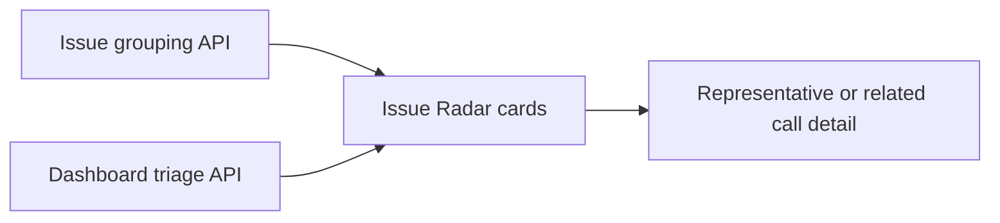

# Story 7.2: Issue Radar UI

**GitHub issue:** #33

**Status:** In Progress

**Owner:** SusmithaKM

**Epic:** #8 - Issue Radar
**Last updated:** 2026-08-23

## 1. Outcome

### User-Visible Goal

Give managers a small Issue Radar view that makes recurring problems, their direction, and supporting calls easy to inspect.

### Scope

- Included: Issue Radar route, category cards, Critical/trend labels, representative-call link, related-call drill-down, responsive styles, and tests.
- Excluded: charts, dense reporting, new grouping rules, transcript search, and data-model changes.

### Acceptance Criteria

- [x] The Issue Radar view shows grouped issues with clear labels.
- [x] A reviewer can inspect a representative call and open related calls.
- [x] The UI remains deliberately simple for the POC.
- [x] Load and navigation intent are logged without customer content.
- [x] Group display and related-call drill-down have automated coverage.

## 2. Design

### Flow

### Components and Ownership

| Area | Files or module | Responsibility |
| --- | --- | --- |
| UI | `apps/web/src/features/issue-radar/IssueRadar.tsx` | Loads, labels, and presents groups with call navigation. |
| API client | `apps/web/src/api/calls.ts` | Defines Issue Radar contract and fetches `/api/dashboard/issues`. |
| Routing | `apps/web/src/App.tsx` | Selects `/?view=issues` without adding a routing dependency. |
| Styles | `apps/web/src/styles.css` | Provides responsive cards, labels, and drill-down presentation. |
| Tests | `apps/web/src/features/issue-radar/IssueRadar.test.tsx` | Verifies labels and both call-navigation paths. |

### Contracts and Data

The UI consumes Story 7.1's `GET /api/dashboard/issues` response and the existing triage endpoint. It uses the representative call's existing high-risk, unresolved, or false-resolution signal to add a Critical label; it preserves the grouping API's Emerging, Stable, Declining, or Needs more data trend label. It does not display transcript text, names, or summaries.

## 3. Operational Behavior

### Logging and Privacy

`issue_radar_loaded`, `issue_radar_load_failed`, and `issue_radar_representative_opened` are browser-console events. They carry only aggregate category count or issue key; no raw transcript, audio, name, summary, or customer content is logged.

### Failure and Recovery

If either read model fails, the page shows its safe error message and provides a route back to Today. Reloading retries both requests. Call Detail owns any failure after a reviewer follows a link.

## 4. Verification

### Automated Tests

| Check | Result | Notes |
| --- | --- | --- |
| Unit tests | Passed | `npm run test --workspace=@call-center-radar/web -- --run` (33 passed). |
| Integration tests | Passed | Component tests exercise the paired Issue Radar and triage read models. |
| Lint and format | Passed for changed files | ESLint passed and Prettier formatted every changed web file. Repository-wide Prettier baseline remains separately failing on unmodified files. |
| Build | Passed | `npm run build --workspace=@call-center-radar/web` completed successfully. |
| Accuracy evaluation | Not applicable | Uses persisted deterministic grouping. |

### Manual Verification and Demo Path

1. Open `http://localhost:5173/?view=issues`.
2. Confirm category cards show Critical and trend labels when available.
3. Open a representative call, then expand a related-call list and open one item.

### Known Gaps and Follow-Up Boundaries

- A category is Critical only when its representative call needs attention; the category aggregation remains Story 7.1's published contract.
- Call Detail, not Issue Radar, owns evidence/transcript rendering and navigation failure UI.

## 5. Delivery Record

- Branch: `feature/story-7.2-issue-radar-ui`
- Pull request: TBD
- Commit(s): Pending
- Review result: Pending

### Change Log

Update this table before every commit. Explain both the change and its reason; do not use generic entries such as "updates" or "fixes".

| Commit | What changed | Why |
| --- | --- | --- |
| Pending | Added the minimal Issue Radar route, cards, labels, drill-down links, styles, tests, and story record. | Implements #33 with the merged #32 API while avoiding reporting or chart scope. |

### PR Readiness and Review

- Mergeability verification: `Pending - npm run pr:verify -- <pr-number>`
- Code quality grade: `Pending - A to F`
- Testing quality grade: `Pending - A to F`
- Review findings and follow-up: Pending focused and full quality-gate verification.
