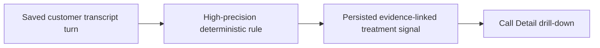

# Story 9.1: Agent treatment signals

**GitHub issue:** #36

**Status:** In Progress

**Owner:** susmitha0510

**Epic:** #10 Agent experience
**Last updated:** 2026-08-23

## 1. Outcome

### User-Visible Goal

A manager reviewing a completed call can see narrow, evidence-backed customer-to-agent treatment signals and open the exact saved transcript turn and matching audio moment.

### Scope

- Included: deterministic abusive-language and explicit escalation/frustration matches from customer-labelled turns; persisted evidence references; Call Detail rendering and evidence drill-down.
- Excluded: agent performance scores, voice-tone emotion inference, workforce ranking, and automated employment decisions.

### Acceptance Criteria

- [x] Treatment signals are backed by transcript evidence.
- [x] The feature highlights difficult interactions without speculative scoring.
- [x] The output remains suitable for supportive workforce discussions.
- [ ] Pull request created and verified against `development`.

## 2. Design

### Flow

### Components and Ownership

| Area | Files or module | Responsibility |
| --- | --- | --- |
| UI | `apps/web/src/features/call-detail/CallDetailPage.tsx` | Render supportive treatment signals and open evidence. |
| API | `apps/api/src/app/agent_treatment.py`, `analysis.py` | Detect only customer-labelled high-precision phrases and expose saved evidence. |
| Persistence | `014_agent_treatment_signals.sql` | Associate rule and immutable transcript-turn reference with an analysis. |
| Tests | API rule, persistence, and UI render tests | Protect speaker, evidence, empty-state, and refresh behavior. |

### Contracts and Data

`GET /api/calls/{call_id}/analysis` will expose `treatment_signals`, each with `rule_id`, a support-oriented `label`, and an `evidence` claim containing the persisted turn ID, quote, and timestamps. The migration stores only rule metadata and a transcript-turn ID; quote and timing are rebuilt from the immutable transcript at read time.

## 3. Operational Behavior

### Logging and Privacy

Log signal counts and rule IDs under `treatment_signals_detected`; log unknown-speaker suppression counts under `treatment_signals_suppressed`. Logs exclude names, transcript text, raw audio, and secrets.

### Failure and Recovery

No match is a normal empty state. Unknown-speaker turns are excluded rather than guessed. A missing evidence turn is not fabricated; it is surfaced as unavailable in the UI and can be diagnosed through the saved analysis/turn relationship.

## 4. Verification

### Automated Tests

| Check | Result | Notes |
| --- | --- | --- |
| Unit tests | Passed | `python -m pytest apps/api/tests/test_agent_treatment.py apps/api/tests/test_analysis.py apps/api/tests/test_workflow.py -q` -> 21 passed, 1 FastAPI/TestClient deprecation warning. |
| Integration tests | Passed | `test_persists_agent_treatment_signals_with_saved_customer_evidence` verifies customer-only evidence persistence and cached response reconstruction. |
| UI tests | Passed | `npm.cmd run test --workspace=@call-center-radar/web -- --run CallDetailPage` -> 20 passed. |
| Lint and format | Passed with noted baseline gap | `python -m ruff check apps/api`, `python -m ruff format --check apps/api`, and targeted Prettier check for touched web files passed. Repo-wide web Prettier check currently reports pre-existing formatting drift across untouched web files. |
| Build | Passed | `npm.cmd run build --workspace=@call-center-radar/web` completed Vite production build. |
| Accuracy evaluation | Passed | Fixture tests cover abusive language, explicit escalation, agent-speaker suppression, unknown-speaker suppression, and broad non-direct wording rejection. |

### Manual Verification and Demo Path

1. Open a completed call containing an explicit customer treatment phrase.
2. In Call Detail, choose the treatment signal and confirm the matching transcript turn and audio timestamp open.
3. Open a normal/unknown-speaker call and confirm it shows no invented signal.

### Known Gaps and Follow-Up Boundaries

- The signal vocabulary is deliberately small and precision-first for the POC; expanding it requires reviewed fixtures and a separate change.
- Existing cached analyses created before this migration will show no treatment signals until analysis is refreshed.
- Repo-wide web Prettier check reports formatting drift in untouched files; this story formats only touched web files to avoid unrelated churn.
- Aggregated agent summaries and operational metrics remain Stories 9.2 and 9.3.

## 5. Delivery Record

- Branch: `feature/story-9.1-agent-treatment-signals`
- Pull request: TBD
- Commit(s): `1cfb9e1` Implement story 9.1 agent treatment signals
- Review result: Self-review complete; no blocking findings before PR.

### Change Log

Update this table before every commit. Explain both the change and its reason; do not use generic entries such as "updates" or "fixes".

| Commit | What changed | Why |
| --- | --- | --- |
| `1cfb9e1` | Create deterministic, evidence-linked treatment-signal foundation and Call Detail presentation. | Meet the story without introducing speculative or punitive agent evaluation. |
| Pending documentation commit | Record the finalized implementation commit in the story delivery record. | Keep the story record accurate before PR creation. |

### PR Readiness and Review

- Mergeability verification: `Pending - npm run pr:verify -- <pr-number>`
- Code quality grade: `A-`
- Testing quality grade: `A-`
- Review findings and follow-up: No blocking findings. Known gap is pre-existing repo-wide web Prettier drift in untouched files; scoped checks on touched files pass.
