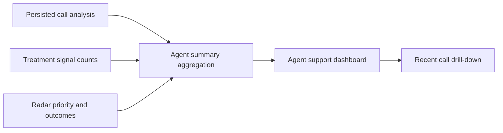

# Story 9.2: Agent summary page

**GitHub issue:** #37

**Status:** In Progress

**Owner:** susmitha0510

**Epic:** #10 Agent experience
**Last updated:** 2026-08-23

## 1. Outcome

### User-Visible Goal

A manager can open an Agent support page that summarizes handled calls, difficult-call patterns, and estimated satisfaction using already persisted evidence, with coaching-oriented wording.

### Scope

- Included: agent-level aggregation, difficult-call counts, estimated satisfaction, treatment-signal counts, unresolved/false-resolution/high-risk counts, recent call drill-downs, supportive coaching notes, dashboard navigation, tests, and load-failure logging.
- Excluded: employee performance scoring, ranking for workforce action, schedule adherence, payroll/workforce-management workflows, and transcript-level data exposure on the summary page.

### Acceptance Criteria

- [x] The page summarizes handled calls and difficult-call patterns clearly.
- [x] The framing is supportive and coaching-oriented.
- [x] The view stays lightweight and grounded in available evidence.
- [ ] Pull request created and verified against `development`.

## 2. Design

### Flow

### Components and Ownership

| Area        | Files or module                                                                 | Responsibility                                                                                                                                                        |
| ----------- | ------------------------------------------------------------------------------- | --------------------------------------------------------------------------------------------------------------------------------------------------------------------- |
| UI          | `apps/web/src/features/agents/AgentSummaryPage.tsx`                             | Render the supportive agent summary page, aggregate KPIs, cards, empty/error states, and recent call links.                                                           |
| API         | `apps/api/src/app/dashboard.py`                                                 | Expose `/api/dashboard/agents` from persisted analysis, priority, false-resolution, and treatment-signal records.                                                     |
| Persistence | Existing tables only                                                            | No schema change; the story reads `calls`, `call_analyses`, `radar_priority_scores`, `call_analysis_false_resolution_signals`, and `call_analysis_treatment_signals`. |
| Tests       | `test_agent_summary.py`, `AgentSummaryPage.test.tsx`, `TodayDashboard.test.tsx` | Cover aggregation, supportive calculation, page rendering, navigation, empty states, and failure state.                                                               |

### Contracts and Data

`GET /api/dashboard/agents` returns:

- `agent_name`
- `calls_handled`
- `difficult_calls`
- `estimated_satisfaction`
- `treatment_signal_count`
- `unresolved_count`
- `false_resolution_count`
- `high_risk_count`
- `coaching_note`
- `recent_call_ids`

The endpoint does not read raw audio or transcript text. It uses only persisted call metadata and derived analysis records.

## 3. Operational Behavior

### Logging and Privacy

API success logs `agent_summary_loaded` with agent count, call count, and difficult-call count. API failure logs `agent_summary_load_failed`. UI success/failure logs `agent_summary_loaded` and `agent_summary_load_failed` in the browser console. Logs exclude customer names, transcript quotes, audio paths, and secrets.

### Failure and Recovery

If the API cannot read dashboard data, it returns `503` with a short manager-safe error. The UI shows a readable alert and a link back to Today. Empty analyzed data shows a normal empty state rather than an error.

## 4. Verification

### Automated Tests

| Check               | Result         | Notes                                                                                                                                                                                                                                          |
| ------------------- | -------------- | ---------------------------------------------------------------------------------------------------------------------------------------------------------------------------------------------------------------------------------------------- |
| Unit tests          | Passed         | `python -m pytest apps/api/tests/test_agent_summary.py apps/api/tests/test_issue_grouping.py -q` -> 6 passed, 1 FastAPI/TestClient deprecation warning.                                                                                        |
| Integration tests   | Passed         | Agent summary endpoint aggregates persisted call analysis, priority, and treatment signals through FastAPI `TestClient`.                                                                                                                       |
| UI tests            | Passed         | `npm.cmd run test --workspace=@call-center-radar/web -- --run AgentSummaryPage TodayDashboard` -> 8 passed; `npm.cmd run test --workspace=@call-center-radar/web -- --run GlobalProcessingQueue TodayDashboard AgentSummaryPage` -> 13 passed. |
| Lint and format     | Passed         | `python -m ruff check apps/api`, `python -m ruff format --check apps/api`, targeted Prettier check for touched web files, and web ESLint passed.                                                                                               |
| Build               | Passed         | `npm.cmd run build --workspace=@call-center-radar/web` completed the production build.                                                                                                                                                         |
| Accuracy evaluation | Not applicable | This story aggregates existing persisted evidence rather than adding a new detector.                                                                                                                                                           |

### Manual Verification and Demo Path

1. Run the API and web app.
2. Open `http://localhost:5173/?view=agents`.
3. Confirm Agent support shows calls handled, difficult calls, estimated satisfaction, support labels, coaching notes, and recent call links.
4. Open a recent call link and confirm it navigates to Call Detail.

### Known Gaps and Follow-Up Boundaries

- Estimated satisfaction is an explainable POC estimate from mood/outcome flags; it is not an employee score.
- Operational metrics such as total duration and handle-time context remain Story 9.3.
- Existing calls need persisted analysis before they appear in the page.
- Repo-wide web Prettier drift remains outside this story; touched files pass targeted Prettier checks.

## 5. Delivery Record

- Branch: `feature/story-9.2-agent-summary-page`
- Pull request: #94
- Commit(s): `1869e6c` Implement story 9.2 agent summary page
- Review result: Self-review complete; no blocking findings before PR.

### Change Log

Update this table before every commit. Explain both the change and its reason; do not use generic entries such as "updates" or "fixes".

| Commit               | What changed                                                                                | Why                                                                                                  |
| -------------------- | ------------------------------------------------------------------------------------------- | ---------------------------------------------------------------------------------------------------- |
| `1869e6c`            | Add agent summary aggregation endpoint and Agent support dashboard page.                    | Meet Story 9.2 with supportive, evidence-grounded manager visibility.                                |
| `8e84f6d`            | Record the finalized implementation commit in the story delivery record.                    | Keep the story record accurate before PR creation.                                                   |
| `75f99b3`            | Record PR #94 in the story delivery record.                                                 | Keep the story record accurate after PR creation.                                                    |
| `1b8a243`            | Cap the global processing queue height and make recent calls scroll inside the queue panel. | Keep call-detail and dashboard content visible when many recent calls exist.                         |
| `5af50f0`            | Record the queue polish commit in the story delivery log.                                   | Keep the story record accurate after the follow-up UI fix.                                           |
| `4c22ae8`            | Tighten the global processing queue height and row density further.                         | Make the call detail content visible even when seven recent calls are present.                       |
| `ce38fe7`            | Record the tighter queue layout commit in the story delivery log.                           | Keep the story record accurate after the follow-up UI fix.                                           |
| `cf5a9a5`            | Move the global processing queue into a left sidebar workspace layout.                      | Avoid the upper/lower page split and keep dashboard or call-detail content visible beside the queue. |
| `74c74bb`            | Record the left/right workspace layout commit in the story delivery log.                    | Keep the story record accurate after the follow-up UI fix.                                           |
| `7cc81ac`            | Merge latest `origin/development` into the Story 9.2 branch.                                | Keep the follow-up PR from reverting Story 2.6 and Story 2.7 work already merged to development.     |
| `a274b3b`            | Record the development merge in the story delivery log before opening the follow-up PR.     | Keep the story record accurate after refreshing the branch.                                          |
| `07f13ca`            | Record the development refresh documentation commit in the story delivery log.              | Keep the story record accurate before PR creation.                                                   |
| Pending local commit | Record follow-up PR #97 and local PR verification limitation.                               | Keep review handoff transparent for the sidebar layout follow-up.                                    |

### PR Readiness and Review

- Follow-up PR: `#97` - `https://github.com/vrize-poc-demo/call-center-radar/pull/97`
- Mergeability verification: local ancestry check passed (`origin/development` is an ancestor of the branch). `npm.cmd run pr:verify -- 97` could not complete locally because `bash` is not installed on this Windows machine.
- Code quality grade: `A-`
- Testing quality grade: `A-`
- Review findings and follow-up: No blocking findings. `gh` is not installed on this machine, so the repo `pr:verify` script may require GitHub UI or connector checks after PR creation.
