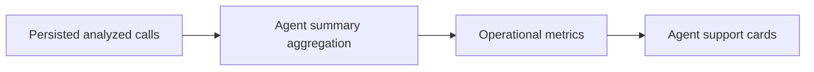

# Story 9.3: Agent operational metrics

**GitHub issue:** #79

**Status:** In Progress

**Owner:** Susmitha

**Epic:** Epic 9 - Agent Experience
**Last updated:** 2026-08-23

## 1. Outcome

### User-Visible Goal

Managers can use the Agent support page to review operational context for each agent, including call volume, average handle time, resolved outcomes, average priority, difficult calls, and supportive coaching signals.

### Scope

- Included: persisted agent-level operational aggregates, average handle time derived from call timing or saved transcript timing, resolved outcome counts/rates, average priority, UI cards, and focused tests.
- Excluded: workforce ranking, employment scoring, pay/performance decisions, new database columns, live telephony integration, and voice-tone analysis.

### Acceptance Criteria

- [x] Agent support includes operational metrics beyond difficult-call counts.
- [x] Handle time is derived only from persisted timing metadata and does not inspect raw audio.
- [x] Metrics remain supportive context, not an automated employee score.
- [x] Empty or missing timing data is handled without inventing duration.

## 2. Design

### Flow

### Components and Ownership

| Area        | Files or module                                                                                  | Responsibility                                                                                                             |
| ----------- | ------------------------------------------------------------------------------------------------ | -------------------------------------------------------------------------------------------------------------------------- |
| UI          | `apps/web/src/features/agents/AgentSummaryPage.tsx`                                              | Display agent operational metrics and supportive context.                                                                  |
| API         | `apps/api/src/app/dashboard.py`                                                                  | Aggregate persisted analysis, priority, treatment, and timing data.                                                        |
| Persistence | Existing tables only                                                                             | Reads `calls`, `transcript_turns`, `call_analyses`, `radar_priority_scores`, and treatment/false-resolution signal tables. |
| Tests       | `apps/api/tests/test_agent_summary.py`, `apps/web/src/features/agents/AgentSummaryPage.test.tsx` | Cover aggregation and rendering of operational metrics.                                                                    |

### Contracts and Data

`GET /api/dashboard/agents` extends each `AgentSummary` with:

- `resolved_count`
- `resolved_rate`
- `average_handle_time_ms`
- `calls_with_handle_time`
- `average_priority`

Handle time uses `calls.ended_at_ms - calls.started_at_ms` when both are valid; otherwise it uses the latest saved transcript turn `end_ms`. Calls without timing data do not contribute to the average.

## 3. Operational Behavior

### Logging and Privacy

Existing `agent_summary_loaded` and `agent_summary_load_failed` events remain. Success logs aggregate counts only. Logs exclude names, transcript text, audio paths, raw audio, customer content, and secrets.

### Failure and Recovery

If agent metrics cannot be read, the API returns `503` and the UI shows the existing failure state. Missing timing data displays as unavailable (`—`) while other metrics remain visible.

## 4. Verification

### Automated Tests

| Check               | Result         | Notes                                                                                                                                                                                                                                                                                                                                                                                                     |
| ------------------- | -------------- | --------------------------------------------------------------------------------------------------------------------------------------------------------------------------------------------------------------------------------------------------------------------------------------------------------------------------------------------------------------------------------------------------------- |
| Unit tests          | Passed         | `PYTHONPATH=$PWD/apps/api/src python -m pytest apps/api/tests/test_agent_summary.py -q` passed with 3 tests and 1 existing `httpx` deprecation warning. `npm run test --workspace=@call-center-radar/web -- --run AgentSummaryPage` passed with 3 tests.                                                                                                                                                  |
| Integration tests   | Passed         | FastAPI dashboard endpoint coverage in `apps/api/tests/test_agent_summary.py` validates the extended `/api/dashboard/agents` response contract.                                                                                                                                                                                                                                                           |
| Lint and format     | Passed         | `python -m ruff check apps/api`, `python -m ruff format --check apps/api`, `npm run lint --workspace=@call-center-radar/web`, `npx prettier --ignore-path .prettierignore --check apps/web/src/api/calls.ts apps/web/src/features/agents/AgentSummaryPage.tsx apps/web/src/features/agents/AgentSummaryPage.test.tsx docs/stories/story-9.3-agent-operational-metrics.md`, and `git diff --check` passed. |
| Build               | Passed         | `npm run build --workspace=@call-center-radar/web` completed successfully.                                                                                                                                                                                                                                                                                                                                |
| Accuracy evaluation | Not applicable | This story aggregates persisted operational data rather than adding a detector.                                                                                                                                                                                                                                                                                                                           |

### Manual Verification and Demo Path

1. Start the API and web app from the Story 9.3 worktree.
2. Open `/?view=agents`.
3. Confirm each agent card shows average handle time, resolved outcomes, average priority, difficult calls, and supportive notes.

### Known Gaps and Follow-Up Boundaries

- Handle time is a persisted-data estimate for the POC and does not integrate with production telephony AHT systems.
- Metrics are intentionally descriptive and must not be presented as automated employee performance decisions.

## 5. Delivery Record

- Branch: `feature/story-9.3-agent-operational-metrics`
- Pull request: TBD
- Commit(s): TBD
- Review result: TBD

### Change Log

Update this table before every commit. Explain both the change and its reason; do not use generic entries such as "updates" or "fixes".

| Commit               | What changed                                                        | Why                                                                  |
| -------------------- | ------------------------------------------------------------------- | -------------------------------------------------------------------- |
| Pending local commit | Add Story 9.3 operational metrics API/UI/tests and delivery record. | Let managers see safe operational context in the Agent support view. |

### PR Readiness and Review

- Mergeability verification: `Pending - npm run pr:verify -- <pr-number>`
- Code quality grade: `Pending - A to F`
- Testing quality grade: `Pending - A to F`
- Review findings and follow-up: TBD
