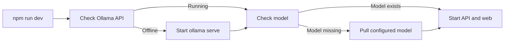

# Story DEV: Start local LLM from the dev runner

**GitHub issue:** #TBD

**Status:** In Progress

**Owner:** TBD

**Epic:** Foundation and developer workflow
**Last updated:** 2026-08-24

## 1. Outcome

### User-Visible Goal

Developers and demo presenters can run one command, `npm run dev`, and have the frontend, API, and local structured-analysis LLM available without remembering a separate `ollama serve` step.

### Scope

- Included: Extend the cross-platform dev runner to check, start, and prepare Ollama for local analysis.
- Included: Document the one-command runner and useful local AI environment overrides.
- Excluded: Installing Ollama itself, changing the production deployment model, or replacing the configured analysis model.

### Acceptance Criteria

- [x] `npm run dev` checks the local Ollama API before starting app services.
- [x] If Ollama is not running and the CLI is available, the runner starts `ollama serve`.
- [x] The runner verifies the configured analysis model and can pull it once when missing.
- [x] A developer can opt out of automatic Ollama startup or model pulling with environment flags.
- [x] Documentation explains why call analysis needs the local LLM and how the runner handles it.

## 2. Design

### Flow

### Components and Ownership

| Area | Files or module | Responsibility |
| --- | --- | --- |
| UI | Not applicable | No UI behavior changed. |
| API | Not applicable | Existing API still calls the configured Ollama endpoint. |
| Persistence | Not applicable | No database schema or persistence changes. |
| Runner | `scripts/dev-all.mjs` | Owns local service startup and readiness checks. |
| Documentation | `README.md`, `docs/Developer_Notes.md` | Explains setup, defaults, and override flags. |
| Tests | Local command checks | Verifies runner syntax and app quality gates. |

### Contracts and Data

No API or database contract changed. The runner uses the existing configuration contract:

- `CALL_RADAR_OLLAMA_BASE_URL`
- `CALL_RADAR_OLLAMA_MODEL`
- `CALL_RADAR_ANALYSIS_TIMEOUT_SECONDS`

New runner-only controls:

- `CALL_RADAR_START_OLLAMA=false`
- `CALL_RADAR_PULL_OLLAMA_MODEL=false`
- `CALL_RADAR_OLLAMA_COMMAND`

## 3. Operational Behavior

### Logging and Privacy

The runner logs only local service readiness, model name, and startup progress. It does not log raw audio, transcripts, customer names, metadata payloads, or secrets.

### Failure and Recovery

If Ollama is missing, unreachable, or the model cannot be prepared, the runner prints the failed local-analysis dependency and exits before starting the app services. Developers can install Ollama, start it manually, change `CALL_RADAR_OLLAMA_MODEL`, or opt out with `CALL_RADAR_START_OLLAMA=false` when working on unrelated frontend/API changes.

## 4. Verification

### Automated Tests

| Check | Result | Notes |
| --- | --- | --- |
| Unit tests | Passed | `npm run test --workspace=@call-center-radar/web`; `PYTHONPATH=apps/api/src ./.venv/bin/python -m pytest apps/api/tests/test_analysis_provider.py apps/api/tests/test_main.py`. |
| Integration tests | Partial | `CALL_RADAR_START_OLLAMA=false node scripts/dev-all.mjs` reached app startup; sandbox blocked binding to `127.0.0.1:5173`. |
| Lint and format | Passed | `npm run lint`. Format check not run because this change only touches JavaScript and Markdown. |
| Build | Passed | `npm run build`. |
| Accuracy evaluation | Not applicable | This change starts the local model; it does not change analysis scoring. |

### Manual Verification and Demo Path

1. Run `npm run dev`.
2. Confirm runner checks `http://127.0.0.1:11434`.
3. Confirm Ollama starts when it was not already running.
4. Confirm the configured model is available.
5. Upload or open a completed call with transcript turns.
6. Confirm Call Detail can load structured call analysis.

### Known Gaps and Follow-Up Boundaries

- The runner does not install Ollama. Installation remains a one-time developer prerequisite.
- The first model pull can take several minutes depending on network and machine speed.
- CI should not run this dev runner because CI does not need a local desktop LLM service.

## 5. Delivery Record

- Branch: `codex/story-dev-runner-ollama`
- Pull request: TBD
- Commit(s): TBD
- Review result: TBD

### Change Log

Update this table before every commit. Explain both the change and its reason; do not use generic entries such as "updates" or "fixes".

| Commit | What changed | Why |
| --- | --- | --- |
| Pending | Updated the dev runner to manage Ollama startup and model readiness; updated README and developer notes. | Call analysis failed when developers started only API/web because the local LLM service stayed offline. |

### PR Readiness and Review

- Mergeability verification: `Pending - npm run pr:verify -- <pr-number>`
- Code quality grade: `Pending - A to F`
- Testing quality grade: `Pending - A to F`
- Review findings and follow-up: TBD
