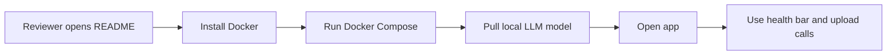

# Story: README Docker Onboarding Rework

**GitHub issue:** #TBD

**Status:** In Review

**Owner:** Vipin

**Epic:** Demo readiness
**Last updated:** 2026-08-31

## 1. Outcome

### User-Visible Goal

A non-technical reviewer can open the README and run the Call Center Radar POC
with Docker without needing to inspect other files first.

### Scope

- Included: README restructure, Docker-first setup steps, tech stack summary,
  architecture overview, model description, feature headings, troubleshooting,
  technology decision details, and internal documentation links.
- Excluded: code behavior changes, Docker image changes, model changes, and
  deployment automation.

### Acceptance Criteria

- [x] README starts with an easy Docker run path.
- [x] README explains what is required to run the project.
- [x] README explains how to run, stop, restart, and clear the Docker demo.
- [x] README lists project features, tech stack, architecture, and model choices.
- [x] README links to internal documentation for deeper technical review.
- [x] Model and library pros/cons are available from the README.

## 2. Design

### Flow

### Components and Ownership

| Area | Files or module | Responsibility |
| --- | --- | --- |
| Documentation | `README.md` | First-run guide and project overview. |
| Documentation | `docs/Technology_Decisions.md` | Model, library, stack, and upgrade tradeoff details. |
| Documentation | `docs/stories/story-readme-docker-onboarding.md` | Records why the README was reworked. |
| UI | Not applicable | No UI behavior changed. |
| API | Not applicable | No API behavior changed. |
| Persistence | Not applicable | No database behavior changed. |
| Tests | Existing quality gate | Confirms documentation changes do not break formatting, lint, tests, or build. |

### Contracts and Data

Not applicable. This story changes documentation only. No API contracts,
database schema, environment variable behavior, immutable evidence references, or
runtime data handling changed.

## 3. Operational Behavior

### Logging and Privacy

Not applicable. No runtime logging changed. The README continues to avoid
printing secrets, raw audio, transcript text, and customer PII.

### Failure and Recovery

The README now gives simple recovery commands for common Docker issues:

- check services with `docker compose ps`
- pull the missing local LLM with `docker compose run --rm ollama-model`
- change the host port with `CALL_RADAR_HOST_PORT`
- clear all local Docker demo data with `docker compose down -v`

## 4. Verification

### Automated Tests

| Check | Result | Notes |
| --- | --- | --- |
| Unit tests | Passed | `npm run test`: 49 web tests and 112 API tests passed. |
| Integration tests | Not applicable | Documentation-only change. |
| Lint and format | Passed | `npm run format:check`; `npm run lint`. |
| Build | Passed | `npm run build`. |
| Accuracy evaluation | Not applicable | No model or scoring behavior changed. |

### Manual Verification and Demo Path

1. Open `README.md`.
2. Confirm the first visible setup path is Docker.
3. Confirm a reviewer can find requirements, run commands, app URL, health
   check, reset command, features, model choices, architecture, and internal doc
   links.

### Known Gaps and Follow-Up Boundaries

- Docker installation itself is described as a prerequisite; the README does not
  replace the operating-system-specific Docker installer.
- This story does not add a one-click desktop installer.

## 5. Delivery Record

- Branch: `codex/readme-docker-guide`
- Pull request: [#120](https://github.com/vrize-poc-demo/call-center-radar/pull/120)
- Commit(s): Initial documentation commit on `codex/readme-docker-guide`
- Review result: Pending human review

### Change Log

Update this table before every commit. Explain both the change and its reason;
do not use generic entries such as "updates" or "fixes".

| Commit | What changed | Why |
| --- | --- | --- |
| Initial branch commit | Reworked README into a Docker-first onboarding guide, restored technology tradeoff documentation, and added this story record. | Make the POC runnable and understandable for non-technical reviewers while preserving links for senior technical reviewers. |

### PR Readiness and Review

- Mergeability verification: `Pending - npm run pr:verify -- 120`
- Code quality grade: `A`
- Testing quality grade: `A`
- Review findings and follow-up: Documentation-only change; no runtime behavior changed.
